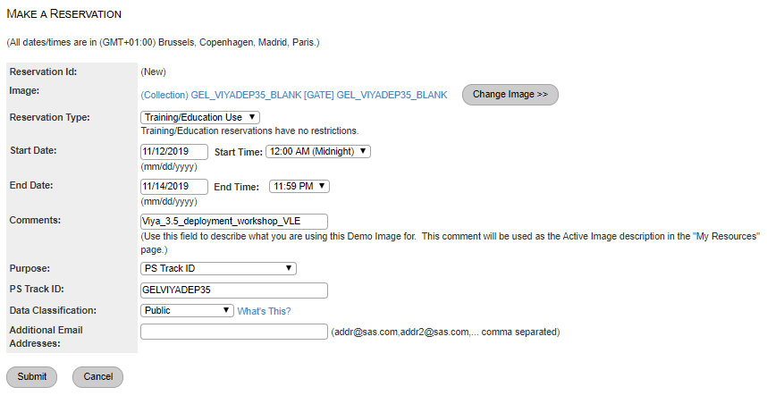
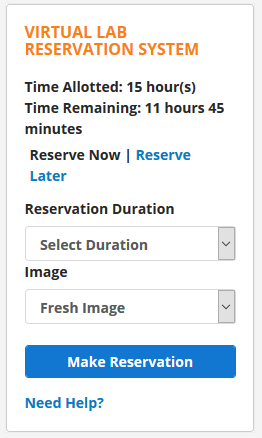

# Hardware Reservation based on profile

* [User Profile](#user-profile)
  * [FTF: SAS Employee in Face to Face training](#ftf-sas-employee-in-face-to-face-training)
  * [IntVLE: SAS Employee using the Internal VLE](#intvle-sas-employee-using-the-internal-vle)
  * [PublicVLE: Non-SAS Employee using the Public VLE](#publicvle-non-sas-employee-using-the-public-vle)
* [Reserving Hardware](#reserving-hardware)
  * [For Face-To-Face (FTF) Workshop](#for-face-to-face-ftf-workshop)
  * [For Internal VLE](#for-internal-vle)
  * [For Public VLE](#for-public-vle)

## User Profile

These Hands-On Instructions are used in multiple situations. It is crucial that you identify early on which is the one that is applicable to you. Some of the early instructions will differ based on this.

### FTF: SAS Employee in Face to Face training

If you are a SAS Employee, and you are sitting in a classroom with an instructor, then you are doing a Face-To-Face Workshop. (FTF)

### IntVLE: SAS Employee using the Internal VLE

If you are a SAS Employee, and you are using the [Internal VLE](http://eduvle.sas.com/course/view.php?id=1742) then you are in the "IntVLE" situation.

### PublicVLE: Non-SAS Employee using the Public VLE

If your employer is not SAS Institute and you are using the [SAS' Public VLE](https://vle.sas.com/course/view.php?id=2493), then you are in the "PubVLE" situation.

## Reserving Hardware

### For Face-To-Face (FTF) Workshop

There is nothing for you to do: The Instructor will give you a printed sheet with the details of the Windows Client Machine of your Lab Environment.

### For Internal VLE

1. To reserve the required machines, you must be part of the STICExnetUsers group.
1. If you are not yet a member of the STICExnetUsers group, join the STICExnetUsers Group:
    1. [Click here](mailto:dlistadmin@wnt.sas.com?subject=Subscribe%20STICEXNETUsers) to prepare an email to join STICExnetUsers group
    1. Send the email with no changes
1. Once the email is sent, you will be notified via email of the creation of the account.
    * Your account should be created and ready for use within 1 hour (Note: we have seen it take much longer than 1 hour for this group membership to propagate through the network. To expedite the group membership, simply log out of the SAS network and log back in). Until the group membership occurs, RACE will inform that you are not authorized to reserve the environment.
1. To reserve your collection, you will need to click on this URL: **[Reserve a blank collection](http://race.exnet.sas.com/Reservations?action=new&imageId=198151&imageKind=C&comment=Viya%203.5%20deployment%20workshop%20VLE&purpose=PST&sso=GELVIYADEP35&schedtype=SchedTrainEDU&startDate=now&endDateLength=3&discardonterminate=y)** and then press Submit in the web interface. Do not modify the URL.

    * NOTE: DO NOT CHANGE THE END DATE TO EXTEND THE RESERVATION. You have 3 working days to complete the exercises, and that should be sufficient. You can always get a new reservation later.

1. This URL will take you to this page:

    

1. Once there, press submit.
    * The machines will take a certain amount of time to come online. Instructions for connecting to the environment will be provided in the workshop instructions. In the meantime, there are hands-on that must be executed on your own workstation, so perform those and by the time you are finished, your machines should be ready.

### For Public VLE

If you are using the Public VLE, the Web Interface of the VLE contains a Virtual Lab Reservation Module.

You can select the number of hours to reserve the environment for (Select Duration).  Your initial reservation will use a "Fresh Image" and any subsequent reservations that build on the first reservation must use "Saved Image".
It will take approximately 30 minutes to start the images.  Once they are available the Virtual Lab Reservation System panel will update with connection information.
**It is recommended to not book less than 4 hours**, to give yourself enough time to get far enough in the Hands-on.
