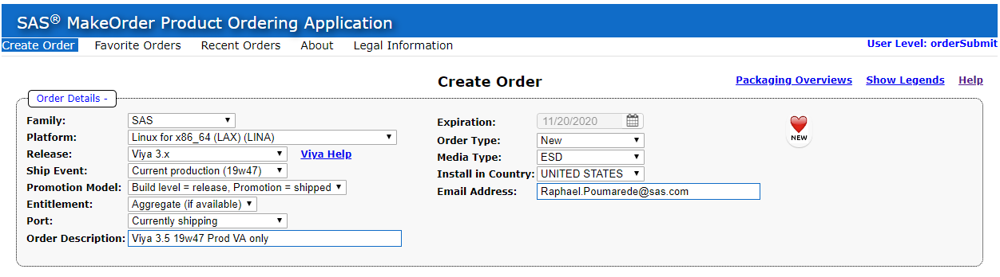
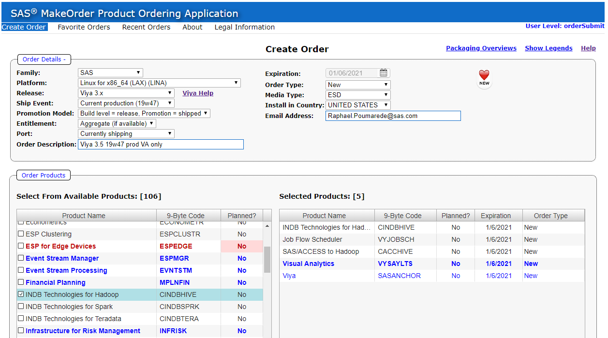
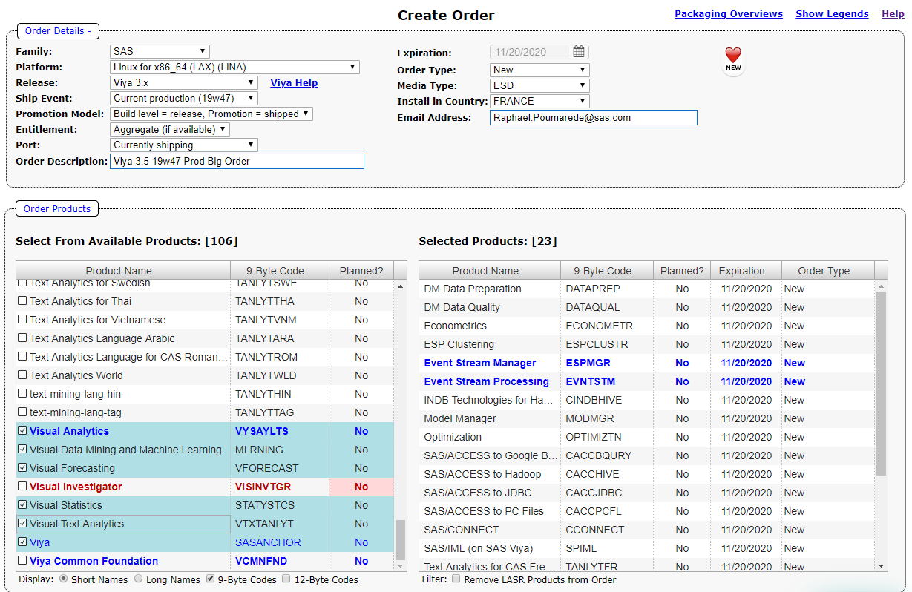
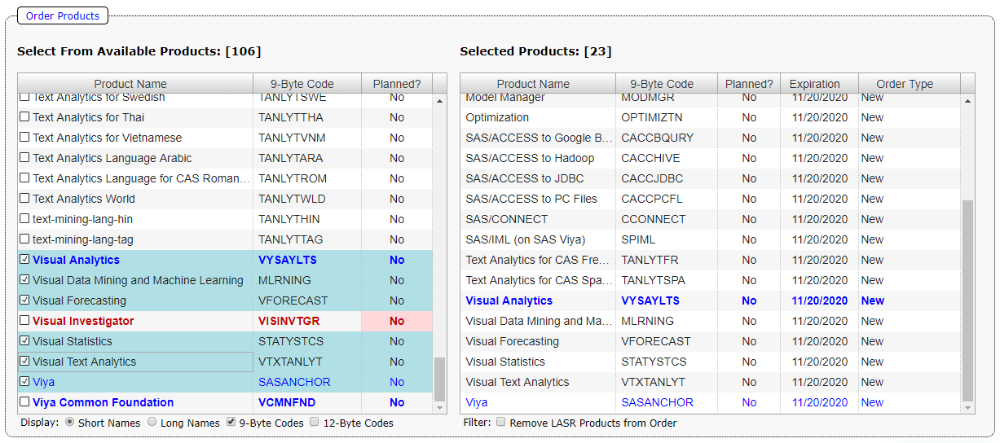

# Creating an order

* [Creating a VA-Only order](#creating-a-va-only-order)
* [Creating a bigger order](#creating-a-bigger-order)
* [Opening the SOE](#opening-the-soe)

Without a software order, it is impossible to deploy SAS Software. As part of this workshop, you will get to create and possibly use your own order.
If you are not a SAS Employee, you do not have access to MakeOrder. A video of these hands-on will be provided for you in the VLE.

## Creating a VA-Only order

For the deployment workshop, we will be using the smallest possible Viya order, making it simpler and easier to install.

1. Open the [MakeOrder URL](http://makeorder.sas.com/makeorder/) on your own workstation (laptop or desktop):

    You may have to authenticate and read some disclaimers.
    Sometimes, the application bugs out if you select the wrong things. A browser refresh (F5) usually helps.

1. On the Order screen, select the following in the top part:
( it is likely that the Ship Event will have changed by the time you do the exercise. You should select whatever is the currently shipping software.)

1. NOTE:
    * Depending on where you are in the world, you may not be allowed to receive the Order.
Since this software will be installed on server in RACE-AWS, located in North Virginia, you should select "United States" for the "Install in Country", regardless of where you are.
(I have Canada in mine, which works too).
    * Your screen may look slightly different. As time passes and new ship-events become available, changes can occur.

1. In the products tab, select only the following:
    * Visual Analytics
    * Job Flow Scheduler
    * SAS/ACCESS to Hadoop
    * INDB Technologies for Hadoop

1. The selection should look like:

1. Click "Submit Order"

## Creating a bigger order

Once you have submitted the first (small) order, you can create a second, more realistic order.

1. Open the [MakeOrder URL](http://makeorder.sas.com/makeorder/). You may have to authenticate and read some disclaimers.
Sometimes, the application bugs out if you select the wrong things. A browser refresh (F5) usually helps.

1. On the Order screen, select the following in the top part.
Change the name to something like VA Big Order
Select the currently shipping ship-event (19w47 at time of writing)

1. In the products tab, select the following:

    * DM Data Preparation
    * DM Data Quality
    * Econometrics
    * ESP Clustering
    * Event Stream Manager
    * Event Stream Processing
    * INDB Technology for Hadoop
    * Model Manager
    * Optimization
    * SAS/ACCESS to Google Big Query
    * SAS/ACCESS to Hadoop
    * SAS/ACCESS to JDBC
    * SAS/ACCESS to PC Files
    * SAS/CONNECT
    * SAS/IML (on SAS Viya)
    * Text Analytics for CAS French
    * Text Analytics for CAS Spanish
    * Visual Analytics
    * Visual Data Mining and Machine Learning
    * Visual Forecasting
    * Visual Statistics
    * Visual Text Analytics

1. The resulting selection should be close to:

You should have 23 selected products (22 selections + Viya).

1. Click "Submit Order"

*Note: make sure that the "Common Planning Service" product is NOT included (it might get included if you clicked "Full product order") otherwise the playbook build may fail.*

## Opening the SOE

1. When you receive the e-mails, compare the body of the e-mails as well as the .zip attachment.

1. Try to figure out where are the:
    * expiry date
    * number of cores
    * CAS Actions that you are licensed to use
    * whether they differ in the 2 orders
