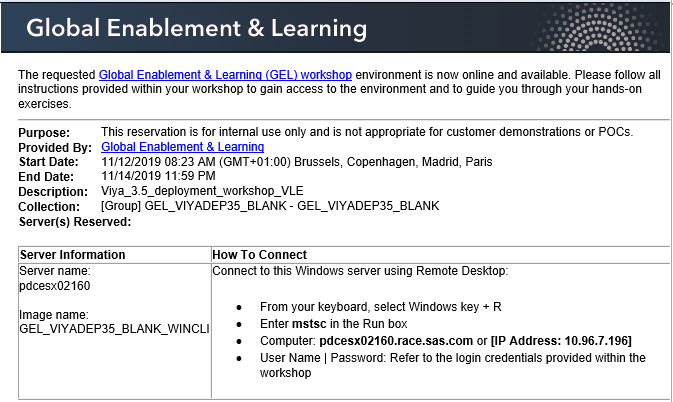
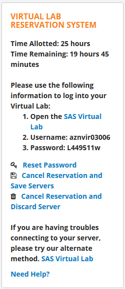
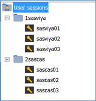

# Connecting to the environment

* [Workshop Environment description](#workshop-environment-description)
* [FTF Workshop and Internal VLE: Connect to the Windows Client Machine](#ftf-workshop-and-internal-vle-connect-to-the-windows-client-machine)
* [Public VLE: Connect to the Windows Client machine](#public-vle-connect-to-the-windows-client-machine)
* [Confirm access to the Linux Machines](#confirm-access-to-the-linux-machines)
* [Check the RACE Infrastructure ("hostname -f")](#check-the-race-infrastructure-%22hostname--f%22)

## Workshop Environment description

Workshop machines provided:

|             | OS         | Cores | RAM  | Perm Disk | Internal Hostname      |
|-------------|------------|-------|------|-----------|------------------------|
| SASCLIENT01 | Win 2016   | 2     | 8GB  | 160GB     | sasclient              |
| SASVIYA01   | Centos 7.6 | 4     | 48GB | 160GB     | intviya01.race.sas.com |
| SASVIYA02   | Centos 7.6 | 4     | 48GB | 160GB     | intviya02.race.sas.com |
| SASVIYA03   | Centos 7.6 | 4     | 48GB | 160GB     | intviya03.race.sas.com |
| SASCAS01    | Centos 7.6 | 4     | 16GB | 160GB     | intcas01.race.sas.com  |
| SASCAS02    | Centos 7.6 | 4     | 16GB | 160GB     | intcas02.race.sas.com  |
| SASCAS03    | Centos 7.6 | 4     | 16GB | 160GB     | intcas03.race.sas.com  |

This windows Client machine will be your virtual workstation for the duration of this workshop.

## FTF Workshop and Internal VLE: Connect to the Windows Client Machine

In a face-to-face workshop, the teacher will provide you with a printed sheet that has the hostname for your Windows Machine.
If you are using the VLE and booked your own hardware, when your machines are ready, RACE will send you an email (this can take 5 to 20 minutes). That e-mail will look like:



Using Windows Remote Desktop client, connect to the server's hostname or IP address:

* You can build the hostname by concatenating the "server" from the email with ".race.sas.com".
* use the IP address from the email

The credentials are:

* user: **.\student**
* pw: **Metadata0**

## Public VLE: Connect to the Windows Client machine

If you are using the Public VLE, when your machines are ready, the Virtual Lab panel will update and look like the following:



Click on the "SAS Virtual Lab" link to connect to the reservation.  This will open a new tab in your browser.  The Windows client machine will open in that tab.
You will not be able to copy-paste back and forth between your own workstation and the Windows Client machine. You can however copy-paste within the Windows Client Machine.

**If you find that you have worked a portion of the hours reserved and you know that you will not work on the deployment for the full number of hours selected above, be sure to select the "Cancel Reservation and Save Servers" option to minimize the number of "wasted" hours.  This will help keep costs down.  You will be able to resume later.**

## Confirm access to the Linux Machines

Once connected to the Windows Client Machine, open MobaXterm and make sure you can connect to all 6 linux servers defined.



* Once connected to each Linux machine, run:

    ```sh
    free -g
    ```

On each, to confirm that 3 of them have 48 GB of RAM, and 3 have only 16 GB.
Note that the previous command may round these numbers to 47G and 15G.

## Check the RACE Infrastructure ("hostname -f")

The deployment requires that the "hostname -f" command returns the internal fully qualified hostname of the machine (like intviya01.race.sas.com, intviya02.race.sas.com, intcas01.race.sas.com, etc...).

Unfortunately, in some cases, it has been noticed that the hostname information on the machine can be lost.

To confirm that in your own RACE collection machines, the hostnames have been properly assigned, follow the instructions below.

* As cloud-user on the sasviya01 server, run the following code :

    ```bash
    for i in `grep 'sasviya\|sascas' /etc/hosts | awk -F " " '{print $1;}'`;do ssh -o "StrictHostKeyChecking=no" $i "hostname -f";done
    ```

* You should see an output like the following (with 6 FQDN hostnames starting with "int"):

```log
Warning: Permanently added '10.96.11.132' (ECDSA) to the list of known hosts.
intviya03.race.sas.com
Warning: Permanently added '10.96.15.97' (ECDSA) to the list of known hosts.
intcas01.race.sas.com
Warning: Permanently added '10.96.2.214' (ECDSA) to the list of known hosts.
intviya01.race.sas.com
Warning: Permanently added '10.96.7.147' (ECDSA) to the list of known hosts.
intcas03.race.sas.com
Warning: Permanently added '10.96.14.12' (ECDSA) to the list of known hosts.
intcas02.race.sas.com
Warning: Permanently added '10.96.8.226' (ECDSA) to the list of known hosts.
intviya02.race.sas.com
```

* If you don't see the FQDN hostname starting with "int" for one or several machines, then follow the steps below to fix the issue:

    **Only for the machines that do not return the internal full hostname**, run the following command (so that hostname -f starts working again):

    ```log
    sudo hostnamectl set-hostname < FQDN internal hostname >
    ```

    For example on sasviya01 :

    ```log
    sudo hostnamectl set-hostname intviya01.race.sas.com
    ```

    Then on sasviya02:

    ```log
    sudo hostnamectl set-hostname intviya02.race.sas.com
    ```

    (Replace the hostname according to the machine where you are running the command).

You might want to check this each time your collection machines are restarted.
