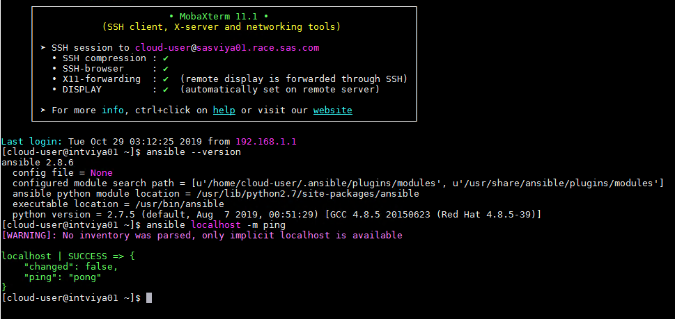

# Installing Ansible on SASVIYA01

* [Installing Ansible on SASVIYA01](#installing-ansible-on-sasviya01)
  * [Installing EPEL](#installing-epel)
  * [Install Ansible with YUM](#install-ansible-with-yum)
  * [Confirm Ansible is running properly](#confirm-ansible-is-running-properly)

## Installing EPEL

1. Check which yum repositories are currently "attached" to this server.

    ```bash
    sudo yum repolist
    ```

    ```log
    #Output
    Loaded plugins: fastestmirror
    Loading mirror speeds from cached hostfile
    * base: mirrors.mit.edu
    * extras: centos.servint.com
    * updates: mirror.vtti.vt.edu
    repo id                  repo name              status
    base/7/x86_64            CentOS-7 - Base        9,911
    extras/7/x86_64          CentOS-7 - Extras        314
    updates/7/x86_64         CentOS-7 - Updates       946
    repolist: 11,171
    ```

1. How many repositories do you see?   ____________________

1. If the previous list already includes “epel - Extra Packages for Enterprise Linux”, you’re all set, you can go to the exercise to install Ansible. Otherwise, the following command will install a new repository: the EPEL repository:

    ```bash
    ## find out which release (6 or 7)
    if grep -q -i "release 6" /etc/redhat-release ; then
    majversion=6
    elif grep -q -i "release 7" /etc/redhat-release ; then
    majversion=7
    else
    echo "Apparently, running neither release 6.x nor 7.x "
    fi

    ## Verify the previous command:
    echo $majversion

    ## Attach EPEL
    sudo yum install -y https://dl.fedoraproject.org/pub/epel/epel-release-latest-$majversion.noarch.rpm
    ```

1. Once that is finished, make sure the EPEL repo is now attached to the server:

    ```bash
    sudo yum repolist
    ```

    ```log
    Loaded plugins: fastestmirror
    Loading mirror speeds from cached hostfile
    * base: mirrors.mit.edu
    * epel: mirror.us.leaseweb.net
    * extras: centos.servint.com
    * updates: mirror.vtti.vt.edu
    repo id                                   repo name                                                               status
    base/7/x86_64                             CentOS-7 - Base                                                          9,911
    epel/x86_64                               Extra Packages for Enterprise Linux 7 - x86_64                          12,605
    extras/7/x86_64                           CentOS-7 - Extras                                                          314
    updates/7/x86_64                          CentOS-7 - Updates                                                         946
    repolist: 23,776
    ```

1. How many repositories do you see now?   ____________________

1. Which of the repositories has the most available packages?

__________________

**Quick Note:** If you ever needed to "detach" the EPEL repo you just added, you can run the following.
<mark style="background-color: yellow">Please don’t do it.</mark>

```sh
# sudo yum erase epel-release
```

```IMPORTANT: SAS Viya 3.5 requires Ansible version 2.7.2 through 2.9.x.```

There are many ways to install Ansible. We present three of them. The first and second have been tested with success. Although it is using a deprecated version of Python (2.7), we recommend you to use them.

## Install Ansible with pip

1. First, install PIP, the python package tool, as well as some related packages.

    ```bash
    ## install pip
    sudo yum install -y python-pip gcc python-devel
    ```

1. Upgrade pip to the latest version (just because)

    ```bash
    sudo pip install --upgrade pip 'setuptools==44'
    ```

1. Now, install a specific version of ansible with pip

    ```sh
    ## find out which versions are available by giving a bad version
    ## I know, how devious!
    sudo pip install 'ansible==notarealversion'
    ```

1. You should see something like:

    ```log
    DEPRECATION: Python 2.7 will reach the end of its life on January 1st, 2020. Please upgrade your Python as Python 2.7 won't be maintained after that date. A future version of pip will drop support for Python 2.7. More details about Python 2 support in pip, can be found at https://pip.pypa.io/en/latest/development/release-process/#python-2-support
    ERROR: Could not find a version that satisfies the requirement ansible==notarealversion (from versions: 1.0, 1.1, 1.2, 1.2.1, 1.2.2, 1.2.3, 1.3.0, 1.3.1, 1.3.2, 1.3.3, 1.3.4, 1.4, 1.4.1, 1.4.2, 1.4.3, 1.4.4, 1.4.5, 1.5, 1.5.1, 1.5.2, 1.5.3, 1.5.4, 1.5.5, 1.6, 1.6.1, 1.6.2, 1.6.3, 1.6.4, 1.6.5, 1.6.6, 1.6.7, 1.6.8, 1.6.9, 1.6.10, 1.7, 1.7.1, 1.7.2, 1.8, 1.8.1, 1.8.2, 1.8.3, 1.8.4, 1.9.0.1, 1.9.1, 1.9.2, 1.9.3, 1.9.4, 1.9.5, 1.9.6, 2.0.0.0, 2.0.0.1, 2.0.0.2, 2.0.1.0, 2.0.2.0, 2.1.0.0, 2.1.1.0, 2.1.2.0, 2.1.3.0, 2.1.4.0, 2.1.5.0, 2.1.6.0, 2.2.0.0, 2.2.1.0, 2.2.2.0, 2.2.3.0, 2.3.0.0, 2.3.1.0, 2.3.2.0, 2.3.3.0, 2.4.0.0, 2.4.1.0, 2.4.2.0, 2.4.3.0, 2.4.4.0, 2.4.5.0, 2.4.6.0, 2.5.0a1, 2.5.0b1, 2.5.0b2, 2.5.0rc1, 2.5.0rc2, 2.5.0rc3, 2.5.0, 2.5.1, 2.5.2, 2.5.3, 2.5.4, 2.5.5, 2.5.6, 2.5.7, 2.5.8, 2.5.9, 2.5.10, 2.5.11, 2.5.12, 2.5.13, 2.5.14, 2.5.15, 2.6.0a1, 2.6.0a2, 2.6.0rc1, 2.6.0rc2, 2.6.0rc3, 2.6.0rc4, 2.6.0rc5, 2.6.0, 2.6.1, 2.6.2, 2.6.3, 2.6.4, 2.6.5, 2.6.6, 2.6.7, 2.6.8, 2.6.9, 2.6.10, 2.6.11, 2.6.12, 2.6.13, 2.6.14, 2.6.15, 2.6.16, 2.6.17, 2.6.18, 2.6.19, 2.6.20, 2.7.0.dev0, 2.7.0a1, 2.7.0b1, 2.7.0rc1, 2.7.0rc2, 2.7.0rc3, 2.7.0rc4, 2.7.0, 2.7.1, 2.7.2, 2.7.3, 2.7.4, 2.7.5, 2.7.6, 2.7.7, 2.7.8, 2.7.9, 2.7.10, 2.7.11, 2.7.12, 2.7.13, 2.7.14, 2.8.0a1, 2.8.0b1, 2.8.0rc1, 2.8.0rc2, 2.8.0rc3, 2.8.0, 2.8.1, 2.8.2, 2.8.3, 2.8.4, 2.8.5, 2.8.6, 2.9.0b1, 2.9.0rc1, 2.9.0rc2, 2.9.0rc3, 2.9.0rc4, 2.9.0rc5)
    ERROR: No matching distribution found for ansible==notarealversion
    ```

1. Ok, now we can install a given version:

    ```bash
    ## use pip instead of Yum, to install a specific ansible version
    sudo pip install 'ansible==2.8.6'
    ```

```IMPORTANT : Python 2.7 has reached the end of its life on January 1st, 2020. pip support for Python 2.7 might be dropped in the near future. See this page for details: https://pip.pypa.io/en/latest/development/release-process/#python-2-support```

## Install Ansible with YUM

* Use the YUM package manager to install the latest ansible version:

    ```sh
    ## use YUM instead of PIP, to install a specific ansible version
    sudo yum install ansible
    ```

<!-- ## Install Python 3 (experimental)

The problem of the previous method is that we still use the deprecated python 2.7.

* An alternative would be to use python 3.

    ```sh
    sudo yum install python36 python36-pip libselinux-python -y
    sudo pip3 install "ansible==2.9.2"
    ```

However using python 3 might have other side effects. Experience has shown various issues with SELinux and YUM when issuing Python 3.

To learn more about the Ansible requirements for the Viya 3.5 deployment, visit: [Support for Operating Systems and Environments in SAS® Viya® 3.5](https://support.sas.com/en/documentation/third-party-software-reference/viya/35/support-for-operating-systems.html) -->

## Confirm Ansible is running properly

1. Make sure which version of Ansible you are using:

   ```bash
    ansible --version
    ```

2. Confirm that the Ansible can "ansible ping" itself (ignore the warning messages):

    ```bash
    ansible localhost -m ping
    ```

3. At this point, you may be copy-pasting this content like a robot.
To weed out robots from the class, I suggest that humans do not execute the following code:

    ```sh
    yes I am a robot. I was just blindly copy-pasting. I should have read the instructions. The only way out is Ctrl-C
    ```

4. Results should be like the following:

    
