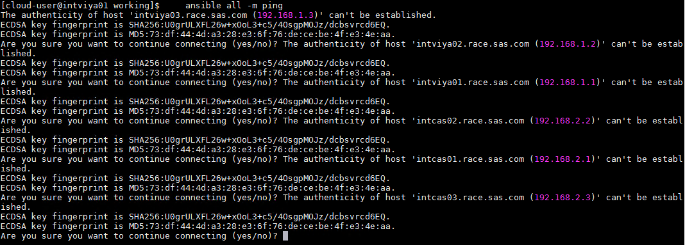
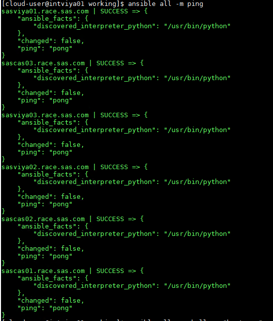
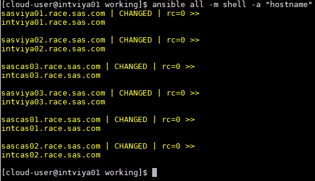

# Configuring Ansible to target the servers

* [Status](#status)
* [Creating an Ansible configuration](#creating-an-ansible-configuration)
* [Testing that Ansible is properly configured](#testing-that-ansible-is-properly-configured)

## Status

* The Ansible Controller has been installed on SASVIYA01
* The Ansible Controller has to be able to target the future VA server (SASVIYA01,SASVIYA02, SASCAS01), etc...
* For the Ansible Controller to target a remote machine, we need to be able to SSH
* For the Ansible Controller to target itself, SSH is not required.
* The way the environment was setup will make things "too easy" for you. So there is an optional, harder exercise at the end.

## Creating an Ansible configuration

Enter the commands on SASVIYA01 unless instructed otherwise.

There are 2 files that are very important to Ansible:

* the Ansible Configuration file
* the Ansible Inventory file

Let's create some simple examples.

1. Run the following commands to create a working folder

    ```bash
    cd ~
    mkdir working
    cd working
    ```

1. Create an inventory file. For now, it will be very simple:

    ```bash
    cat << 'EOF' > ./working.inventory.ini
    [sas_all]
    sasviya01 ansible_host=intviya01.race.sas.com
    sasviya02 ansible_host=intviya02.race.sas.com
    sasviya03 ansible_host=intviya03.race.sas.com
    sascas01  ansible_host=intcas01.race.sas.com
    sascas02  ansible_host=intcas02.race.sas.com
    sascas03  ansible_host=intcas03.race.sas.com
    EOF
    ```

1. Create an Ansible config file

    ```bash
    cat << 'EOF' > ./ansible.cfg
    [defaults]
    log_path = ./working.log
    inventory = working.inventory.ini
    host_key_checking = true
    forks = 10
    retry_files_enabled = False
    gathering = smart
    remote_tmp = /tmp/.$USER.ansible/
    EOF
    ```

## Testing that Ansible is properly configured

1. Now that we have our servers in our inventory, let's see if we can "ansible ping" them:

    ```sh
    cd ~/working
    ansible all -m ping
    ```

1. You might see something that looks like the following:

    

1. You need to accept the fingerprint for machines. Type "yes", press enter, then, regardless of what is on the screen, type "yes" again, and press enter again. (Trust me on this). Keep going until you get back to the prompt.

1. Now, we can confirm that all works:

    ```sh
    cd ~/working
    ansible all -m ping
    ansible all -m shell -a "hostname"
    ```

    <!-- ```bash
    ssh-keyscan -H intviya01.race.sas.com >> ~/.ssh/known_hosts
    ssh-keyscan -H intviya02.race.sas.com >> ~/.ssh/known_hosts
    ssh-keyscan -H intviya03.race.sas.com >> ~/.ssh/known_hosts
    ssh-keyscan -H intcas01.race.sas.com >> ~/.ssh/known_hosts
    ssh-keyscan -H intcas02.race.sas.com >> ~/.ssh/known_hosts
    ssh-keyscan -H intcas03.race.sas.com >> ~/.ssh/known_hosts
    ``` -->

1. A successful output looks like:

    

    

1. Confirm that this works as well, confirming that not only ssh, but also sudo works.

    ```sh
    ansible all -m shell -a "id"
    ansible all -m shell -a "sudo -l"
    ansible all -m shell -a "id" -b
    ```

1. A successful output looks like:

    ```log
    [cloud-user@intviya01 working]$ ansible all -m shell -a "id"
    sasviya01.race.sas.com | CHANGED | rc=0 >>
    uid=1000(cloud-user) gid=1000(cloud-user) groups=1000(cloud-user),981(docker) context=unconfined_u:unconfined_r:unconfined_t:s0-s0:c0.c1023

    sasviya03.race.sas.com | CHANGED | rc=0 >>
    uid=1000(cloud-user) gid=1000(cloud-user) groups=1000(cloud-user),981(docker) context=unconfined_u:unconfined_r:unconfined_t:s0-s0:c0.c1023

    sascas03.race.sas.com | CHANGED | rc=0 >>
    uid=1000(cloud-user) gid=1000(cloud-user) groups=1000(cloud-user),981(docker) context=unconfined_u:unconfined_r:unconfined_t:s0-s0:c0.c1023

    sascas02.race.sas.com | CHANGED | rc=0 >>
    uid=1000(cloud-user) gid=1000(cloud-user) groups=1000(cloud-user),981(docker) context=unconfined_u:unconfined_r:unconfined_t:s0-s0:c0.c1023

    sasviya02.race.sas.com | CHANGED | rc=0 >>
    uid=1000(cloud-user) gid=1000(cloud-user) groups=1000(cloud-user),981(docker) context=unconfined_u:unconfined_r:unconfined_t:s0-s0:c0.c1023

    sascas01.race.sas.com | CHANGED | rc=0 >>
    uid=1000(cloud-user) gid=1000(cloud-user) groups=1000(cloud-user),981(docker) context=unconfined_u:unconfined_r:unconfined_t:s0-s0:c0.c1023

    [cloud-user@intviya01 working]$ ansible all -m shell -a "sudo -l"
    [WARNING]: Consider using 'become', 'become_method', and 'become_user' rather than running sudo

    sasviya01.race.sas.com | CHANGED | rc=0 >>
    Matching Defaults entries for cloud-user on intviya01:
        !visiblepw, always_set_home, match_group_by_gid, always_query_group_plugin, env_reset, env_keep="COLORS DISPLAY HOSTNAME HISTSIZE KDEDIR LS_COLORS", env_keep+="MAIL PS1 PS2 QTDIR USERNAME LANG LC_ADDRESS LC_CTYPE", env_keep+="LC_COLLATE LC_IDENTIFICATION LC_MEASUREMENT LC_MESSAGES", env_keep+="LC_MONETARY LC_NAME LC_NUMERIC LC_PAPER LC_TELEPHONE", env_keep+="LC_TIME LC_ALL LANGUAGE LINGUAS _XKB_CHARSET XAUTHORITY", secure_path=/sbin\:/bin\:/usr/sbin\:/usr/bin

    User cloud-user may run the following commands on intviya01:
        (ALL) NOPASSWD: ALL

    sascas03.race.sas.com | CHANGED | rc=0 >>
    Matching Defaults entries for cloud-user on intcas03:
        !visiblepw, always_set_home, match_group_by_gid, always_query_group_plugin, env_reset, env_keep="COLORS DISPLAY HOSTNAME HISTSIZE KDEDIR LS_COLORS", env_keep+="MAIL PS1 PS2 QTDIR USERNAME LANG LC_ADDRESS LC_CTYPE", env_keep+="LC_COLLATE LC_IDENTIFICATION LC_MEASUREMENT LC_MESSAGES", env_keep+="LC_MONETARY LC_NAME LC_NUMERIC LC_PAPER LC_TELEPHONE", env_keep+="LC_TIME LC_ALL LANGUAGE LINGUAS _XKB_CHARSET XAUTHORITY", secure_path=/sbin\:/bin\:/usr/sbin\:/usr/bin

    User cloud-user may run the following commands on intcas03:
        (ALL) NOPASSWD: ALL

    sasviya03.race.sas.com | CHANGED | rc=0 >>
    Matching Defaults entries for cloud-user on intviya03:
        !visiblepw, always_set_home, match_group_by_gid, always_query_group_plugin, env_reset, env_keep="COLORS DISPLAY HOSTNAME HISTSIZE KDEDIR LS_COLORS", env_keep+="MAIL PS1 PS2 QTDIR USERNAME LANG LC_ADDRESS LC_CTYPE", env_keep+="LC_COLLATE LC_IDENTIFICATION LC_MEASUREMENT LC_MESSAGES", env_keep+="LC_MONETARY LC_NAME LC_NUMERIC LC_PAPER LC_TELEPHONE", env_keep+="LC_TIME LC_ALL LANGUAGE LINGUAS _XKB_CHARSET XAUTHORITY", secure_path=/sbin\:/bin\:/usr/sbin\:/usr/bin

    User cloud-user may run the following commands on intviya03:
        (ALL) NOPASSWD: ALL

    sascas02.race.sas.com | CHANGED | rc=0 >>
    Matching Defaults entries for cloud-user on intcas02:
        !visiblepw, always_set_home, match_group_by_gid, always_query_group_plugin, env_reset, env_keep="COLORS DISPLAY HOSTNAME HISTSIZE KDEDIR LS_COLORS", env_keep+="MAIL PS1 PS2 QTDIR USERNAME LANG LC_ADDRESS LC_CTYPE", env_keep+="LC_COLLATE LC_IDENTIFICATION LC_MEASUREMENT LC_MESSAGES", env_keep+="LC_MONETARY LC_NAME LC_NUMERIC LC_PAPER LC_TELEPHONE", env_keep+="LC_TIME LC_ALL LANGUAGE LINGUAS _XKB_CHARSET XAUTHORITY", secure_path=/sbin\:/bin\:/usr/sbin\:/usr/bin

    User cloud-user may run the following commands on intcas02:
        (ALL) NOPASSWD: ALL

    sascas01.race.sas.com | CHANGED | rc=0 >>
    Matching Defaults entries for cloud-user on intcas01:
        !visiblepw, always_set_home, match_group_by_gid, always_query_group_plugin, env_reset, env_keep="COLORS DISPLAY HOSTNAME HISTSIZE KDEDIR LS_COLORS", env_keep+="MAIL PS1 PS2 QTDIR USERNAME LANG LC_ADDRESS LC_CTYPE", env_keep+="LC_COLLATE LC_IDENTIFICATION LC_MEASUREMENT LC_MESSAGES", env_keep+="LC_MONETARY LC_NAME LC_NUMERIC LC_PAPER LC_TELEPHONE", env_keep+="LC_TIME LC_ALL LANGUAGE LINGUAS _XKB_CHARSET XAUTHORITY", secure_path=/sbin\:/bin\:/usr/sbin\:/usr/bin

    User cloud-user may run the following commands on intcas01:
        (ALL) NOPASSWD: ALL

    sasviya02.race.sas.com | CHANGED | rc=0 >>
    Matching Defaults entries for cloud-user on intviya02:
        !visiblepw, always_set_home, match_group_by_gid, always_query_group_plugin, env_reset, env_keep="COLORS DISPLAY HOSTNAME HISTSIZE KDEDIR LS_COLORS", env_keep+="MAIL PS1 PS2 QTDIR USERNAME LANG LC_ADDRESS LC_CTYPE", env_keep+="LC_COLLATE LC_IDENTIFICATION LC_MEASUREMENT LC_MESSAGES", env_keep+="LC_MONETARY LC_NAME LC_NUMERIC LC_PAPER LC_TELEPHONE", env_keep+="LC_TIME LC_ALL LANGUAGE LINGUAS _XKB_CHARSET XAUTHORITY", secure_path=/sbin\:/bin\:/usr/sbin\:/usr/bin

    User cloud-user may run the following commands on intviya02:
        (ALL) NOPASSWD: ALL

    [cloud-user@intviya01 working]$ ansible all -m shell -a "id" -b
    sasviya01.race.sas.com | CHANGED | rc=0 >>
    uid=0(root) gid=0(root) groups=0(root) context=unconfined_u:unconfined_r:unconfined_t:s0-s0:c0.c1023

    sasviya03.race.sas.com | CHANGED | rc=0 >>
    uid=0(root) gid=0(root) groups=0(root) context=unconfined_u:unconfined_r:unconfined_t:s0-s0:c0.c1023

    sascas03.race.sas.com | CHANGED | rc=0 >>
    uid=0(root) gid=0(root) groups=0(root) context=unconfined_u:unconfined_r:unconfined_t:s0-s0:c0.c1023

    sasviya02.race.sas.com | CHANGED | rc=0 >>
    uid=0(root) gid=0(root) groups=0(root) context=unconfined_u:unconfined_r:unconfined_t:s0-s0:c0.c1023

    sascas02.race.sas.com | CHANGED | rc=0 >>
    uid=0(root) gid=0(root) groups=0(root) context=unconfined_u:unconfined_r:unconfined_t:s0-s0:c0.c1023

    sascas01.race.sas.com | CHANGED | rc=0 >>
    uid=0(root) gid=0(root) groups=0(root) context=unconfined_u:unconfined_r:unconfined_t:s0-s0:c0.c1023
    ```

<!-- ## Optional: install ARA

Now that we are sure that Ansible if working nicely, it is a good time to install ARA: <http://ara.readthedocs.io/en/latest/faq.html#what-is-ara>.

* If you want to have a better view on what Ansible is doing, follow the instructions to install ARA, in section: 27.3-Setup ARA for the playbook run analysis.

    ```sh
    sudo pip install cliff==2.11
    sudo pip install 'ara==0.14.6'

    #only once!
    cat << 'EOF' >> ~/working/ansible.cfg
    # For ARA to work
    callback_plugins=/usr/lib/python2.7/site-packages/ara/plugins/callbacks
    action_plugins=/usr/lib/python2.7/site-packages/ara/plugins/actions
    library=/usr/lib/python2.7/site-packages/ara/plugins/modules
    EOF
    ```

Notes:

* The added lines in ansible.cfg for ARA might need to be placed in the [default] section.
* There is a bug with ARA 0.15 that makes the default log file (./deployment.log) empty. Therefore, you should stick to ARA 0.14.6 for now.
-->
