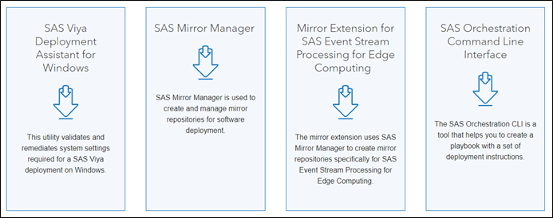
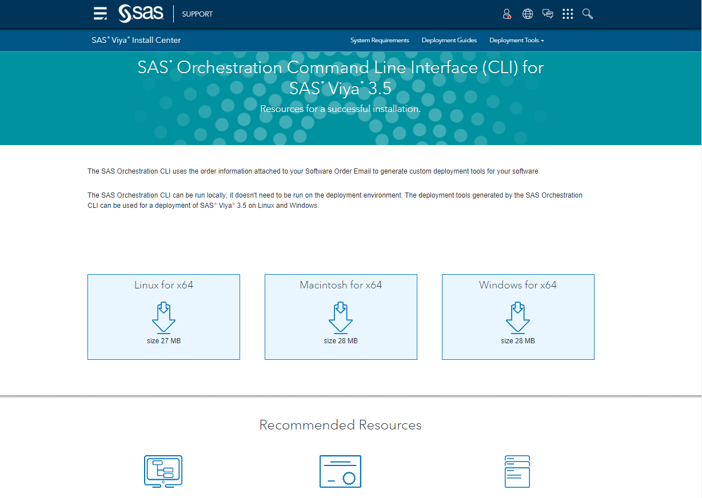
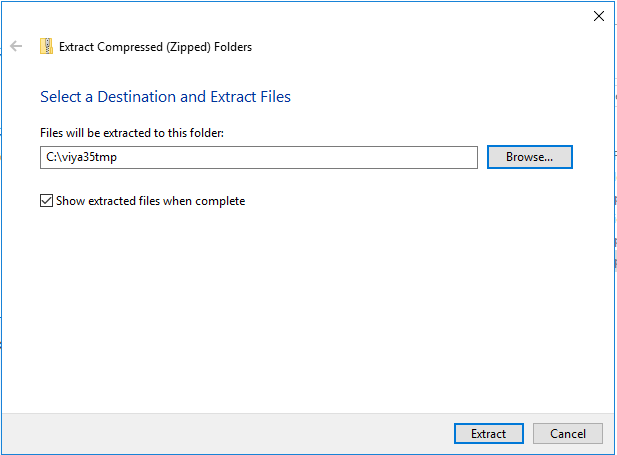
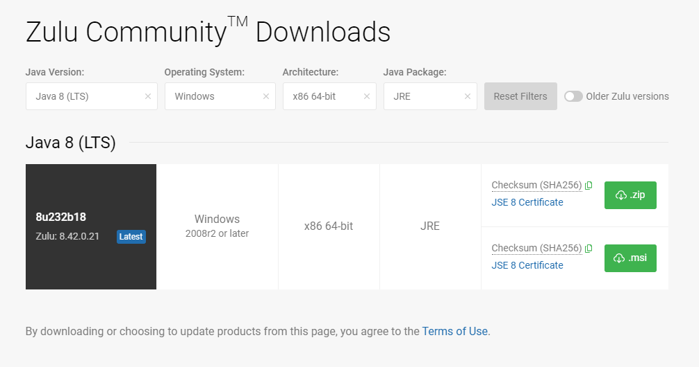
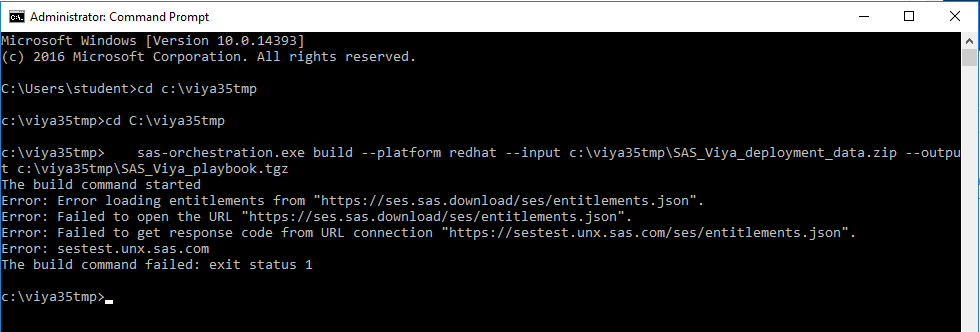
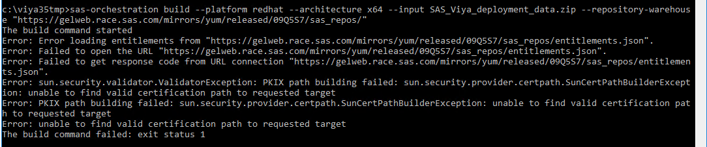
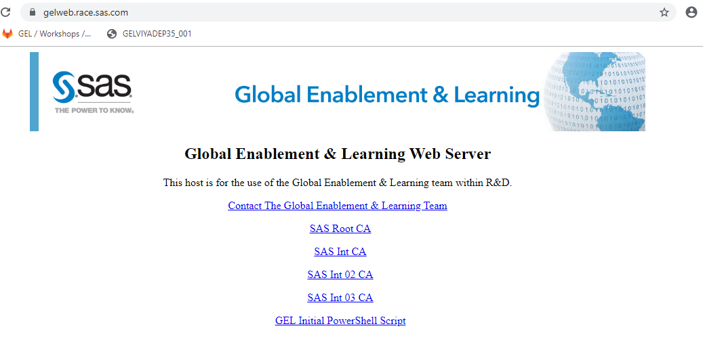
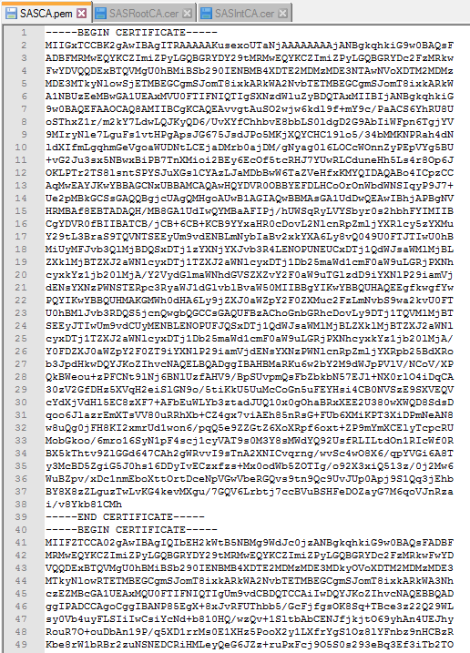
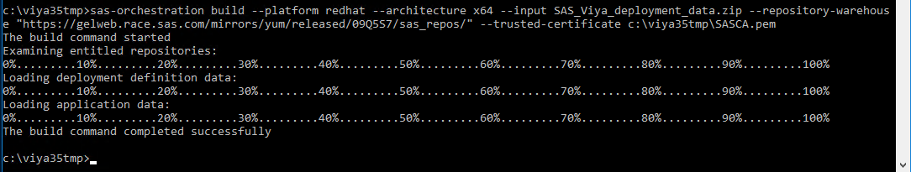
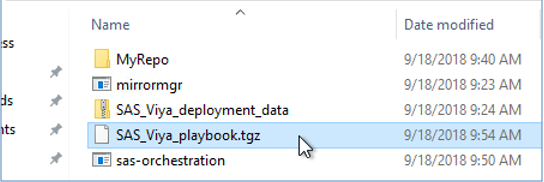

# Building your deployment playbook

* [Introduction](#introduction)
* [Download the Deployment Data zip file](#download-the-deployment-data-zip-file)
* [Installing the SAS Orchestration Package builder on your workstation](#installing-the-sas-orchestration-package-builder-on-your-workstation)
* [Build your playbook](#build-your-playbook)
* [Fast track: build you playbook on the linux host](#fast-track-build-you-playbook-on-the-linux-host)

## Introduction

Since the release of Viya 3.3, you receive attached to your Software Order Email a file called SAS_Viya_deployment_data.zip. We will call this file the "Deployment Data zip file".

You need to use a tool I like to call the "SAS Orchestration Package Builder" to create a playbook from the attached file.
(The truth is that the tool is officially named "SAS Orchestration Command Line Interface", which I find slightly confusing, because it does not orchestrate anything, it builds an orchestration package.)

First, execute these steps on the Windows Client Machine provided as part of this workshop.

1. On the Windows machine of your collection,
1. Open a Windows/DOS command prompt
1. Type or copy/paste the following, to create a temp working directory:

    ```sh
    mkdir c:\viya35tmp
    cd c:\viya35tmp
    ```

## Download the Deployment Data zip file

1. To use the Orchestration CLI, we will need a valid order.
To make it easier, rather than using the order you created, you will use an order that is already loaded up on our GELWEB server.

1. Using Chrome, download the Deployment Data zip file available at this URL: [SAS_Viya_deployment_data.zip](https://gelweb.race.sas.com/mirrors/yum/released/09QBTW/SAS_Viya_deployment_data.zip)

1. Clicking the link above will make Chrome download the file, and it will end up in your "Downloads" directory.

1. Move it (the .zip file itself, not its content) in the previously created c:\viya35tmp folder.

## Installing the SAS Orchestration Package builder on your workstation

1. In your web browser, open this URL: [Deployment Tools](http://support.sas.com/content/support/en/documentation/install-center/viya/deployment-tools/35.html)

    

1. Click on "SAS Orchestration Command Line interface"

    

1. Download the appropriate file for the OS of your workstation (for Windows it will be a zip file).
1. Unzip the content of sas-orchestration.zip file in **C:\viya35tmp**

    

1. Before moving on, we should probably check that you also have a Java Runtime environment:
java -version

    It should return something close to:

    ```log
    c:\viya35tmp>java -version
    java version "1.8.0_181"
    Java(TM) SE Runtime Environment (build 1.8.0_181-b13)
    Java HotSpot(TM) Client VM (build 25.181-b13, mixed mode)
    ```

1. If that is not the case, you might want to get one installed. (However, this is not critical to the rest of the workshop).

* In Google chrome, open the [Azul Zulu Java download page](https://www.azul.com/downloads/zulu-community/?&version=java-8-lts&os=&os=windows&architecture=x86-64-bit&package=jre)

    

* Click on the ".msi" green button, download it, run it (accept the default choices) to install the JRE.
* Reopen the DOS CMD windows and check if java is now available (java -version).

    ```sh
    c:\viya35tmp>java -version
    openjdk version "1.8.0_232"
    OpenJDK Runtime Environment (Zulu 8.42.0.21-CA-win64) (build 1.8.0_232-b18)
    OpenJDK 64-Bit Server VM (Zulu 8.42.0.21-CA-win64) (build 25.232-b18, mixed mode)
    ```

## Build your playbook

In this exercise, you will use the deployment data file received in the Software Order e-mail and build the deployment playbook using the tool you just downloaded.

1. Go back to the command prompt and execute:

    ```sh
    cd C:\viya35tmp
    sas-orchestration.exe build --platform redhat --input c:\viya35tmp\SAS_Viya_deployment_data.zip --output c:\viya35tmp\SAS_Viya_playbook.tgz
    ```

1. This step will fail. You will see something like:

    

1. As mentioned earlier, this is expected.
1. As we have previously done, we will instruct this tool to not attempt to work off of the SAS servers, but instead, we will make it use your newly created and newly served mirror. (At this point, your Mirror has to be fully replicated on the sasviya01 machine. If the mirrormgr and/or rsync commands are still running, you need to wait for them to complete).

    ```sh
    cd C:\viya35tmp
    sas-orchestration.exe build --architecture x64 --platform redhat --input c:\viya35tmp\SAS_Viya_deployment_data.zip --output c:\viya35tmp\SAS_Viya_playbook.tgz --repository-warehouse "https://gelweb.race.sas.com/mirrors/yum/released/09QBTW/sas_repos"
    ```

1. if you run the command again it will fail again

You will see something like:



You need to prepare a certificate so the gelweb server will be trusted by the orchestration CLI.

1. Open the [welcome page](https://gelweb.race.sas.com) of the GELWEB server.

    

Click on "SAS Root CA" and "SAS Int CA". The files will be downloaded in the "Download" folder.
Open the 2 files with Notepad++, create a new file called SASCA.pem then copy and concatenate the content of the 2 other files into it (Root CA first, then intermediary CA, keep the ---BEGIN CERTIFICATE-- and --end CERTIFICATE--- markers, remove any blank line or space at the end of the file).

It should look like this:



**Make sure there is no empty line at the end of the file !**

Save the SASCA.pem file in the c:\viya35tmp folder

1. Now run the command that use our trusted certificate :

    ```sh
    sas-orchestration build --platform redhat --architecture x64 --input SAS_Viya_deployment_data.zip --repository-warehouse "https://gelweb.race.sas.com/mirrors/yum/released/09QBTW/sas_repos/" --trusted-certificate c:\viya35tmp\SASCA.pem
    ```

1. This should produce a much better output, and generate your playbook.

    

1. You should now see the file **"SAS_Viya_Playbook.tgz"** in the current folder:

    

Otherwhise, if the playbook build does not work, simply get the prebuilt one from gelweb:

```shell
wget https://gelweb.race.sas.com/mirrors/yum/released/09QBTW/SAS_Viya_playbook.tgz
```

## Fast track: build you playbook on the linux host

Instead of building the playbook on the windows machine and uploading it on sasviya01, you could also have directly built it on the sasviya01 machine.

**Review the commands below but don't run them.**

1. Get the Deployment Data zip file from (https://gelweb.race.sas.com/mirrors/yum/released/09QBTW/)

    ```bash
    mkdir -p /home/cloud-user/ViyaMirror/
    cd /home/cloud-user/ViyaMirror/
    curl -kO https://gelweb.race.sas.com/mirrors/yum/released/09QBTW/SAS_Viya_deployment_data.zip
    ```

1. Get the orchestration CLI from the web

    ```bash
    cd /home/cloud-user/ViyaMirror/
    # to uncomment after Viya 3.5 GA
    curl -kO "https://support.sas.com/installation/viya/35/sas-orchestration-cli/lax/sas-orchestration-linux.tgz";tar -xvf sas-orchestration-linux.tgz
    ```

1. Run the Orchestration CLI build command

    ```bash
    cd /home/cloud-user/ViyaMirror/
    ./sas-orchestration build --platform redhat --input SAS_Viya_deployment_data.zip --output SAS_Viya_playbook.tgz   --repository-warehouse https://gelweb.race.sas.com/mirrors/yum/released/09QBTW/sas_repos/
    ```
