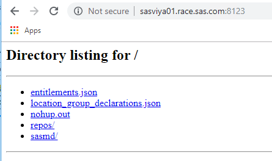

# Mirror creation

* [Goals](#goals)
* [Setting up Mirror Manager](#setting-up-mirror-manager)
* [Running mirrormgr](#running-mirrormgr)
* [Uploading the mirror on the sasviya01 server](#uploading-the-mirror-on-the-sasviya01-server)
* [fast-track : Mirror creation on the linux host](#fast-track--mirror-creation-on-the-linux-host)
* [Serving the mirror](#serving-the-mirror)

Since Viya 3.4, a command-line utility, called "SAS Mirror Manager" provides the functionality to build a mirror repository with SAS packages corresponding to a specific order.
You can use this tool from a windows workstation, a linux server or even a Macintosh OS (as long as you have a standard order and the machine has access to Internet).
However, in our lab environment, remember that you are using an Internal Order attached to a SAS Repository hosted on the internal SAS Network and your Windows Client Machine is not on the SAS network. So we will explore alternatives.

In this hands-on,

* We will use the Mirror Manager to create our own packages repository on one of our machine.
* We will then serve this repository through a web server

## Goals

* Experience the mirror manager usage
* Serve the mirror repository through a simple HTTP server.

## Setting up Mirror Manager

1. Open Chrome
1. Download the windows version of the Mirror Manager Command Line utility from the support web site:


    [Mirror Manager](https://support.sas.com/en/documentation/install-center/viya/deployment-tools/35/mirror-manager.html)

    

1. Once you have downloaded the .zip file, uncompress its content (mirrormgr.exe) into the C:\viya35tmp folder. The result should look like:

    

## Running mirrormgr

1. Using the Windows command prompt, create a directory called "MyRepo" in C:\viya35tmp (this is where we will place our Mirror repository)

    ```sh
    cd C:\viya35tmp
    mkdir MyRepo
    ```

1. At this point, your content should look like this:

    ```sh
    dir
    ```

    ```log
    Directory of c:\viya35tmp

    08/11/2018  08:58 AM    <DIR>          .
    08/11/2018  08:58 AM    <DIR>          ..
    08/11/2018  08:07 AM        12,179,968 mirrormgr.exe
    08/11/2018  08:58 AM    <DIR>          MyRepo
    08/11/2018  08:55 AM            15,231 SAS_Viya_deployment_data.zip
                2 File(s)     12,195,199 bytes
                3 Dir(s)  37,000,585,216 bytes free

    ```

1. In the above, dates and sizes might vary.

1. Now we are ready to run the Mirror Manager utility. The normal syntax would be the following. You can try it if you want, but you will get an error:

    ```sh
    cd C:\viya35tmp
    mirrormgr mirror --deployment-data C:\viya35tmp\SAS_Viya_deployment_data.zip --path C:\viya35tmp\MyRepo --platform x64-redhat-linux-6 --latest
    ```

1. If you do, you will see the following error message:

    ```log
    Error: Get https://sestest.unx.sas.com/ses/entitlements.json: dial tcp: lookup sestest.unx.sas.com: no such host
    Usage:
    mirrormgr mirror [flags]
    mirrormgr mirror [command]

    Available Commands:
    diff        Diff the remote and local repository contents
    package     Downloads specific packages

    Flags:
        --cacert string            CA certificate for communicating with upstream repository server (default "$APPDATA\\mirrormgr\\ca.pem")
        --cert string              Certificate for authenticating with upstream repository server (default "$APPDATA\\mirrormgr\\cert.pem")
        --deployment-data string   Deployment data archive
    -h, --help                     help for mirror
        --httpdebug                Turn on debugging of http requests to log file
    -k, --insecure                 disable TLS certificate validation
        --latest                   If set, only mirror latest versions of content
        --no-verify                If set, skip verification steps during download
    -p, --path string              Path where repositories will be downloaded (default "$USERPROFILE\\sas_repos")
        --platform string          Filter repositories to mirror by platform (e.g. x64-redhat-linux-6)
        --remove-old               If set with latest, any older packages will be removed from the local mirror.
    -r, --repo strings             List of repositories to mirror, if not specified all repositories will be mirrored
    -t, --type string              Mirror repositories of this type (yum or apt)
        --url string               Base URL of upstream repositories (default "https://ses.sas.download/ses")
        --workers int              number of download threads to use (default 4)

    Global Flags:
        --config string     Config file location (default "$APPDATA\\mirrormgr\\mirrormgr.yaml")
    -d, --debug             Turn on debug level logging
        --log-file string   Log file location (default "$LOCALAPPDATA\\mirrormgr\\mirrormgr.log")
    -v, --version           Print version information

    Use "mirrormgr mirror [command] --help" for more information about a command.

    Get https://sestest.unx.sas.com/ses/entitlements.json: dial tcp: lookup sestest.unx.sas.com: no such host
    ```

1. That is because mirrormgr tried to reach SAS directly, and that was not possible.

1. Instead, we will add some commands to tell Mirrormgr to use the GELWEB mirror instead of SAS's.
This command will take some time (10-25 minutes) to complete. Keep reading the instructions while it does.

    ```sh
    cd C:\viya35tmp
    mirrormgr mirror --deployment-data C:\viya35tmp\SAS_Viya_deployment_data.zip --path C:\viya35tmp\MyRepo --platform x64-redhat-linux-6 --latest  --insecure --url "https://gelweb.race.sas.com/mirrors/yum/released/09QBTW/sas_repos"
    ```

1. Come back to your DOS CMD windows, you should see that the mirroring operation has started:

    

1. Continue with the instructions in this document while your mirror is being created. Eventually, you should see:

    

## Uploading the mirror on the sasviya01 server

We now (or soon will) have around 11GB of RPM files on the Windows machine. We need to get that uploaded to one of the Linux machines, to be able to serve it easily.

There are various ways to achieve that.

In this workshop, we choose to use the built-in rsync capabilities of MobaXterm:

1. Open a new local session in MobaXterm, by clicking one of these 2 buttons.

    

1. in the terminal, move to the location of your repository, and confirm you can see the file:

    ```sh
    cd  /drives/c/viya35tmp/myrepo/
    ls -al
    ```

1. You should see (if the download has finished):

    ```log
    total 20
    drwxrwx---    1 Administ UsersGrp         0 Oct 18 04:12 .
    drwxrwx---    1 Administ UsersGrp         0 Oct 18 04:05 ..
    -rwxr-x---    1 Administ UsersGrp      2025 Oct 18 04:09 entitlements.json
    -rwxr-x---    1 Administ UsersGrp     26219 Oct 18 04:09 location_group_declarations.json
    drwxrwx---    1 Administ UsersGrp         0 Oct 18 04:09 repos
    drwxrwx---    1 Administ UsersGrp         0 Oct 18 04:12 sasmd
    ```

1. Now, we can create a directory on sasviya01 to receive the data:

    ```sh
    ssh cloud-user@sasviya01.race.sas.com "mkdir -p /home/cloud-user/ViyaMirror/ ; ls -al /home/cloud-user"
    ```

1. You might be prompted for the password for cloud-user. If so, it is simply lnxsas (LNXSAS, in lowercase)

1. Now that the remote directory is created, we can use rsync to upload the content to it. Note that at this point, the content of your mirror on the windows machine might not be fully downloaded. That does not matter, as RSYNC will upload what is there, and can be re-executed multiple times to bring the remote machine up to date.

    ```sh
    rsync -e "ssh"  -avz . cloud-user@sasviya01.race.sas.com:/home/cloud-user/ViyaMirror/
    ```

1. In all, the upload should take about 20 to 25 minutes. The output will be quite large, showing all the files that were uploaded.

    

1. Once the download with mirrormgr is finalized, you have to re-run the same command one last time to make sure all the files are updated. You should see:

    

## fast-track : Mirror creation on the linux host

Instead of creating the mirror on the windows machine and uploading it on sasviya01, you could also have directly created it on the sasviya01 machine.

**Review the commands below but don't run them.**

1. Get the Deployment Data zip file from (https://gelweb.race.sas.com/mirrors/yum/released/09QBTW/)

    ```bash
    mkdir -p /home/cloud-user/ViyaMirror/
    cd /home/cloud-user/ViyaMirror/
    curl -kO https://gelweb.race.sas.com/mirrors/yum/released/09QBTW/SAS_Viya_deployment_data.zip
    ```

1. Get the mirror manager from the web

    ```bash
    cd /home/cloud-user/ViyaMirror/
    curl -kO "https://support.sas.com/installation/viya/35/sas-mirror-manager/lax/mirrormgr-linux.tgz"
    tar -xvf mirrormgr-linux.tgz
    ```

1. Run the mirror manager build command

    ```bash
    cd /home/cloud-user/ViyaMirror/
    ./mirrormgr mirror \
        --deployment-data ./SAS_Viya_deployment_data.zip \
        --path /home/cloud-user/ViyaMirror/ \
        --platform x64-redhat-linux-6 \
        --latest --workers 10 \
        --insecure --url "https://gelweb.race.sas.com/mirrors/yum/released/09QBTW/sas_repos"
    ```

## Serving the mirror

Currently, the mirror is only on one out of the 6 linux machines. For that machine to share it with the others, there are multiple methods:

1. copy it everywhere
1. NFS-Mount it everywhere
1. Serve it over http or https

In this workshop, we will choose the HTTP option. Instead of deploying a real web server, like Apache or NginX, we'll simply use python to serve the content of the folder.

1. Using MobaXterm, log on to sasviya01 as cloud-user.
1. We could use the python simple http server:

    ```bash
    #Do not run this
    #python -m SimpleHTTPServer 8123 &
    ```

1. But it's better to install and use a multi-threaded version called "ComplexHTTPServer"

1. Install ComplexHTTPServer with pip

    ```bash
    # install ComplexHTTPServer
    sudo pip install ComplexHTTPServer
    ```

1. Go to the Mirror folder and start the server:

    ```bash
    cd ~/ViyaMirror/
    nohup python -m ComplexHTTPServer 8123 > /dev/null 2>/dev/null  &
    ```

1. You will see the following message:

    ```log
    [cloud-user@intviya01 ViyaMirror]$ sudo pip install ComplexHTTPServer
    Collecting ComplexHTTPServer
    Downloading https://files.pythonhosted.org/packages/49/ce/06734d3eb65427de3ba25b729d2f4a4bb5d3862cd6adb2be546e13507816/ComplexHTTPServer-0.3.tar.gz
    Installing collected packages: ComplexHTTPServer
    Running setup.py install for ComplexHTTPServer ... done
    Successfully installed ComplexHTTPServer-0.3
    You are using pip version 8.1.2, however version 19.3 is available.
    You should consider upgrading via the 'pip install --upgrade pip' command.
    [cloud-user@intviya01 ~]$ cd ~/ViyaMirror/
    [cloud-user@intviya01 ViyaMirror]$ nohup python -m ComplexHTTPServer 8123 &
    [1] 25698
    [cloud-user@intviya01 ViyaMirror]$ nohup: ignoring input and appending output to 'nohup.out'
    ```

1. Now, the content of the mirror folder is being served. To confirm it is the case, open Chrome, and navigate to: [http://sasviya01.race.sas.com:8123/](http://sasviya01.race.sas.com:8123/)
You should see a list of folders and files.

    
