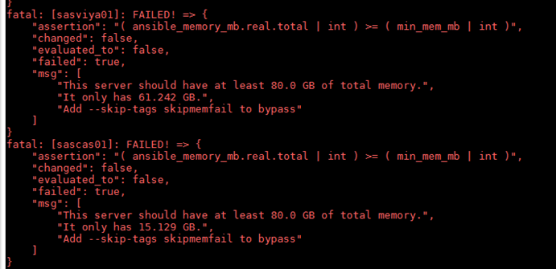

# Performing the pre requisites

* [Performing the pre requisites](#performing-the-pre-requisites)
  * [Manual pre-reqs](#manual-pre-reqs)
  * [Automatic pre-reqs](#automatic-pre-reqs)
  * [Disable SELinux](#disable-selinux)

Pre-requisites are key to a successful deployment. And although they are the responsibility of the customer, SAS Consultants will often have to at least verify them, answer questions, and often, guide the customers.

Pre-requisites are found in the official deployment guide, which will always be the "source of the truth".

[Deployment Guide](http://support.sas.com/documentation/onlinedoc/viya/index.html)

Every pre-req is documented in the deployment guide, and customers should be pointed to that document whenever there are questions about what needs to be done.

It is the customer's responsibility to perform all pre-reqs.

Wise consultants will "trust but verify" that all pre-reqs have been adequately performed.

## Manual pre-reqs

If the customer is performing the pre-req’s, it’s their choice to perform them manually or automatically based on the product documentation.

## Automatic pre-reqs

Because pre-reqs are both tedious and critical, having an automated way of verifying and performing them would be a very useful feature to have. That feature is not fully included in the Viya deployment playbook.

However, some consultants have pooled their time and energy to transcribe the documentation's pre-reqs into a set of Ansible Playbooks to add that feature.

These playbooks are now part of Viya-ARK, the Viya Infrastructure Resource Kit and is available on GitHub, for all to use.

[Viya-ARK](https://github.com/sassoftware/viya-ark)


[Pre-Install Playbook](https://github.com/sassoftware/viya-ark/tree/master/playbooks/pre-install-playbook)

Please read the documentation for the pre-install playbook.

[Pre-Install README](https://github.com/sassoftware/viya-ark/blob/master/playbooks/pre-install-playbook/README.md)

Ok, now, to use the Viya -ARK pre-install playbook:
The instructions are as follows:

1. Make sure you are connected to the Ansible Controller (SASVIYA01)

1. Use the following command to make sure that git is installed on the Ansible Controller

    ```bash
    ansible localhost -m yum -a "name=git state=present" -b
    ```

1. We have just made ansible install the Git package onto the controller. We could have done "sudo yum install git -y", but what's the fun in that?
For good measure, and to showcase Ansible's features, let's execute the same command again:

    ```bash
    ansible localhost -m yum -a "name=git state=present" -b
    ```

1. Notice how different the output is the second time around?
1. We will now Clone the Viya-ARK git repository.

    ```bash
    # Use VIYA-ARK
    mkdir -p ~/working
    cd ~/working
    GIT_REPO=https://github.com/sassoftware/viya-ark.git
    #BRANCH_TO_USE=Viya34-ark-1.7
    BRANCH_TO_USE=Viya35-ark-1.0
    git clone $GIT_REPO --branch $BRANCH_TO_USE --depth 1
    ```

1. Before running the playbook, let's look at the default values of the variables that come with it:

    ```sh
    less  viya-ark/playbooks/pre-install-playbook/roles/viya-ark.preinstall/defaults/main.yml
    ```

1. We are not going to change any of those values YET. Press "q" to exit.
1. To get a feel for what a playbook WOULD do, it's good to start by listing its tasks (ignore the warnings):

    ```bash
    ansible-playbook viya-ark/playbooks/pre-install-playbook/viya_pre_install_playbook.yml --list-tasks
    ```

1. Read the list, to get an idea for how much work this playbook is saving you (and your customer) from. ;-)
1. Now that the VIYA-ARK pre-req playbook is on the ansible controller, we can run it.

    ```sh
    cd ~/working
    ansible-playbook viya-ark/playbooks/pre-install-playbook/viya_pre_install_playbook.yml --check
    ```

1. You will likely encounter an error early on:

    

1. To overcome this issue, you have 2 choices:

   * either:

    ```sh
    ansible-playbook viya-ark/playbooks/pre-install-playbook/viya_pre_install_playbook.yml --check --skip-tags skipmemfail
    ```

   * or:

    ```sh
    ansible-playbook viya-ark/playbooks/pre-install-playbook/viya_pre_install_playbook.yml --check -e 'min_mem_mb=10000'
    ```

1. You will encounter many more errors. Eventually, your command will possibly be:

    ```sh
    cd ~/working
    ansible-playbook viya-ark/playbooks/pre-install-playbook/viya_pre_install_playbook.yml \
    --skip-tags skipmemfail,skipcoresfail,skipstoragefail,skipnicssfail,bandwidth \
    -e 'yum_cache_yn=1' \
    -e 'use_pause=no' \
    -e '{"custom_group_list": { "group": "sas" , "gid":"10001" } }' \
    -e '{"custom_user_list": [ { "name": "cas" , "uid":"10002", "group":"sas" , "groups":"sas" } , { "name": "sas" , "uid":"10001", "group":"sas" , "groups":"sas" } ] }' \
    --check
    ```

1. But you still have the --check in the command, it's not actually changing anything.

## Disable SELinux

The Viya ARK 3.5 comes with a change on the way to handle SELinux security.
In previous version, the pre-installation playbook would set the SELinux to "permissive" to allow a successful deployment.
In the new 3.5 version, if the mode is set to "enforcing", the pre-install playbook will fail and a message directing the user to take the necessary actions will be given.

See the "SELinux Configuration" section in the Viya ARK [README](https://github.com/sassoftware/viya-ark/blob/master/playbooks/pre-install-playbook/README.md) for more details.

So we can either set SELinux to permissive manually or elicit the SAS Viya 3.4 behavior by passing in extra parameter -e viya_version=3.4 (and limiting the scope to selinux_config task)

1. Run this command to do so:

    ```bash
    cd ~/working
    ansible-playbook viya-ark/playbooks/pre-install-playbook/viya_pre_install_playbook.yml \
    -e 'use_pause=no' \
    --tags selinux_config \
    -e 'viya_version=3.4'
    ```

1. Now we can run the Viya ARK 3.5 pre-installation playbook without the --check parameter.

    ```bash
    cd ~/working
    ansible-playbook viya-ark/playbooks/pre-install-playbook/viya_pre_install_playbook.yml \
    --skip-tags skipmemfail,skipcoresfail,skipstoragefail,skipnicssfail,bandwidth \
    -e 'yum_cache_yn=1' \
    -e 'use_pause=no' \
    -e '{"custom_group_list": { "group": "sas" , "gid":"10001" } }' \
    -e '{"custom_user_list": [ { "name": "cas" , "uid":"10002", "group":"sas" , "groups":"sas" } , { "name": "sas" , "uid":"10001", "group":"sas" , "groups":"sas" } ] }'
    ```

1. Once it's finished running, execute it one more time. If this playbook was written to be efficient, the second time around, all tasks should be OK and none should be changed.