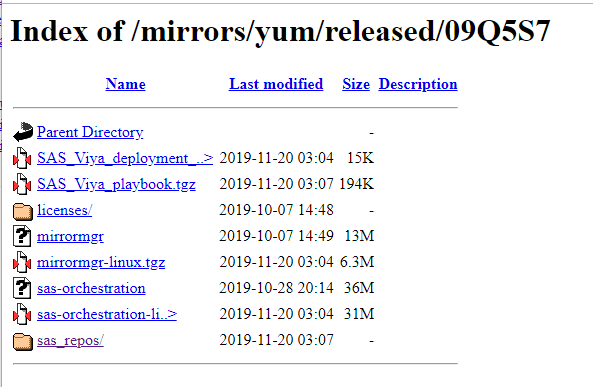
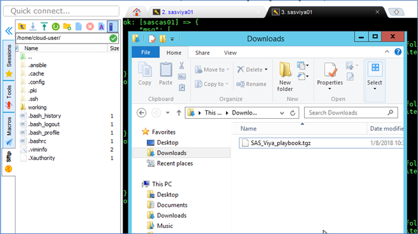

# Playbook upload and prep

* [Getting the generated playbook to Ansible Controller](#getting-the-generated-playbook-to-ansible-controller)
* [Fast CLI way of getting pre-built playbook](#fast-cli-way-of-getting-pre-built-playbook)
* [Untar the playbook and backup important files](#untar-the-playbook-and-backup-important-files)
* [Make the ansible.cfg file updateable](#make-the-ansiblecfg-file-updateable)
* [Copy the sitedefault.yml in place](#copy-the-sitedefaultyml-in-place)
* [Copy the Viya-Ark services management scripts](#copy-the-viya-ark-services-management-scripts)
* [Update the license file](#update-the-license-file)

## Getting the generated playbook to Ansible Controller

At this stage, you would have normally used the playbook that was generated in the earlier steps.

However, if you skip the playbook build exercise, you can click on the URL below to get it:

[Download generated playbook from gelweb](https://gelweb.race.sas.com/mirrors/yum/released/09QBTW/SAS_Viya_playbook.tgz)

Make sure to download this file from the Windows client provided as part of your environment. Not from your own workstation.



Now, you can use drag and drop to upload the Viya Playbook onto your Ansible Controller, SASVIYA01. Simply drop it in the home directory of "cloud-user".



## Fast CLI way of getting pre-built playbook

Another solution is to download the playbook directly to the Ansible Controller from the gelweb server.

* Run the command below to do it :

    ```bash
    cd ~
    curl -o ~/SAS_Viya_playbook.tgz --insecure https://gelweb.race.sas.com/mirrors/yum/released/09QBTW/SAS_Viya_playbook.tgz
    ```

## Untar the playbook and backup important files

* These commands will untar the playbook, and make a backup of some important files.

    ```bash
    cd ~

    # extract the Viya playbook
    tar xvf SAS_Viya_playbook.tgz

    # list the content of the Viya deployment playbook
    cd sas_viya_playbook
    ls -al

    #backup vars.yml and inventory.
    cp vars.yml vars.yml.orig
    cp inventory.ini inventory.ini.orig
    ```

## Make the ansible.cfg file updateable

By default, the ansible.cfg is read-only.

* Because we will need to modify it, let's make it writeable.

    ```bash
    cd ~/sas_viya_playbook
    chmod u+w ansible.cfg
    ```

## Copy the sitedefault.yml in place

Entering the LDAP information by hand, especially for OpenLDAP is time-consuming and boring. So instead, we will drop the sitedefault.yml in its desired location so it all gets added to the environment.

* Run the following code:

    ```bash
    # copy the sitedefault.yml file to pre-configure the authentication
    cp ~/working/homegrown/openldap/sitedefault.yml  ~/sas_viya_playbook/roles/consul/files/
    ```

## Copy the Viya-Ark services management scripts

We will use the "SAS Viya Multi-Machine Services Utilities Playbooks"  (included in SAS Viya ARK) to stop and start the Viya services.

These scripts are available on [github](https://github.com/sassoftware/viya-ark/tree/master/playbooks/viya-mmsu)

* It will make things easier if it is located inside the playbook, so let's copy them :

    ```bash
    cp -R ~/working/viya-ark/ ~/sas_viya_playbook
    ```

## Update the license file

As you are using a recent order, there is nothing to do here.
