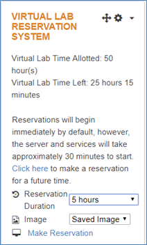

# Split Deployment

* [Split Deployment](#split-deployment)
  * [Deployment Topology](#deployment-topology)
  * [Explaining the Hosts definitions used for this workshop](#explaining-the-hosts-definitions-used-for-this-workshop)
    * [Default Inventory Host definition](#default-inventory-host-definition)
  * [Update the inventory](#update-the-inventory)
    * [Manually](#manually)
    * [Automatically](#automatically)
  * [Configure Network Settings](#configure-network-settings)
  * [Update your ansible.cfg file](#update-your-ansiblecfg-file)
    * [Change inventory](#change-inventory)
    * [Increase forks](#increase-forks)
  * [Update the vars.yml file](#update-the-varsyml-file)
    * [Confirm/change the repository warehouse URL](#confirmchange-the-repository-warehouse-url)
    * [Change deployTarget](#change-deploytarget)
    * [Change the CAS_DISK_CACHE location](#change-the-casdiskcache-location)
    * [Change the SASWORK location](#change-the-saswork-location)
    * [Change SASStudio WorkspaceServer hostname](#change-sasstudio-workspaceserver-hostname)
  * [Kicking off the deployment](#kicking-off-the-deployment)
    * [Tmux](#tmux)
    * [Perform the System assessment](#perform-the-system-assessment)
    * [Launch deployment](#launch-deployment)
    * [Restart deployment if interrupted by image shutdown](#restart-deployment-if-interrupted-by-image-shutdown)

With the given environment, there are different ways in which the software can be deployed.
This is the first of 3 possible deployments.

You can either try the different deployment methods in sequence, or just pick one. If you want to try them one after the other, you must fully uninstall Viya in between each.

## Deployment Topology

As the Architect of this project, I have decided to group the Stateless Services on machine SASViya01, put the Stateful Services on SASViya02, and all SPRE-Using Services on SASViya03. The SASCAS machines will be my CAS Cluster. In table form, it would look like this:

| Server    |    role                           | HostGroup                                                                                                                                                                                                             |
|-----------|-----------------------------------|-----------------------------------------------------------------------------------------------------------------------------------------------------------------------------------------------------------------------|
| sasviya01 |    Stateless services             | AdminServices <br> CASServices  <br> CognitiveComputingServices <br> CommandLine <br> ComputeServices <br>  CoreServices  <br> DataServices  <br> GraphBuilderServices <br>  HomeServices  <br> ReportServices <br>  ReportViewerServices <br>  StudioViya <br>  ThemeServices <br>  configuratn |
| sasviya02 |    Stateful services              | CommandLine <br>  consul <br>  httpproxy <br>  pgpoolc  <br> rabbitmq  <br> sasdatasvrc                                                                                                                                                             |
| sasviya03 |    Foundation and SPRE related    | programming <br>  Operations  <br> ComputeServer  <br> CommandLine                                                                                                                                                                      |
| sascas01  |    CAS Controller                 | sas_casserver_primary  <br> CommandLine                                                                                                                                                                                     |
| sascas02  |    CAS Worker                     | sas_casserver_worker  <br> CommandLine                                                                                                                                                                                      |
| sascas03  |    Nothing                        |                                                                                                                                                                                                                       |                                                                                                                                                                                   |

## Explaining the Hosts definitions used for this workshop

The machines provided as part of this Virtual Lab have been setup in a particular way, which gives each of them multiple IP addresses.

In a nutshell, each machine will have an internal IP address starting with 192.168.1 or 192.168.2 and also an external IP adress starting with something like 10.96.7.

The external IP address allows the access from the outside (a machine that is not one of the running RACE collection).

The internal IP address can only be used for communications between the collection machines and will always remain the same, even if we save the collection and then "re-instanciate" it, but the external IP will likely be different each time we re-instanciate a saved collection.

For the deployment all we need is an IP adress that can be used to communicate from the ansible controller to the other machines, so we will use the internal IP address.

### Default Inventory Host definition

* As we have seen in previous Hands-On, we can simply define the hosts as follows:

    ```log
    sasviya01 ansible_host=intviya01.race.sas.com
    sasviya02 ansible_host=intviya02.race.sas.com
    sasviya03 ansible_host=intviya03.race.sas.com
    sascas01  ansible_host=intcas01.race.sas.com
    sascas02  ansible_host=intcas02.race.sas.com
    ```

But you could also choose to use IP addresses, or any other kind of valid hostname as the entry after ansible_host.

* For example, this too would be valid:

    ```log
    sasviya01 ansible_host=192.168.1.1
    sasviya02 ansible_host=192.168.1.2
    sasviya03 ansible_host=192.168.1.3
    sascas01  ansible_host=192.168.2.1
    sascas02  ansible_host=192.168.2.2
    ```

## Update the inventory

Depending on your style of learning, you can either manually make changes to your inventory, or use the one I provide in the automated step.

### Manually

* You should make a copy of the file "inventory.ini" in the playbook folder.

    ```sh
    cd ~/sas_viya_playbook/
    cp inventory.ini split01.ini
    ```

Now you can update the file based on the content of the table above.

### Automatically

* As a help, or if you are in a rush, you can paste the below to generate an alternative the desired inventory (called split01.ini).

    ```bash
    cat << 'EOF' > ~/sas_viya_playbook/split01.ini
    sasviya01 ansible_host=intviya01.race.sas.com
    sasviya02 ansible_host=intviya02.race.sas.com
    sasviya03 ansible_host=intviya03.race.sas.com
    sascas01 ansible_host=intcas01.race.sas.com
    sascas02 ansible_host=intcas02.race.sas.com

    # The AdminServices host group contains services used to support administrative tasks that have transient load.
    [AdminServices]
    sasviya01

    # The CASServices host group contains services used to interact between the CAS server(s) and the mid-tier services.
    [CASServices]
    sasviya01

    # The CognitiveComputingServices host group contains services for performing common text analytics tasks.
    [CognitiveComputingServices]
    sasviya01

    # The CommandLine host group contains command line interfaces for remote interaction with services.
    # It should include every host in the deployment.
    [CommandLine]
    sasviya03
    sasviya01
    sasviya02
    sascas01
    sascas02

    # The ComputeServer host group contains the Compute Server that executes SAS code on behalf of the Compute Service.
    # It supports more than one host during initial deployment for both single-tenant and multi-tenant deployments.
    # If multiple hosts are configured, home directories must be located on shared storage devices as configured by
    # the customer. Examples of shared storage are a shared directory, CAS, or other accessible location. Failover is
    # not supported. In the event of a failure, a session will be established on a different host, and the user must
    # log on to re-establish state. In a multi-tenant environment, hosts are shared across all tenants. Adding additional
    # hosts to this host group after the initial deployment is not currently supported for multi-tenant deployments.
    [ComputeServer]
    sasviya03

    # The ComputeServices host group contains services for launching and accessing the SAS Compute Server.
    [ComputeServices]
    sasviya01

    # The CoreServices host group contains base-level services providing a common feature set to mid-tier services.
    # SAS Logon is part of this host group.
    [CoreServices]
    sasviya01

    # The DataServices host group contains services that provide data management features.
    [DataServices]
    sasviya01

    # The GraphBuilderServices host group contains services that provide tools to create and edit custom graphs.
    [GraphBuilderServices]
    sasviya01

    # The HomeServices host group contains services that provide SAS Home and its features.
    [HomeServices]
    sasviya01

    # The Operations host group contains services that accumulate metric, log, and notification events from RabbitMQ, then process those into CAS tables which are consumed by the SAS Environment Manager application.
    # The Operations services utilize applications supplied by the programming host group, so specify a target host that
    # is included in the programming host group.
    # The Operations host group does not support multiple hosts at this time. Do not put more than one host in the
    # Operations host group.
    [Operations]
    sasviya03

    # The ReportServices host group contains services that provide report management features.
    [ReportServices]
    sasviya01

    # The ReportViewerServices host group contains services that provide report viewing features.
    [ReportViewerServices]
    sasviya01

    # The StudioViya host group contains services that provide a SAS programming interface.
    [StudioViya]
    sasviya01

    # The ThemeServices host group contains services that provide theme management features.
    [ThemeServices]
    sasviya01

    # The configuratn host group contains the service that manages customizable configuration for the SAS environment.
    [configuratn]
    sasviya01

    # The consul host group contains the Consul server.
    [consul]
    sasviya02

    # The httpproxy host group contains HTTP Proxy Server.
    [httpproxy]
    sasviya02

    # The pgpoolc host group contains PG Pool for High Availability PostgreSQL.
    [pgpoolc]
    sasviya02

    # The programming host group contains SAS Foundation, SAS Studio, SAS Workspace Server, SAS/CONNECT and any SAS/ACCESS engines.
    # It has the same conditions as ComputeServer.
    [programming]
    sasviya03

    # The rabbitmq host group contains Rabbit MQ, a messaging broker.
    # The deployment will take the first entry in this host list as the "primary"
    # machine to initialize the cluster. After that deployment, if you adjust the
    # inventory and place a different entry as the first Rabbit MQ machine, you will
    # run the risk two distinct Rabbit MQ clusters running independently with no
    # knowledge of each other and messages split between the two.
    #
    # A RabbitMQ cluster must have an odd number of machines.
    [rabbitmq]
    sasviya02

    # The sas_casserver_primary host group contains the CAS controller node.
    # The first host in the sas_casserver_primary list is used by the tenant in a single-tenant deployment or by the
    # provider in a multi-tenant deployment. Only one configuration of CAS (including one primary controller and one
    # secondary controller) per tenant is supported. Therefore, if you change the first host in the list, you are
    # changing the primary CAS controller for a single-tenant deployment or, for multi-tenant deployments, you
    # are changing the primary CAS controller for the provider. Any additional hosts in the sas_casserver_primary
    # list are used in a multi-tenant environment. The configuration for those additional hosts (primary controller,
    # secondary controller, or worker) are determined by the tenant-vars.yml file.
    # For more information about the tenant-vars.yml file, see the SAS Viya Administration documentation.
    [sas_casserver_primary]
    sascas01

    # The sas_casserver_secondary host group can be used to create a CAS backup controller node.
    # This is an optional node that can take over for the primary CAS controller node if it fails. It is used only by
    # the tenant in a single-tenant deployment or by the provider in a multi-tenant deployment. Secondary controllers
    # for additional tenants are determined by the tenant-vars.yml file. To support failover for predefined libraries,
    # a shared file system must be available for the primary and secondary controllers. Each CAS cluster can have only
    # one CAS backup controller node.
    # For more information about the shared file system, see the SAS Viya deployment documentation.
    [sas_casserver_secondary]

    # The sas_casserver_worker host group contains CAS worker node.
    # It is used only by the tenant in a single-tenant deployment or by the provider in a multi-tenant deployment. Workers
    # for additional tenants are determined by the tenant-vars.yml file.
    # For more information about the tenant-vars.yml file, see the SAS Viya Administration documentation.
    [sas_casserver_worker]
    sascas02

    # The sasdatasvrc host group contains SAS PostgreSQL.
    [sasdatasvrc]
    sasviya02

    # [sas_all:children] contains each host group used in your SAS deployment. Do not alter its contents.
    # See your deployment guide for more details.
    [sas_all:children]
    AdminServices
    CASServices
    CognitiveComputingServices
    CommandLine
    ComputeServer
    ComputeServices
    CoreServices
    DataServices
    GraphBuilderServices
    HomeServices
    Operations
    ReportServices
    ReportViewerServices
    StudioViya
    ThemeServices
    configuratn
    consul
    httpproxy
    pgpoolc
    programming
    rabbitmq
    sas_casserver_primary
    sas_casserver_secondary
    sas_casserver_worker
    sasdatasvrc
    EOF
    ```

## Configure Network Settings

The machines provided as part of this Virtual Lab have been setup in a particular way, which gives each of them multiple IP addresses.

For example, if you run commands like "hostname -I" or "ifconfig", you will notice that each machine has multiple network interfaces with different IP adresses.

Please keep in mind that this is specific to this workshop. This will very likely vary at your customer site.

Since our servers have more than one IP address each, we must add more information. This is so that Consul can start gracefully, despite the multiple IPs.

In the previous versions of Viya, attributes such as "consul_bind_adapter", "internal_deployment_ipv4_override" or "self_deployment_ipv4_override" were required.

**With SAS Viya 3.5**, a new "network settings configuration" concept, replacing the usage of these attributes in the inventory file.

The idea is, for a multi-NICs machine, to set into a "network configuration file" the __IP__ and __hostname__ that we want to use for SAS Viya internal communications.

For each machine with multiple NICs we need to prepare a "network configuration file" that will have a name based on the machine alias as defined in the inventory file.

* The configuration files needs to exist in a subfolder of the playbook called "host_vars"

    ```sh
    mkdir ~/sas_viya_playbook/host_vars
    ```

    <!-- cheat code for idempotency
    ```bash
    ansible localhost -m file -a "path=~/sas_viya_playbook/host_vars state=directory"
    ```
    -->

We will create 6 different files corresponding to our 6 machines as each of them has multiple network interfaces.

* For each of them, we need to specify the internal IP and hostname that we want the Viya services to use using a format such as :

    ```log
    ---
    network_conf:
      SAS_HOSTNAME: machine1-internal.mycompany.com
      SAS_BIND_ADDR: 192.168.1.23
      SAS_EXTERNAL_HOSTNAME: machine1.race.sas.com
      SAS_EXTERNAL_BIND_ADDR_IF: "eth1"
    ```

* So let's create our own network configuration files:

    ```bash
    cat > ~/sas_viya_playbook/host_vars/sasviya01.yml << EOF
    ---
    network_conf:
      SAS_HOSTNAME: intviya01.race.sas.com
      SAS_BIND_ADDR: 192.168.1.1
      SAS_EXTERNAL_HOSTNAME: sasviya01.race.sas.com
      SAS_EXTERNAL_BIND_ADDR_IF: "eth0"
    EOF

    cat > ~/sas_viya_playbook/host_vars/sasviya02.yml << EOF
    ---
    network_conf:
      SAS_HOSTNAME: intviya02.race.sas.com
      SAS_BIND_ADDR: 192.168.1.2
      SAS_EXTERNAL_HOSTNAME: sasviya02.race.sas.com
      SAS_EXTERNAL_BIND_ADDR_IF: "eth0"
    EOF

    cat > ~/sas_viya_playbook/host_vars/sasviya03.yml << EOF
    ---
    network_conf:
      SAS_HOSTNAME: intviya03.race.sas.com
      SAS_BIND_ADDR: 192.168.1.3
      SAS_EXTERNAL_HOSTNAME: sasviya03.race.sas.com
      SAS_EXTERNAL_BIND_ADDR_IF: "eth0"
    EOF

    cat > ~/sas_viya_playbook/host_vars/sascas01.yml << EOF
    ---
    network_conf:
      SAS_HOSTNAME: intcas01.race.sas.com
      SAS_BIND_ADDR: 192.168.2.1
      SAS_EXTERNAL_HOSTNAME: sascas01.race.sas.com
      SAS_EXTERNAL_BIND_ADDR_IF: "eth0"
    EOF

    cat > ~/sas_viya_playbook/host_vars/sascas02.yml << EOF
    ---
    network_conf:
      SAS_HOSTNAME: intcas02.race.sas.com
      SAS_BIND_ADDR: 192.168.2.2
      SAS_EXTERNAL_HOSTNAME: sascas02.race.sas.com
      SAS_EXTERNAL_BIND_ADDR_IF: "eth0"
    EOF
    ```

**Be careful with the space indentation when you create yaml files !**

## Update your ansible.cfg file

### Change inventory

By default, your ansible.cfg file has a line that says "inventory = inventory.ini". We now need to change it so that it points to the new file: split01.ini.
Make sure that the line "inventory" in ansible.cfg matches with the new inventory file you want to user.

* My file looks like:

    ```sh
    cd ~/sas_viya_playbook/
    cat ansible.cfg
    ```

    ```log
    [defaults]
    remote_tmp = /tmp/.$USER.ansible/
    log_path = ./deployment.log
    retry_files_enabled = False
    roles_path = ./roles
    library = ./library
    inventory = split01.ini
    deprecation_warnings = False
    gathering = smart
    gather_subset = !hardware,network
    ```

If you prefer to copy-paste to get to the same result, you can do the following:

* **this quick command will make the change.you can use a text editor if you prefer**

    ```bash
    cd ~/sas_viya_playbook/
    ansible localhost -m lineinfile -a "dest=ansible.cfg regexp='inventory' line='inventory = split01.ini'" --diff
    ```

### Increase forks

The forks parameter controls how many hosts are configured by Ansible in parallel. By default, the forks parameter in Ansible is a very conservative 5.
This means that only 5 hosts will be configured at the same time. In our deployment we have 6 hosts, that implies that the 6th would be serialized at each step and wait until one of the previous five finishes. To speed up the deployment process, we will increase this parameter to 10.

* **this quick command will make the change.you can use a text editor if you prefer**

    ```bash
    cd ~/sas_viya_playbook/
    ansible localhost -m lineinfile -a "dest=ansible.cfg regexp='forks' line='forks = 10'" --diff
    ```

## Update the vars.yml file

### Confirm/change the repository warehouse URL

In the vars.yml, you have to locate the variable called REPOSITORY_WAREHOUSE, and make sure that the value is accurate and will work.

If you wanted to deploy without a mirror, the value should be:

```log
REPOSITORY_WAREHOUSE: "https://ses.sas.download/"
```

* If instead, you want to use our own mirror, you have to update it to:

    ```log
    REPOSITORY_WAREHOUSE: "http://sasviya01.race.sas.com:8123/"
    ```

* You can do it manually using your favorite text editor or simply run the command below:

    ```bash
    cd ~/sas_viya_playbook
    ansible localhost -m lineinfile -a "dest=vars.yml regexp='REPOSITORY_WAREHOUSE' line='REPOSITORY_WAREHOUSE: \"http://sasviya01.race.sas.com:8123/\"'" --diff
    ```

### Change deployTarget

Because we changed the default nickname (deployTarget), we need to update the vars.yml file as well to reflect that change.

1. Open vars.yml with your favorite text editor
vi vars.yml
1. Locate the text "deployTarget"
1. Replace it with the text "sasviya02" without changing the indentation. The result should look like:

    ```log
    # Multiple invocation definitions
    # The machine reference (with deployTarget as the default) must be enclosed
    # in quotes if it is set to a value that starts with a number.
    INVOCATION_VARIABLES:
      sasviya02:
        pgpoolc:
        - HA_PGPOOL_VIRTUAL_IP: ''
          HA_PGPOOL_WATCHDOG_PORT: ''
          PCP_PORT: '5430'
          PGPOOL_PORT: '5431'
          POOL_NUMBER: '0'
          SANMOUNT: '{{ SAS_CONFIG_ROOT }}/data/sasdatasvrc'
          SERVICE_NAME: postgres
        sasdatasvrc:
        - NODE_NUMBER: '0'
          PG_PORT: '5432'
          SANMOUNT: '{{ SAS_CONFIG_ROOT }}/data/sasdatasvrc'
          SERVICE_NAME: postgres
    ```

* You can also do it automatically if your run the command below:

    ```bash
    cd ~/sas_viya_playbook
    ansible localhost -m lineinfile -a "dest=vars.yml regexp='  deployTarget' line='  sasviya02:'" --diff
    ```

The reason for this change is that the nickname of the machine in the host groups pgpoolc and sasdatasrvc is no longer "deployTarget". It is now "sasviya02". This change in the inventory requires a matching change in the vars.yml.

### Change the CAS_DISK_CACHE location

1. Create specific locations for CAS disk cache on the CAS nodes.

    ```bash
    cd ~/sas_viya_playbook
    ansible sas_casserver_primary,sas_casserver_worker -m file -a "path=/sastmp/cascache/d1 state=directory owner=cas group=sas mode=1777" -b
    ansible sas_casserver_primary,sas_casserver_worker -m file -a "path=/sastmp/cascache/d2 state=directory owner=cas group=sas mode=1777" -b
    ```

_Note : in a real project instead of separated folders you would likely use separate FileSystems with the fastest Storage type as possible._

1. In vars.yml, look for the CAS_CONFIGURATION block.

   * In it, uncomment CAS_DISK_CACHE and enter the list of folders provided when we set up the drives.
   * Note that here, we are entering the names of the folders that exist on the CAS machines. On these, there should only be 2 folders.
   * The result should look like this:

    ```log
    CAS_CONFIGURATION:
      env:
        CAS_DISK_CACHE: '/sastmp/cascache/d1:/sastmp/cascache/d2'
        CAS_CONTROLLER_TEMP: '/sastmp/cascache/d1:/sastmp/cascache/d2'
        #CAS_VIRTUAL_HOST: 'loadbalancer.company.com'
        #CAS_VIRTUAL_PROTO: 'https'
        #CAS_VIRTUAL_PORT: 443
      cfg:
        #gcport: 0
        #httpport: 8777
        #port: 5570
        #colocation: 'none'
        #SERVICESBASEURL: 'https://loadbalancer.company.com'
    ```

* again you can use ansible to do it for you

    ```bash
    # update CASDISK CACHE
    ansible localhost -m lineinfile -a "dest=vars.yml regexp='CAS_DISK_CACHE' line='    CAS_DISK_CACHE: \'/sastmp/cascache/d1:/sastmp/cascache/d2\''" --diff
    # insert CAS_CONTROLLER_TEMP
    ansible localhost -m lineinfile -a "dest=vars.yml insertafter='CAS_DISK_CACHE' line='    CAS_CONTROLLER_TEMP: \'/sastmp/cascache/d1:/sastmp/cascache/d2\''" --diff
    ```

### Change the SASWORK location

* Also, for us to be able to leverage the defined SASWORK location (/sastmp/saswork), we need to create a folder on the "programming" and the "ComputeServer" machines.

    ```bash
    ansible programming,ComputeServer -m file -a "name=/sastmp/saswork state=directory owner=sas group=sas mode=1777" -b
    ```

* Then we have to add the following lines:

    ```log
    # Creates a workspaceserver sasenv_deployment file
    FOUNDATION_CONFIGURATION:
      #1: '# Comment about KEY'
      #2: KEY=value
      1: '#Set SASSWORK for the compute server'
      2: COMPUTESERVER_TMP_PATH=/sastmp/saswork

    # creates a workspace server sasv9_deployment.cfg file
    SASV9_CONFIGURATION:
      1: '/* set SASWORK to the right location */'
      2: 'WORK=/sastmp/saswork'
    ```

* Instead of the manual edit you can use ansible to automate this changes

    ```bash
    # insert SASWORK
    ansible localhost -m lineinfile -a "dest=vars.yml insertafter='SASV9_CONFIGURATION' line='  1: WORK=/sastmp/saswork'" --diff
    # insert COMPUTESERVER WORK
    ansible localhost -m lineinfile -a "dest=vars.yml insertafter='FOUNDATION_CONFIGURATION' line='  1: COMPUTESERVER_TMP_PATH=/sastmp/saswork'" --diff
    # enable SASV9_CONFIGURATION (remove comment sign)
    ansible localhost -m lineinfile -a "dest=vars.yml regexp='SASV9_CONFIGURATION' line='SASV9_CONFIGURATION:'" --diff
    # enable FOUNDATION_CONFIGURATION (remove comment sign)
    ansible localhost -m lineinfile -a "dest=vars.yml regexp='FOUNDATION_CONFIGURATION' line='FOUNDATION_CONFIGURATION:'" --diff
    ```


### Change SASStudio WorkspaceServer hostname

By default, the WorkspaceServer name for SAS Studio (Basic) is "localhost".
In the vars.yml, you have to locate the block STUDIO_CONFIGURATION to see it.

```log
STUDIO_CONFIGURATION:
  init:
    #sasstudio.appserver.port_comment: '# Port that Studio is listening on'
    #sasstudio.appserver.port: 7080
    #sasstudio.appserver.https.port: 7443
    #webdms.workspaceServer.hostName: localhost
    #webdms.workspaceServer.port: 8591
  appserver:
    #1: '# Comment about KEY'
    #2: KEY="value with spaces"
```

It generally makes sense, since we know that SAS Studio (Basic) and the workspace server are both part of the [programming] hostgroup and will land on the same machine.

However, you might remember that when configuring the network settings we set the bind adress to 192.168.x.y for the services running on our machines.
It means that all the services (except the public ones like httpd and CAS for example) will start and bind to an IP adress like 192.168.x.y.

So because of our network settings, the object spawner (deployed on sasviya03) will only listen on the port 8591 to requests sent to the 192.168.1.3 IP address and a request sent to "localhost" (127.0.0.1) will fail to reach the Object spawner service.

To avoid that we need to change the value of webdms.workspaceServer.hostName to the hostname that corresponds to 192.168.1.3 IP Address.

* If you want to be able to use SAS Studio (Basic), change the value of webdms.workspaceServer.hostName as shown below:

    ```log
    # Updates the init_deployment.properties and appserver_deployment.sh
    STUDIO_CONFIGURATION:
      init:
        #sasstudio.appserver.port_comment: '# Port that Studio is listening on'
        #sasstudio.appserver.port: 7080
        #sasstudio.appserver.https.port: 7443
        sas.studio.basicHost: intviya03.race.sas.com
        #webdms.workspaceServer.port: 8591
      appserver:
        #1: '# Comment about KEY'
        #2: KEY="value with spaces"
    ```

Also, you can notice that we use the new variable name **sas.studio.basicHost** as the old name (webdms.workspaceServer.hostName) is deprecated.

* You can do it manually using your favorite text editor or simply run the command below:

    ```bash
    cd ~/sas_viya_playbook
    ansible localhost -m lineinfile -a "dest=vars.yml regexp='    #webdms.workspaceServer.hostName' line='    sas.studio.basicHost: intviya03.race.sas.com'" --diff
    ```

## Kicking off the deployment

### Tmux

(this is optional, but highly recommended)
If your SSH connection was to drop during this time, you'd have to reconnect and kick off the deployment again. Tmux is a little piece of software that helps insure against this possibility.
To start a new tmux session, simply run:

```sh
tmux
```

To exit and close out of the tmux session, simply type:

```sh
exit
```

To detach from the session, type on your keyboard the shortcut key:
(this always confuse people the first time. You have to press "ctrl b" on your keyboard, then lift your hands off the keyboard, and the press the letter d. All tmux commands start with control-b and then some other letter or symbol)

```sh
ctrl b followed by d
```

to list running sessions, run

```sh
tmux ls
```

to re-attach to session 0, run

```sh
tmux a -t 0
```

If you want to insure against accidental disconnection, or to be able to detach and re-attach, make sure to kick off the deployment from inside the tmux session.

### Perform the System assessment

Before running the actual deployment, you can run the system-assessment playbook to potentially detect some issue in advance:
If you are not yet in tmux, you can kick it off:

```sh
tmux
```

and now, within the tmux session, run:

```sh
ansible-playbook system-assessment.yml
```

### Launch deployment

Running this deployment will take around 65 minutes (in my experience)

* Execute:

    ```bash
    cd ~/sas_viya_playbook
    time ansible-playbook site.yml
    ```

If the deployment was successful you should see something like that :

```log
PLAY RECAP ******************************************************************************************************************************
localhost                  : ok=14   changed=1    unreachable=0    failed=0    skipped=10   rescued=0    ignored=0
sascas01                   : ok=256  changed=86   unreachable=0    failed=0    skipped=229  rescued=0    ignored=0
sascas02                   : ok=238  changed=74   unreachable=0    failed=0    skipped=219  rescued=0    ignored=0
sasviya01                  : ok=1115 changed=664  unreachable=0    failed=0    skipped=915  rescued=0    ignored=0
sasviya02                  : ok=302  changed=126  unreachable=0    failed=0    skipped=222  rescued=0    ignored=0
sasviya03                  : ok=310  changed=112  unreachable=0    failed=0    skipped=257  rescued=0    ignored=0


real	61m42.665s
user	11m2.410s
sys	5m45.367s
```

This output shows you the number of task that were run on each host and how many of them has been changing the initial state. You can also see if any of the task has failed. Make sure that the value of failed is equal to **0** for each host.

* Now, as we have a multi-machine you should prevent the services to start automatically at the machine boot on all your hosts.

    ```bash
    cd ~/sas_viya_playbook
    ansible sas_all -m service -a "name=sas-viya-all-services.service enabled=no" -b > ./service.disable.log
    #ansible-playbook viya-ark/playbooks/viya-mmsu/viya-services-stop.yml
    ```

* Recap:
  * The "time" commands will display the time it took to deploy at the end.
  * The ansible command will ensure that the default "All Viya services startup script" is disabled, which is the desired setting in Multi-machine deployments.
  * The last (commented) line triggers a stop all the viya services. Only uncomment this last line if you are in a Face to face workshop and instructed by the teacher to do so.

### Restart deployment if interrupted by image shutdown

If you are working in the VLE where there is time limit on the images and the time limit expires before the deployment is complete, it will be necessary to clean up the deployment and start again.

Before you can begin this process, you will need to start the environment again from the VLE workshop page.  Select the duration that you expect to work on the deployment and select "Saved Image"



The follow steps will clean-up the existing deployment across all machines. It should only take a couple of minutes.

```sh
cd ~/sas_viya_playbook/
time ansible-playbook deploy-cleanup.yml
```

Now that the clean-up is complete re-run the deployment.  Start tmux first

```sh
tmux
```

* and run the playbook to deploy Viya:

```sh
time ansible-playbook site.yml; ansible sas_all -m service -a "name=sas-viya-all-services.service enabled=no" -b > ./service.disable.log
```
