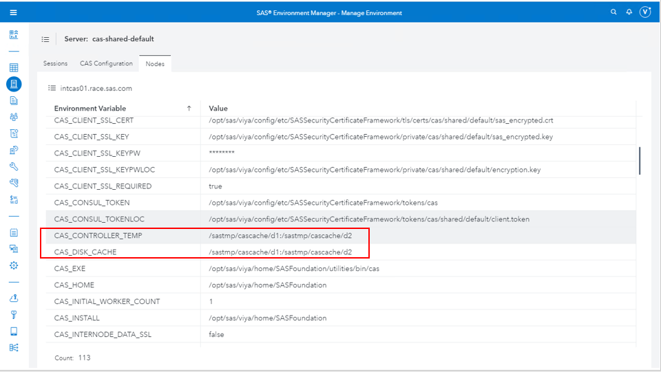
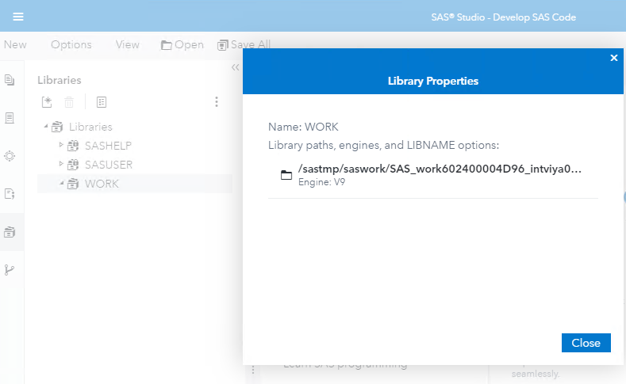
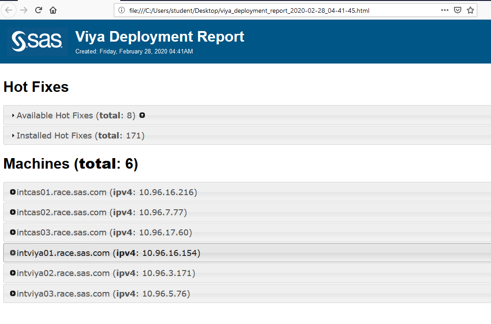

# Validation

* [Validation](#validation)
  * [Run this custom command to get all the URLs of the environment](#run-this-custom-command-to-get-all-the-urls-of-the-environment)
  * [Connect to your SAS Viya deployment](#connect-to-your-sas-viya-deployment)
  * [Check the CAS Disk cache settings](#check-the-cas-disk-cache-settings)
  * [Check the SASWORK settings](#check-the-saswork-settings)
  * [Use the Validation guide](#use-the-validation-guide)
  * [Run the Viya ARK Deployment report](#run-the-viya-ark-deployment-report)

## Run this custom command to get all the URLs of the environment

The command below, when executed from the Ansible Controller, should give you a decent list of the URLs you can access with your web browser.

* It will both display them, and create a file called "urls.txt" for later use.

    ```bash
    cd ~/sas_viya_playbook

    ansible httpproxy -m shell -a 'host=`hostname -f` ; cat /etc/httpd/conf.d/proxy.conf | grep ProxyPass | grep -e '/SAS' -e 'shared' | awk  "{print \$2}" | sort | uniq  | sed "s/^/https:\/\/"$host"/" ' | sed "s/int/sas/" | tee urls.txt
    ```

## Connect to your SAS Viya deployment

Open the page https://sasviya02.race.sas.com in Google Chrome, logon as viyademo01/lnxsas and perform some simple validation tests.

## Check the CAS Disk cache settings

Open the page https://sasviya02.race.sas.com/SASEnvironmentManager in Google Chrome, logon as viyademo01/lnxsas and in the top left menu select "Manage environment".

Then click on "Servers", then on the "Nodes" tab and double-click on the Controller.
You should be able to validate the values for the CAS Disk Cache on teh controller and workers, as in the screenshot below.



* In MobaXterm, connect to the sascas02 machine and run the command below to list the CAS Disk Cache files.

    ```bash
    sudo lsof -nP -c cas  2>/dev/null |  grep '(deleted)'
    ```

You should see a list of files.

Ensure they are located in ```/sastmp/cascache/d1``` or ```/sastmp/cascache/d2``` directories.

## Check the SASWORK settings

Now, in the top left menu select "Develop SAS Code", on the left panel, click on the "Libraries" icon. Right-Click on the "WORK" and chose "Properties" to check the temporary location for the SAS Datasets used by the Compute Server.



If you want to check the SASWORK for SPRE, you can do the same from SAS Studio basic (unless you turned it off in a previous step).

## Use the Validation guide

Use the Validation Guide for Viya 3.4 ( <http://misksapm.na.sas.com/KnowledgeSharingApplication/AdvSearchDisplayArtifact.jsp?Entry_ID=11526> ) to perform as much of the validation as possible.

You can access the word document on the Windows Client machine from [there](https://gelweb.race.sas.com/scripts/PSGEL144_001/Validation%20Guide%20-%20VA%208.3%20on%20SAS%20Viya%203.4%20v1.00.docx)

## Run the Viya ARK Deployment report

The Viya ARK offers a playbook to build deployment reports. The playbook gathers information about SAS Viya software and the hosts where it is deployed. The data gathered is then written to disk as a YAML-formatted data file and a static web-page for easily viewing the data.

* run the command below to generate the deployment report.

    ```bash
    cd ~/sas_viya_playbook
    ansible-playbook viya-ark/playbooks/deployment-report/viya-deployment-report.yml
    ```

* Download and open the generated html page :

    