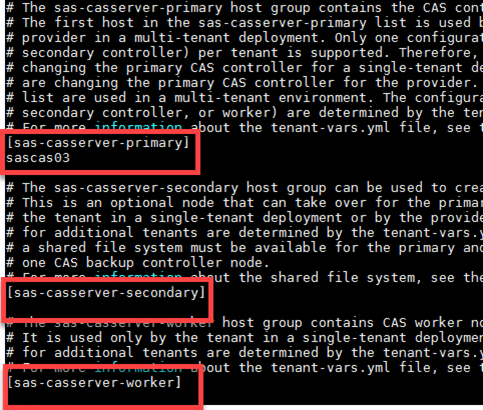
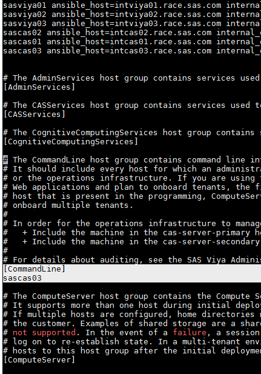
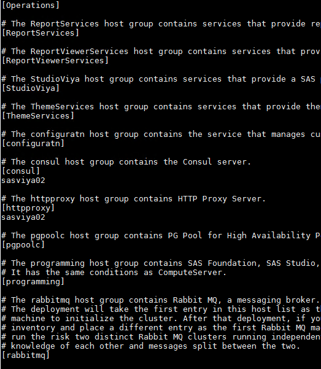
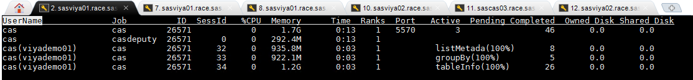
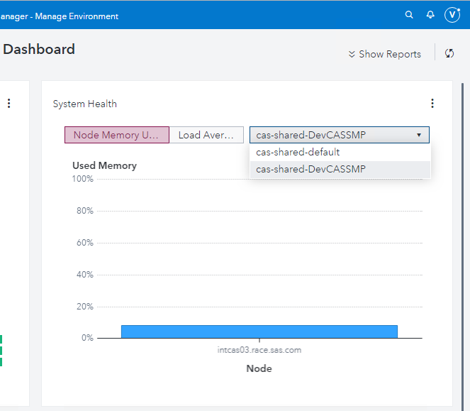
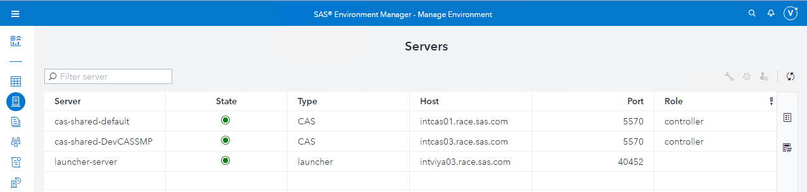

# Add a new CAS Server

* [Add a new CAS Server](#add-a-new-cas-server)
  * [Prepare a new vars.yml for the new CAS Server](#prepare-a-new-varsyml-for-the-new-cas-server)
  * [Prepare an inventory file for the new CAS Server](#prepare-an-inventory-file-for-the-new-cas-server)
    * [Fast track - generate the DevCAS inventory file content](#fast-track---generate-the-devcas-inventory-file-content)
  * [Perform the pre-requisite](#perform-the-pre-requisite)
  * [Configure the network](#configure-the-network)
  * [Create the directory for CAS temporary space](#create-the-directory-for-cas-temporary-space)
  * [Run ansible to add the new CAS Server](#run-ansible-to-add-the-new-cas-server)
  * [Check the new CAS SMP server](#check-the-new-cas-smp-server)
    * [With Gridmon](#with-gridmon)
    * [With Environment Manager](#with-environment-manager)

In this exercise, we want to have an initial MPP deployment and see how to add an SMP CAS Server.

So we start with an existing MPP deployment: 1 CAS Controller (sascas01), 1 CAS worker (sascas02) and then we add an SMP CAS Server on a new Host (sascas03).
That is why in the "split" scenario, we did not install anything on SASCAS03.

We will call the new CAS server : DevCASSMP.

## Prepare a new vars.yml for the new CAS Server

* Copy the old vars.yml into a new file:

    ```bash
        cd ~/sas_viya_playbook
        cp vars.yml DevCASSMP.vars.yml
    ```

Edit the DevCASSMP.vars.yml file, to add a new line below the CAS Configuration title (not the CAS_CONFIGURATION block):

```sh
#########################################################################
## CAS Configuration
#########################################################################
casenv_instance: DevCASSMP
```

* Run this command to do it automatically:

    ```bash
    cd ~/sas_viya_playbook
    ansible localhost -m lineinfile -a "dest=DevCASSMP.vars.yml insertbefore='casenv_user:' line='casenv_instance: DevCASSMP'"
    ```

## Prepare an inventory file for the new CAS Server

* In the same fashion, create an inventory for the new CAS servers.

    ```bash
    cd ~/sas_viya_playbook
    cp split01.ini DevCASSMP.inventory.ini
    ```

Open DevCASSMP.inventory.ini file to modify it.
At the top of the file, map sascas03 as a new deployment target if it's missing:

```sh
sascas03 ansible_host=intcas03.race.sas.com
```

Then remove the host entries from all the other host groups.
Keep the [hostgroup] names, but remove the machine name(s) below, except for **[sas_casserver_primary]**, **[consul]**, **[httpproxy]** and **[CommandLine]**.

Assign the new deployment target to the **[sas_casserver_primary]** host group.

As we want to add an SMP CAS server, there is no worker so we must empty the other sas_casserver* host groups:



Verify that the [consul] and [httpproxy] host groups are present and contain the deployment targets from your original SAS Viya deployment.

```log
# The consul host group contains the Consul server.
[consul]
sasviya02
```

and:

```log
# The httpproxy host group contains HTTP Proxy Server.
[httpproxy]
sasviya02
```

As it is also recommended to have the "CommandLine" component installed on all the machines of the deployment, insert the name of the new server in the "CommandLine" host group:

```log
[CommandLine]
sascas03
```

<mark style="background-color: red"> Don't touch the last section "[sas_all:children]"</mark>

The final result should be similar to these screenshots:





There is nothing more to change as we are starting from a copy of the original inventory file.

### Fast track - generate the DevCAS inventory file content

* The command below will create the inventory file in the format that we expect.

    ```bash
    cd ~/sas_viya_playbook
    cat << 'EOF' > ~/sas_viya_playbook/DevCASSMP.inventory.ini
    sasviya01 ansible_host=intviya01.race.sas.com
    sasviya02 ansible_host=intviya02.race.sas.com
    sasviya03 ansible_host=intviya03.race.sas.com
    sascas01 ansible_host=intcas01.race.sas.com
    sascas02 ansible_host=intcas02.race.sas.com
    sascas03 ansible_host=intcas03.race.sas.com

    [AdminServices]

    [CASServices]

    [CognitiveComputingServices]

    [CommandLine]
    sascas03

    [ComputeServer]

    [ComputeServices]

    [CoreServices]

    [DataServices]

    [GraphBuilderServices]

    [HomeServices]

    [Operations]

    [ReportServices]

    [ReportViewerServices]

    [StudioViya]

    [ThemeServices]

    [configuratn]

    [consul]
    sasviya02

    [httpproxy]
    sasviya02

    [pgpoolc]

    [programming]

    [rabbitmq]

    [sas_casserver_primary]
    sascas03

    [sas_casserver_secondary]

    [sas_casserver_worker]

    [sasdatasvrc]

    [sas_all:children]
    AdminServices
    CASServices
    CognitiveComputingServices
    CommandLine
    ComputeServer
    ComputeServices
    CoreServices
    DataServices
    GraphBuilderServices
    HomeServices
    Operations
    ReportServices
    ReportViewerServices
    StudioViya
    ThemeServices
    configuratn
    consul
    httpproxy
    pgpoolc
    programming
    rabbitmq
    sas_casserver_primary
    sas_casserver_secondary
    sas_casserver_worker
    sasdatasvrc
    EOF
    ```

## Perform the pre-requisite

The new host for the new CAS Server has several pre-requisites (for example it must contain the CAS user account (cas) and group (sas)).

* If it was not done before, ensure you have checked the pre-requisite or run the VIYA-ARK playbook (as explained in the pre-requisite section) using an inventory that includes our new host: sascas03.

    It does not hurt to run the pre-requisites on all the machines (just in case something like Puppet would have changed some settings :) )

    ```bash
    cd ~/working
    ansible-playbook viya-ark/playbooks/pre-install-playbook/viya_pre_install_playbook.yml \
    --skip-tags skipmemfail,skipcoresfail,skipstoragefail,\
    skipnicssfail,bandwidth,yum_repo \
    -e 'yum_cache_yn=1' \
    -e 'use_pause=no' \
    -e '{"custom_group_list": { "group": "sas" , "gid":"10001" } }' \
    -e '{"custom_user_list": [ { "name": "cas" , "uid":"10002", "group":"sas" , "groups":"sas" } , { "name": "sas" , "uid":"10001", "group":"sas" , "groups":"sas" } ] }'
    ```

Note: in the "skip-tags" list we include "yum_repo". That task would perform the check that the new machine can connect to SAS repositories; since we are using a mirror, we can skip it.

## Configure the network

Remember that all the machines in our environment have multiple network cards, IPs and hostnames. So just like for the initial deployment we need to prepare a "network configuration file" containing the new host (sascas03) internal hostname and IP.

* Run the commands below to generate the required file in the playbook vars

    ```bash
    cat > ~/sas_viya_playbook/host_vars/sascas03.yml << EOF
    ---
    network_conf:
      SAS_HOSTNAME: intcas03.race.sas.com
      SAS_BIND_ADDR: 192.168.2.3
      SAS_EXTERNAL_HOSTNAME: sascas03.race.sas.com
      SAS_EXTERNAL_BIND_ADDR_IF: "eth0"
    EOF
    ```

## Create the directory for CAS temporary space

1. Create specific locations for CAS disk cache on the CAS nodes.

    ```bash
    cd ~/sas_viya_playbook
    ansible sas_casserver_primary,sas_casserver_worker -m file -a "path=/sastmp/cascache/d1 state=directory owner=cas group=sas mode=1777" -b -i DevCASSMP.inventory.ini
    ansible sas_casserver_primary,sas_casserver_worker -m file -a "path=/sastmp/cascache/d2 state=directory owner=cas group=sas mode=1777" -b -i DevCASSMP.inventory.ini
    ```

## Run ansible to add the new CAS Server

* Run the command below from the ansible controller (tmux usage is recommended):

    ```bash
    cd ~/sas_viya_playbook
    time ansible-playbook -i DevCASSMP.inventory.ini site.yml -e "@DevCASSMP.vars.yml" ; ansible sascas03 -i DevCASSMP.inventory.ini -m service -a "name=sas-viya-all-services.service enabled=no" -b > ./service.disable.log
    ```

We include the command to disable the automatic startup of the Viya service otherwise when the sascas03 is booted, the "sas-viya-all-services" script will automatically starts up, and it not the desired configuration in multiple hosts deployments.

From our experience the addition of a new CAS server takes around 20 minutes.

## Check the new CAS SMP server

### With Gridmon

* Log on to the cas03 machine

    ```sh
    ssh intcas03
    ```

* switch to the "cas" account

    ```sh
    sudo su - cas
    ```

* run gridmon

    ```sh
    /opt/sas/viya/home/SASFoundation/utilities/bin/gridmon.sh
    ```

You should see something like the following:



* Type "q" to exit gridmon.

### With Environment Manager

Open SAS Environment Manager, and make sure that you can now see a new SMP CAS Server:



