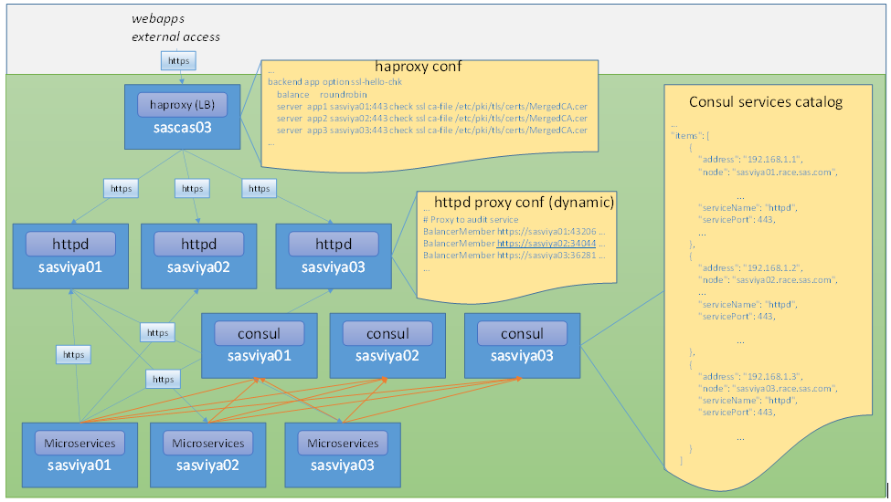
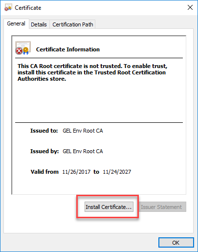
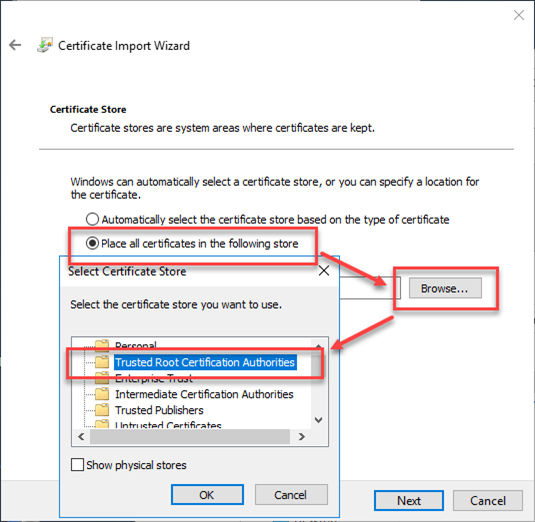
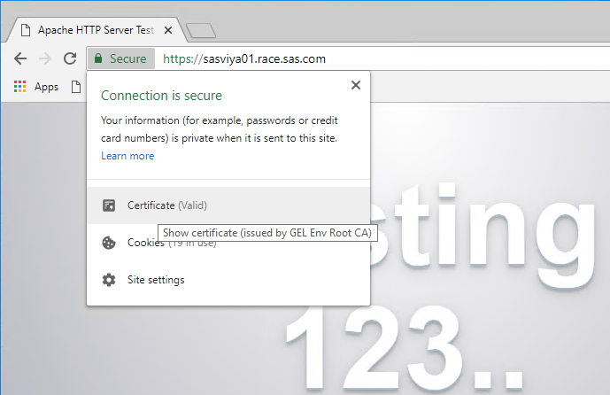
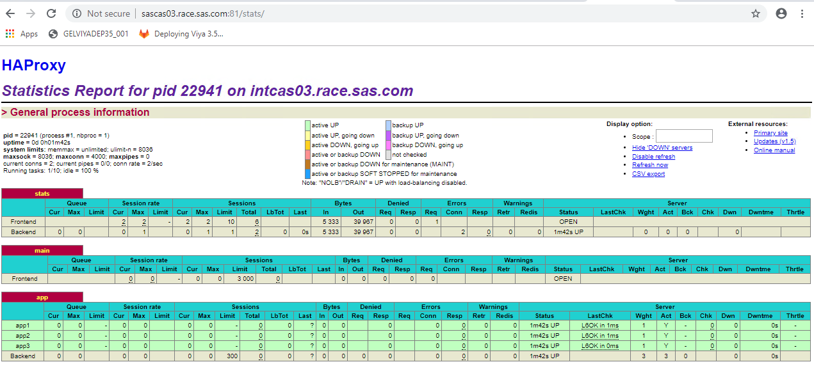
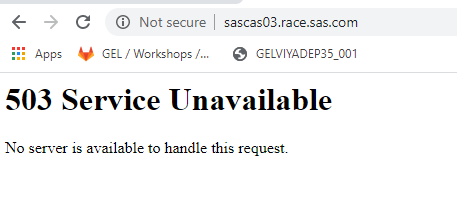
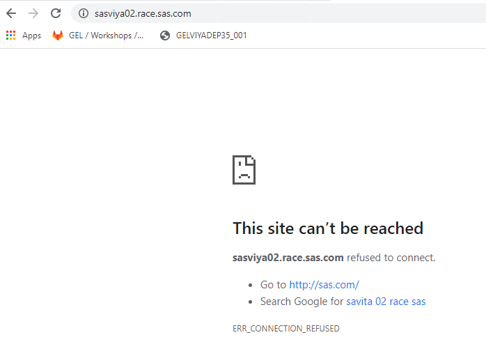

# HA deployment (with custom certificates)

* [HA deployment (with custom certificates)](#ha-deployment-with-custom-certificates)
  * [Topology](#topology)
  * [Un-deploy](#un-deploy)
  * [Setup a shared Filesystem across machines](#setup-a-shared-filesystem-across-machines)
  * [Almost everything on all 3 machines (inventory)](#almost-everything-on-all-3-machines-inventory)
  * [Update your ansible.cfg](#update-your-ansiblecfg)
  * [Configure the web servers cluster](#configure-the-web-servers-cluster)
  * [Configure custom certificates for the Web Servers](#configure-custom-certificates-for-the-web-servers)
  * [Import GEL Root cert in Windows client truststore](#import-gel-root-cert-in-windows-client-truststore)
    * [Prepare a poor man's Load-Balancer (haproxy)](#prepare-a-poor-mans-load-balancer-haproxy)
  * [Update vars.yml](#update-varsyml)
    * [Save a backup](#save-a-backup)
    * [pgpoolc and sasdataserverc](#pgpoolc-and-sasdataserverc)
    * [Use the correct Apache cert root to distribute into SAS truststores](#use-the-correct-apache-cert-root-to-distribute-into-sas-truststores)
    * [Adding load-balancer information for CAS](#adding-load-balancer-information-for-cas)
    * [Use dynamic hostnames for the workspace servers](#use-dynamic-hostnames-for-the-workspace-servers)
  * [Create SASWORK custom folders](#create-saswork-custom-folders)
  * [Re-execute OpenLDAP playbook with home directories on shared folders](#re-execute-openldap-playbook-with-home-directories-on-shared-folders)
  * [Don't use a sitedefault.yml](#dont-use-a-sitedefaultyml)
  * [Kick off the deployment](#kick-off-the-deployment)
  * [Post HA deployment configuration](#post-ha-deployment-configuration)
    * [Launcher server configuration](#launcher-server-configuration)
  * [Check the services and validate](#check-the-services-and-validate)
  * [(optionnal) Turn off SAS Studio Basic](#optionnal-turn-off-sas-studio-basic)
  * [Troubleshooting (apache HTTP servers down)](#troubleshooting-apache-http-servers-down)

## Topology

We will now assign the software in the following way:

| Server    |    role                           | HostGroup                                                                                                                                                                                                                                                                                                 |
|-----------|-----------------------------------|-----------------------------------------------------------------------------------------------------------------------------------------------------------------------------------------------------------------------------------------------------------------------------------------------------------|
| sasviya01 |    Stateless services             | AdminServices <br> CASServices <br>  CognitiveComputingServices <br>CommandLine <br>ComputeServices <br>CoreServices <br>DataServices <br>GraphBuilderServices <br>HomeServices <br> ReportServices <br> ReportViewerServices <br> StudioViya <br> ThemeServices <br> configuratn <br> consul <br> httpproxy <br> pgpoolc <br> rabbitmq <br> sasdatasvrc <br> programming <br> ComputeServer             |
| sasviya02 |    Stateful services              | AdminServices <br> CASServices <br> CognitiveComputingServices <br> CommandLine <br> ComputeServices <br> CoreServices <br> DataServices <br> GraphBuilderServices <br> HomeServices <br> _________ <br> ReportServices <br> ReportViewerServices <br> StudioViya <br> ThemeServices <br> configuratn <br> consul <br> httpproxy <br> _______ <br> rabbitmq <br> sasdatasvrc <br> programming <br> ComputeServer  |
| sasviya03 |    Foundation and SPRE related    | <br> AdminServices <br> CASServices <br> CognitiveComputingServices <br>  CommandLine <br>ComputeServices <br>CoreServices <br>DataServices <br>GraphBuilderServices <br>HomeServices <br>_________ <br>ReportServices <br>ReportViewerServices <br>StudioViya <br>ThemeServices <br>configuratn <br>consul <br>httpproxy <br>________ <br>rabbitmq <br>sasdatasvrc <br>programming <br>ComputeServer <br>|
| sascas01  |    CAS Controller                 | sas_casserver_primary <br>CommandLine                                                                                                                                                                                                                                                                         |
| sascas02  |    CAS Secondary controller       | sas-casserver-secondary <br> CommandLine                                                                                                                                                                                                                                                                       |
| sascas03  |    CAS Worker                     | sas-casserver-worker <br> CommandLine                                                                                                                                                                                                                                                                          |

## Un-deploy

* Remember to first un-deploy if you are trying a different deployment:

    ```bash
    cd ~/sas_viya_playbook
    time ansible-playbook deploy-cleanup.yml
    ```

It should take between 3 and 4 minutes to run completely.

The httpd package is not uninstalled by the deploy-cleanup playbook.

* As we want to customize the Apache web server configuration for HA, we have to uninstall it before proceeding:

    ```bash
    cd ~/sas_viya_playbook
    #uninstall the httpd package
    ansible httpproxy -m yum -a "name=httpd,mod_ssl state=absent" -b
    ```

After the deploy-cleanup playbook execution, it is always a good idea to check that there are no more Viya process running on our Viya machines, such as rabbitmq...

* You could use the Viya ARK script for that:

    ```bash
    cd ~/sas_viya_playbook
    ansible-playbook viya-ark/playbooks/viya-mmsu/viya-services-stop.yml -e "enable_stray_cleanup=true"
    ```

* If the additional CAS server was created on the sascas03 host we also need to undeploy it:

    ```bash
    ansible-playbook deploy-cleanup.yml -i DevCASSMP.inventory.ini  -e "@DevCASSMP.vars.yml"
    ```

## Setup a shared Filesystem across machines

As has been discussed in the architecture sections, configuring HA will rely on the presence of a shared file system.Mainly:

* The Primary and Secondary CAS controller need to share a folder (/opt/sas/viya/config/data/cas)
* All machines running [programming] or [ComputeServer] should have shared Home directories for their users

To simulate and speed up the process, the playbook below streamlines setting this up in the lab environment.

* Fair warning: this is a really bad way of doing it and you should not do that at a customer site.

    ```bash
    cd ~/working/
    ansible-playbook ~/GELVIYADEP35-deploying-viya-3.5-on-linux/scripts/playbooks/gel.poor.man.shared.fs.yml
    ```

* If this has worked, you should now be able to validate that the shared folders mount point exist on all machines:

    ```bash
    ansible all -m shell -b -a "mount | grep share"
    ```

The results should look like:

```log
sascas01 | CHANGED | rc=0 >>
sasviya01.race.sas.com:/shared/sharedcascontroller on /opt/sas/viya/config/data/cas type nfs4 (rw,relatime,vers=4.1,rsize=1048  576,wsize=1048576,namlen=255,hard,proto=tcp,timeo=600,retrans=2,sec=sys,clientaddr=10.96.12.135,local_lock=none,addr=10.96.4.5  )
sasviya01.race.sas.com:/shared/sharedhomes on /sharedhome type nfs4 (rw,relatime,vers=4.1,rsize=1048576,wsize=1048576,namlen=2  55,hard,proto=tcp,timeo=600,retrans=2,sec=sys,clientaddr=10.96.12.135,local_lock=none,addr=10.96.4.5)
sasviya01.race.sas.com:/shared/dnfs on /dnfs type nfs4 (rw,relatime,vers=4.1,rsize=1048576,wsize=1048576,namlen=255,hard,proto  =tcp,timeo=600,retrans=2,sec=sys,clientaddr=10.96.12.135,local_lock=none,addr=10.96.4.5)
sasviya01.race.sas.com:/shared/backups on /viyabackups type nfs4 (rw,relatime,vers=4.1,rsize=1048576,wsize=1048576,namlen=255,  hard,proto=tcp,timeo=600,retrans=2,sec=sys,clientaddr=10.96.12.135,local_lock=none,addr=10.96.4.5)

sascas02 | CHANGED | rc=0 >>
sasviya01.race.sas.com:/shared/sharedcascontroller on /opt/sas/viya/config/data/cas type nfs4 (rw,relatime,vers=4.1,rsize=1048  576,wsize=1048576,namlen=255,hard,proto=tcp,timeo=600,retrans=2,sec=sys,clientaddr=10.96.7.127,local_lock=none,addr=10.96.4.5)
sasviya01.race.sas.com:/shared/sharedhomes on /sharedhome type nfs4 (rw,relatime,vers=4.1,rsize=1048576,wsize=1048576,namlen=2  55,hard,proto=tcp,timeo=600,retrans=2,sec=sys,clientaddr=10.96.7.127,local_lock=none,addr=10.96.4.5)
sasviya01.race.sas.com:/shared/dnfs on /dnfs type nfs4 (rw,relatime,vers=4.1,rsize=1048576,wsize=1048576,namlen=255,hard,proto  =tcp,timeo=600,retrans=2,sec=sys,clientaddr=10.96.7.127,local_lock=none,addr=10.96.4.5)
sasviya01.race.sas.com:/shared/backups on /viyabackups type nfs4 (rw,relatime,vers=4.1,rsize=1048576,wsize=1048576,namlen=255,  hard,proto=tcp,timeo=600,retrans=2,sec=sys,clientaddr=10.96.7.127,local_lock=none,addr=10.96.4.5)

sasviya03 | CHANGED | rc=0 >>
sasviya01.race.sas.com:/shared/sharedcascontroller on /opt/sas/viya/config/data/cas type nfs4 (rw,relatime,vers=4.1,rsize=1048  576,wsize=1048576,namlen=255,hard,proto=tcp,timeo=600,retrans=2,sec=sys,clientaddr=10.96.13.254,local_lock=none,addr=10.96.4.5  )
sasviya01.race.sas.com:/shared/sharedhomes on /sharedhome type nfs4 (rw,relatime,vers=4.1,rsize=1048576,wsize=1048576,namlen=2  55,hard,proto=tcp,timeo=600,retrans=2,sec=sys,clientaddr=10.96.13.254,local_lock=none,addr=10.96.4.5)
sasviya01.race.sas.com:/shared/dnfs on /dnfs type nfs4 (rw,relatime,vers=4.1,rsize=1048576,wsize=1048576,namlen=255,hard,proto  =tcp,timeo=600,retrans=2,sec=sys,clientaddr=10.96.13.254,local_lock=none,addr=10.96.4.5)
sasviya01.race.sas.com:/shared/backups on /viyabackups type nfs4 (rw,relatime,vers=4.1,rsize=1048576,wsize=1048576,namlen=255,  hard,proto=tcp,timeo=600,retrans=2,sec=sys,clientaddr=10.96.13.254,local_lock=none,addr=10.96.4.5)

sasviya01 | CHANGED | rc=0 >>
sasviya01.race.sas.com:/shared/sharedcascontroller on /opt/sas/viya/config/data/cas type nfs4 (rw,relatime,vers=4.1,rsize=1048  576,wsize=1048576,namlen=255,hard,proto=tcp,timeo=600,retrans=2,sec=sys,clientaddr=10.96.4.5,local_lock=none,addr=10.96.4.5)
sasviya01.race.sas.com:/shared/sharedhomes on /sharedhome type nfs4 (rw,relatime,vers=4.1,rsize=1048576,wsize=1048576,namlen=2  55,hard,proto=tcp,timeo=600,retrans=2,sec=sys,clientaddr=10.96.4.5,local_lock=none,addr=10.96.4.5)
sasviya01.race.sas.com:/shared/dnfs on /dnfs type nfs4 (rw,relatime,vers=4.1,rsize=1048576,wsize=1048576,namlen=255,hard,proto  =tcp,timeo=600,retrans=2,sec=sys,clientaddr=10.96.4.5,local_lock=none,addr=10.96.4.5)
sasviya01.race.sas.com:/shared/backups on /viyabackups type nfs4 (rw,relatime,vers=4.1,rsize=1048576,wsize=1048576,namlen=255,  hard,proto=tcp,timeo=600,retrans=2,sec=sys,clientaddr=10.96.4.5,local_lock=none,addr=10.96.4.5)

sasviya02 | CHANGED | rc=0 >>
sasviya01.race.sas.com:/shared/sharedcascontroller on /opt/sas/viya/config/data/cas type nfs4 (rw,relatime,vers=4.1,rsize=1048  576,wsize=1048576,namlen=255,hard,proto=tcp,timeo=600,retrans=2,sec=sys,clientaddr=10.96.14.234,local_lock=none,addr=10.96.4.5  )
sasviya01.race.sas.com:/shared/sharedhomes on /sharedhome type nfs4 (rw,relatime,vers=4.1,rsize=1048576,wsize=1048576,namlen=2  55,hard,proto=tcp,timeo=600,retrans=2,sec=sys,clientaddr=10.96.14.234,local_lock=none,addr=10.96.4.5)
sasviya01.race.sas.com:/shared/dnfs on /dnfs type nfs4 (rw,relatime,vers=4.1,rsize=1048576,wsize=1048576,namlen=255,hard,proto  =tcp,timeo=600,retrans=2,sec=sys,clientaddr=10.96.14.234,local_lock=none,addr=10.96.4.5)
sasviya01.race.sas.com:/shared/backups on /viyabackups type nfs4 (rw,relatime,vers=4.1,rsize=1048576,wsize=1048576,namlen=255,  hard,proto=tcp,timeo=600,retrans=2,sec=sys,clientaddr=10.96.14.234,local_lock=none,addr=10.96.4.5)

sascas03 | CHANGED | rc=0 >>
sasviya01.race.sas.com:/shared/sharedcascontroller on /opt/sas/viya/config/data/cas type nfs4 (rw,relatime,vers=4.1,rsize=1048  576,wsize=1048576,namlen=255,hard,proto=tcp,timeo=600,retrans=2,sec=sys,clientaddr=10.96.1.42,local_lock=none,addr=10.96.4.5)
sasviya01.race.sas.com:/shared/sharedhomes on /sharedhome type nfs4 (rw,relatime,vers=4.1,rsize=1048576,wsize=1048576,namlen=2  55,hard,proto=tcp,timeo=600,retrans=2,sec=sys,clientaddr=10.96.1.42,local_lock=none,addr=10.96.4.5)
sasviya01.race.sas.com:/shared/dnfs on /dnfs type nfs4 (rw,relatime,vers=4.1,rsize=1048576,wsize=1048576,namlen=255,hard,proto  =tcp,timeo=600,retrans=2,sec=sys,clientaddr=10.96.1.42,local_lock=none,addr=10.96.4.5)
sasviya01.race.sas.com:/shared/backups on /viyabackups type nfs4 (rw,relatime,vers=4.1,rsize=1048576,wsize=1048576,namlen=255,  hard,proto=tcp,timeo=600,retrans=2,sec=sys,clientaddr=10.96.1.42,local_lock=none,addr=10.96.4.5)
```

* You can create a file in /opt/sas/viya/config/data/cas from one of the CAS controller to make sure the second CAS controller can see it.

    As cloud-user on sasviya01, run the code below to create a test file from the sascas01 machine:

    ```bash
    cd ~/sas_viya_playbook
    #create a test file from sascas01
    ansible sascas01 -m shell -a "touch /opt/sas/viya/config/data/cas/test.txt" -b
    ```

* Then:

    ```bash
    # list the file from sascas02
    ansible sascas02 -m shell -a "ls -l /opt/sas/viya/config/data/cas/test.txt" -b
    ```

On the second command output you can see on sascas02 the file created from sascas01:

```log
sascas02 | CHANGED | rc=0 >>
-rw-r--r--. 1 root root 0 Nov 25 12:29 /opt/sas/viya/config/data/cas/test.txt
```

Fair Warning: These mounted partitions will likely not survive a reboot: Because we are mounting drives from SASVIYA01 onto the others, it is very likely that upon reboot, SASVIYA01 will not be up in time for the other servers to mount the drives. It will therefore be required to come back here and run this playbook again.

## Almost everything on all 3 machines (inventory)

* As before, you should manually update the inventory, but if you are unsure, you can have a valid inventory created with the following command:

    ```bash
    #Return to Viya Playbook directory
    cd ~/sas_viya_playbook

    cat << 'EOF' > ~/sas_viya_playbook/ha01.ini
    sasviya01 ansible_host=intviya01.race.sas.com
    sasviya02 ansible_host=intviya02.race.sas.com
    sasviya03 ansible_host=intviya03.race.sas.com
    sascas01 ansible_host=intcas01.race.sas.com
    sascas02 ansible_host=intcas02.race.sas.com
    sascas03 ansible_host=intcas03.race.sas.com

    [AdminServices]
    sasviya01
    sasviya02
    sasviya03

    [CASServices]
    sasviya01
    sasviya02
    sasviya03

    # The CognitiveComputingServices host group contains services for performing common text analytics tasks.
    [CognitiveComputingServices]
    sasviya01
    sasviya02
    sasviya03


    [CommandLine]
    sasviya01
    sasviya02
    sasviya03
    sascas01
    sascas02
    sascas03


    [ComputeServer]
    sasviya01
    sasviya02
    sasviya03

    [ComputeServices]
    sasviya01
    sasviya02
    sasviya03


    [CoreServices]
    sasviya01
    sasviya02
    sasviya03

    [DataServices]
    sasviya01
    sasviya02
    sasviya03

    [GraphBuilderServices]
    sasviya01
    sasviya02
    sasviya03

    [HomeServices]
    sasviya01
    sasviya02
    sasviya03


    [Operations]
    sasviya01

    [ReportServices]
    sasviya01
    sasviya02
    sasviya03

    [ReportViewerServices]
    sasviya01
    sasviya02
    sasviya03

    [StudioViya]
    sasviya01
    sasviya02
    sasviya03

    [ThemeServices]
    sasviya01
    sasviya02
    sasviya03

    [configuratn]
    sasviya01
    sasviya02
    sasviya03

    [consul]
    sasviya01
    sasviya02
    sasviya03

    [httpproxy]
    sasviya01
    sasviya02
    sasviya03

    [pgpoolc]
    sasviya01


    [programming]
    sasviya01
    sasviya02
    sasviya03


    [rabbitmq]
    sasviya01
    sasviya02
    sasviya03

    [sas_casserver_primary]
    sascas01

    [sas_casserver_secondary]
    sascas02

    [sas_casserver_worker]
    sascas03

    [sasdatasvrc]
    sasviya01
    sasviya02
    sasviya03

    [sas_all:children]
    AdminServices
    CASServices
    CognitiveComputingServices
    CommandLine
    ComputeServer
    ComputeServices
    CoreServices
    DataServices
    GraphBuilderServices
    HomeServices
    Operations
    ReportServices
    ReportViewerServices
    StudioViya
    ThemeServices
    configuratn
    consul
    httpproxy
    pgpoolc
    programming
    rabbitmq
    sas_casserver_primary
    sas_casserver_secondary
    sas_casserver_worker
    sasdatasvrc
    EOF
    ```

## Update your ansible.cfg

By default, your ansible.cfg file has a line that says "inventory = inventory.ini". We now need to change it so that it points to the new file: ha01.ini.

* This quick command will make the change. You can use a text editor if you prefer:

    ```bash
    cd ~/sas_viya_playbook/
    ansible localhost -m lineinfile -a "dest=ansible.cfg regexp='inventory' line='inventory = ha01.ini'"
    ```

## Configure the web servers cluster

As we want to build a true HA environment (not simply multiple instances of the Microservices), we will have multiple web servers and a load-balancer to handle the external clients http requests. The diagram below illustrates our target environment, shows the components interactions and shows extract of the key configuration items allowing the High Availability:



More details and explanations on how service routing and discovery is working with such HA deployment are provided in Edoardo Riva's GEL blog: [
High Availability with SAS Viya: Service Discovery and Routing](http://sww.sas.com/blogs/wp/gate/23712/high-availability-with-sas-viya-service-discovery-and-routing/itaedr/2018/08/26).

## Configure custom certificates for the Web Servers

We will use a custom certificate for our httpd proxies but also for the load-balancer as it is required to use either http or https from end-to-end in such Load-balancing setup. (It is simpler to use our own TLS certificates everywhere from the beginning, rather than trying to modify and reuse the default self-signed certificates).

The certificates and keys have already been created on the GELWEB server and will be used for our httpd servers configuration.

* Install apache on the Viya servers:

    ```bash
    cd ~/sas_viya_playbook
    ansible httpproxy -m yum -a "name=httpd,mod_ssl state=present" -b
    ```

* Get Merged SAS Root CA and GEL Root CA (MergedCA includes SAS & GEL, ca_cert only GEL)

    ```bash
    ansible httpproxy -m get_url -a "dest=/etc/pki/tls/certs/  url=https://gelweb.race.sas.com/scripts/GELVIYADEP35_001/TLS/MergedCA.cer" -b

    ansible httpproxy -m get_url -a "dest=/etc/pki/tls/certs/  url=https://gelweb.race.sas.com/scripts/GELVIYADEP35_001/TLS/ca_cert.pem" -b

    #Get web server cert and key
    ansible httpproxy -m get_url -a "dest=/etc/pki/tls/certs/  url=https://gelweb.race.sas.com/scripts/GELVIYADEP35_001/TLS/web_server_cert.pem" -b

    ansible httpproxy -m get_url -a "dest=/etc/pki/tls/private/  url=https://gelweb.race.sas.com/scripts/GELVIYADEP35_001/TLS/web_server_key.pem " -b
    ```

* Update Apache TLS configuration to point to new certificates (instead of default self-signed certificates):

    ```bash
    ansible httpproxy -m replace -a "dest=/etc/httpd/conf.d/ssl.conf regexp='localhost.crt' replace='web_server_cert.pem' " -b
    ansible httpproxy -m replace -a "dest=/etc/httpd/conf.d/ssl.conf regexp='localhost.key' replace='web_server_key.pem' " -b
    #Restart apache:
    ansible httpproxy -m service -a "name=httpd state=restarted enabled=yes" -b
    #Test the https access with the merged certificate (copy paste the lines one by one.):
    openssl s_client -quiet -connect sasviya01.race.sas.com:443 -CAfile /etc/pki/tls/certs/MergedCA.cer

    openssl s_client -quiet -connect sasviya02.race.sas.com:443 -CAfile /etc/pki/tls/certs/MergedCA.cer

    openssl s_client -quiet -connect sasviya03.race.sas.com:443 -CAfile /etc/pki/tls/certs/MergedCA.cer
    ```

A successful result looks like:

```log
[cloud-user@intviya01 sas_viya_playbook]$ openssl s_client -quiet -connect sasviya01.race.sas.com:443 -CAfile /etc/pki/tls/certs/MergedCA.cer
depth=1 C = US, ST = North Carolina, L = Cary, O = SAS, OU = GEL, CN = GEL Env Root CA, emailAddress = noreply@none.sas.com
verify return:1
depth=0 C = US, ST = North Carolina, L = Cary, O = SAS, OU = GEL, emailAddress = noreply@none.sas.com, CN = sasviya.race.sas.com
verify return:1
read:errno=0
[cloud-user@intviya01 sas_viya_playbook]$ openssl s_client -quiet -connect sasviya02.race.sas.com:443 -CAfile /etc/pki/tls/certs/MergedCA.cer
depth=1 C = US, ST = North Carolina, L = Cary, O = SAS, OU = GEL, CN = GEL Env Root CA, emailAddress = noreply@none.sas.com
verify return:1
depth=0 C = US, ST = North Carolina, L = Cary, O = SAS, OU = GEL, emailAddress = noreply@none.sas.com, CN = sasviya.race.sas.com
verify return:1
read:errno=0
[cloud-user@intviya01 sas_viya_playbook]$ openssl s_client -quiet -connect sasviya03.race.sas.com:443 -CAfile /etc/pki/tls/certs/MergedCA.cer
depth=1 C = US, ST = North Carolina, L = Cary, O = SAS, OU = GEL, CN = GEL Env Root CA, emailAddress = noreply@none.sas.com
verify return:1
depth=0 C = US, ST = North Carolina, L = Cary, O = SAS, OU = GEL, emailAddress = noreply@none.sas.com, CN = sasviya.race.sas.com
verify return:1
read:errno=0
[cloud-user@intviya01 sas_viya_playbook]$
```

## Import GEL Root cert in Windows client truststore

From the windows client, use the Chrome browser to download the [CA certificate from the gelweb server](https://gelweb.race.sas.com/scripts/GELVIYADEP35_001/TLS/ca_cert.crt) (it does not matter in which folder you save it, the default download folder is OK).

Open the saved file, you will be presented with the following window. Click Install Certificate:



In the next dialogs, select "Local Machine", click "Next", "Place all certificates in the following store", then browse to the "Trusted Root Certification Authorities":



Confirm with OK, Next, Finish. Select "Yes" in the Security Warning pop-up.

You can confirm the import is successful by closing Chrome, then reopening it and navigating to https://sasviya01.race.sas.com/.

Chrome should acknowledge that the connection is secure and if you click on the "Secure" green lock, it should confirm the Certificate is valid and issued by GEL Env Root CA:



### Prepare a poor man's Load-Balancer (haproxy)

This is a collection of quick steps to setup a simple load balancer on one of the machines that does not have http.

You can run these steps during the deployment.
Feel free to send improvements our way (erwan.granger@sas.com).

1. Install haproxy on sascas03

    ```bash
    ansible sascas03 -m yum -a "name=haproxy state=present" -b
    ```

1. Download form the workshop folder the haproxy config file and the concatenated cert/key file

    ```bash
    ansible sascas03 -m get_url -a "dest=/etc/pki/tls/certs/  url=https://gelweb.race.sas.com/scripts/GELVIYADEP35_001/TLS/haproxy.pem" -b

    ansible sascas03 -m get_url -a "dest=/etc/pki/tls/certs/  url=https://gelweb.race.sas.com/scripts/GELVIYADEP35_001/TLS/MergedCA.cer" -b

    ansible sascas03 -m get_url -a "dest=/etc/haproxy/  url=https://gelweb.race.sas.com/scripts/GELVIYADEP35_001/haproxy.cfg" -b
    ```

1. Now, enable and start the service:

    ```bash
    ansible sascas03 -m service -a "name=haproxy state=started enabled=yes" -b
    ```

1. You can now access the Load-Balancer stats at:

    (http://sascas03.race.sas.com:81/stats/)

    (u=admin, p=admin)

You should see something like that :



## Update vars.yml

### Save a backup

* Before modifying this file for the HA scenario, you should take a backup of it. This can be useful later if you want to try the Multi-tenancy deployment.

    ```bash
    cd ~/sas_viya_playbook
    cp vars.yml vars.yml.split
    ```

### pgpoolc and sasdataserverc

Open your vars.yml file and edit it to be able to deploy Postgres in HA mode.

```yaml
INVOCATION_VARIABLES:
  sasviya01:
    pgpoolc:
    - HA_PGPOOL_VIRTUAL_IP: ''
      HA_PGPOOL_WATCHDOG_PORT: ''
      PCP_PORT: '5430'
      PGPOOL_PORT: '5431'
      POOL_NUMBER: '0'
      SANMOUNT: '{{ SAS_CONFIG_ROOT }}/data/sasdatasvrc'
      SERVICE_NAME: postgres
    sasdatasvrc:
    - NODE_NUMBER: '2'
      PG_PORT: '5432'
      SANMOUNT: '{{ SAS_CONFIG_ROOT }}/data/sasdatasvrc'
      SERVICE_NAME: postgres
  sasviya02:
    sasdatasvrc:
    - NODE_NUMBER: '1'
      PG_PORT: '5432'
      SANMOUNT: '{{ SAS_CONFIG_ROOT }}/data/sasdatasvrc'
      SERVICE_NAME: postgres
  sasviya03:
    sasdatasvrc:
    - NODE_NUMBER: '0'
      PG_PORT: '5432'
      SANMOUNT: '{{ SAS_CONFIG_ROOT }}/data/sasdatasvrc'
      SERVICE_NAME: postgres
```

<!-- THE CODE BELOW IS FOR AUTOMATION WITH CHEAT CODE

* Run the commands to do the substitution in the block from the split vars.yml

    ```bash
    cd ~/sas_viya_playbook
    ansible localhost -m lineinfile -a "dest=vars.yml regexp='  sasviya02' line='  sasviya01:'"
    ansible localhost -m lineinfile -a "dest=vars.yml regexp='- NODE_NUMBER' line='    - NODE_NUMBER: '2''"
    ```

* Now add a new block

    ```bash
    cat > /tmp/insertPGHABlock.yml << EOF
    ---
    - hosts: sasviya01

      tasks:
      - name: Insert PostgreSQL HA block
        blockinfile:
          path: ~/sas_viya_playbook/vars.yml
          insertafter: "      SERVICE_NAME: postgres"
          block: |2
              sasviya02:
                sasdatasvrc:
                - NODE_NUMBER: '1'
                  PG_PORT: '5432'
                  SANMOUNT: '{{ SAS_CONFIG_ROOT }}/data/sasdatasvrc'
                  SERVICE_NAME: postgres
              sasviya03:
                sasdatasvrc:
                - NODE_NUMBER: '0'
                  PG_PORT: '5432'
                  SANMOUNT: '{{ SAS_CONFIG_ROOT }}/data/sasdatasvrc'
                  SERVICE_NAME: postgres
    EOF
    ansible-playbook /tmp/insertPGHABlock.yml
    ``` -->

### Use the correct Apache cert root to distribute into SAS truststores

* Run the command below to reference our certificates in the vars.yml so they will be implemented in our httpproxy servers.

    ```bash
    ansible localhost -m lineinfile -a "dest=~/sas_viya_playbook/vars.yml regexp='^HTTPD_CERT_PATH' line='HTTPD_CERT_PATH: \"/etc/pki/tls/certs/MergedCA.cer\"'" --diff
    ```

### Adding load-balancer information for CAS

* Point cas to the load balancer using https

    ```bash
    ansible localhost -m lineinfile -a "dest=~/sas_viya_playbook/vars.yml regexp='SERVICESBASEURL:' line='     SERVICESBASEURL: \'https://sascas03.race.sas.com\''" --diff
    ```

### Use dynamic hostnames for the workspace servers

In the "Split deployment" section, we fixed the workspace hostname in vars.yml.

```log
    # Updates the init_deployment.properties and appserver_deployment.sh
    STUDIO_CONFIGURATION:
      init:
        #sasstudio.appserver.port_comment: '# Port that Studio is listening on'
        #sasstudio.appserver.port: 7080
        #sasstudio.appserver.https.port: 7443
        sas.studio.basicHost: intviya03.race.sas.com
        #webdms.workspaceServer.port: 8591
      appserver:
        #1: '# Comment about KEY'
        #2: KEY="value with spaces"
```

If we do the same in a HA scenario we would hard-code a single hostname in the configuration files on all hosts where we have the workspace server.

Instead we will reuse the machine hostname defined in the network configuration files:

```log
    # Updates the init_deployment.properties and appserver_deployment.sh
    STUDIO_CONFIGURATION:
      init:
        #sasstudio.appserver.port_comment: '# Port that Studio is listening on'
        #sasstudio.appserver.port: 7080
        #sasstudio.appserver.https.port: 7443
        sas.studio.basicHost: "{{network_conf.SAS_HOSTNAME}}"
        #webdms.workspaceServer.port: 8591
      appserver:
        #1: '# Comment about KEY'
        #2: KEY="value with spaces"
```

WARNING: Note that what we are doing here is a trick. It is only possible to do it because we have configured Multi-nic network settings and made the network_conf.SAS_HOSTNAME varaibale available for the deployment playbook.

Another approach (without using the network.conf variable) is to change the values of the variables in  /opt/sas/viya/config/etc/sasstudio/default/init_deployment.properties on each node after the deployment.

## Create SASWORK custom folders

* For the our 3 workspace and compute servers to be able to leverage the defined SASWORK location (/sastmp/saswork), we need to create a folder on the 3 "programming" and "ComputeServer" machines.

    ```bash
    ansible programming,ComputeServer -m file -a "name=/sastmp/saswork state=directory owner=sas group=sas mode=1777" -b
    ```

## Re-execute OpenLDAP playbook with home directories on shared folders

The LDAP users need to have a home directory that is shared across the machines.

* The following commands will re-define them, so their home is created on /sharedhome instead of /home.

    ```bash
    #uninstall OpenLDAP
    cd ~/working/homegrown/openldap
    ansible-playbook gel.openldapremove.yml

    #re-install OpenLDAP
    ansible-playbook gel.openldapsetup.yml -e "OLCROOTPW=lnxsas" -e 'anonbind=true' -e 'homedir=/sharedhome' -e 'use_pause=no'
    ```

## Don't use a sitedefault.yml

In the earlier instructions, we already copied the sitedefault.yml in place so the LDAP configuration is pre-defined.

* Because that makes the post-deployment "too easy", we are going to rename it before installing (so it won't be automatically picked up during the deployment).

    ```sh
    cd ~/sas_viya_playbook
    mv roles/consul/files/sitedefault.yml roles/consul/files/sitedefault.yml.disabled
    ```

## Kick off the deployment

* This deployment takes around 75 minutes (in my testing)

    ```bash
    cd ~/sas_viya_playbook
    time ansible-playbook site.yml ; ansible sas_all -m service -a "name=sas-viya-all-services.service enabled=no" -b > ./service.disable.log
    ```

This deployment might fail after about 4 minutes. Can you find out why, by reading the wall of red text?

## Post HA deployment configuration

### Launcher server configuration

Two values need to be changed in the Consul KV store to complete the HA configuration. It could have been done via the sitedefault.yml configuration file. However, as we are voluntarily not using a sitedefault.yml during the deployment in this exercise, we will do it post installation with the sas-bootstrap-config tool:

We need to modify 2 values in the Consul configuration.

* first, define an alias:

    ```sh
    alias sbc='[[ -z "$CONSUL_HTTP_ADDR" ]] && . /opt/sas/viya/config/consul.conf ; [[ -z "$CONSUL_TOKEN" ]] && export CONSUL_TOKEN=$(sudo cat /opt/sas/viya/config/etc/SASSecurityCertificateFramework/tokens/consul/default/client.token); /opt/sas/viya/home/bin/sas-bootstrap-config '
    ```

* write the values in consul

    ```sh
    #this is for the launcher server
    sbc kv write --force config/launcher-server/global/sas-services-url https://sascas03.race.sas.com:443/
    #this is for report services
    sbc kv write --force config/viya/sas.httpproxy.external.hostname sascas03.race.sas.com
    ```

    <!-- FOR CHEATCODES TO WORK - ALIAS DOES NOT WORK WITH THEM :(
    ```bash
    #prepare the environment
    . /opt/sas/viya/config/consul.conf
    export CONSUL_TOKEN=$(sudo cat /opt/sas/viya/config/etc/SASSecurityCertificateFramework/tokens/consul/default/client.token)
    #this is for the launcher server
    /opt/sas/viya/home/bin/sas-bootstrap-config kv write --force config/launcher-server/global/sas-services-url https://sascas03.race.sas.com:443/
    #this is for report services
    /opt/sas/viya/home/bin/sas-bootstrap-config kv write --force config/viya/sas.httpproxy.external.hostname sascas03.race.sas.com
    ```
    -->

* restart impacted services

    ```bash
    ansible httpproxy -m service -a "name=sas-viya-httpproxy-default state=restarted" -b
    ansible ComputeServer -m service -a "name=sas-viya-runlauncher-default state=restarted" -b
    ansible ReportServices -m service -a "name=sas-viya-reportdistribution-default state=restarted" -b
    ```

## Check the services and validate

* It's possible that some services are not up and running at this point.
Check it with the Viya ARK MMSU scripts:

    ```bash
    cd ~/sas_viya_playbook/
    ansible-playbook viya-ark/playbooks/viya-mmsu/viya-services-status.yml
    ```

* Focus on "down", "dead" or "not ready" services

    ```bash
    cd ~/sas_viya_playbook/
    ansible-playbook viya-ark/playbooks/viya-mmsu/viya-services-status.yml | grep -E -i 'down|dead|not\ ready'
    ```

* At this point, some services might be reported as "down" or "not ready".
    In such case, you can run the following command to stop and restart these services.

    ```sh
    cd ~/sas_viya_playbook
    ansible sas_all -m shell -a "for s in \$(/etc/init.d/sas-viya-all-services status | grep -E -i 'down|dead|not\ ready'| awk '{print \$1}' ) ; do /bin/systemctl stop \$s;sleep 10;/bin/systemctl start \$s;/bin/systemctl status \$s;done" -b
    ```

    <!-- ```sh
    #on each host
    sudo su -
    for s in `/etc/init.d/sas-viya-all-services status | grep -E -i 'down|dead|not\ ready'| awk '{print $1}'`; do /bin/systemctl stop $s;sleep 10;/bin/systemctl start $s;/bin/systemctl status $s;done
    ``` -->

After a little while (Even if an individual service is "up" on the host, it might be reported as "down" by the sas-viya-all-services script until it completed its registration into consul), all the services should appears as up when you run the Viya ARK MMSU services status script.

* Run the command below to see only the services that are not "up".

    ```sh
    cd ~/sas_viya_playbook/
    ansible-playbook viya-ark/playbooks/viya-mmsu/viya-services-status.yml | grep -v up
    ```

If you see no lines for the services, then you're good to go :).

Once all the services are "up", you should be able to access the Viya 3.5 HA environment at this url : (https://sascas03.race.sas.com)

Well... actually you can not :)
You can see the login page but if you try to log on with the viyademo01 account, it will not work.
It is because this time we did not use the sitedefault.yml file with the LDAP configuration, so Viya is not aware of any viyademo01 user.
Until you follow the Post activities steps (in the next section) you won't be able to log into your fresh new HA Viya environment.

## (optionnal) Turn off SAS Studio Basic

Just like we did it in the "Viya Services Management" section, we can disable the SAS Studio basic service using ansible and the sasprogramming Host Group.

* So let's disable the service.

    ```bash
    # disable SAS Studio Basic service
    ansible programming -m service -a "name=sas-viya-sasstudio-default state=stopped enabled=no" -b
    ```

* Add sas-viya-sasstudio-default to "/opt/sas/viya/config/etc/viya-svc-mgr/svc-ignore" so sas-viya-all-services will ignore it.

    ```bash
    ansible programming -m shell -a "echo 'sas-viya-sasstudio-default' >> /opt/sas/viya/config/etc/viya-svc-mgr/svc-ignore" -b
    ```

## Troubleshooting (apache HTTP servers down)

* If when you try to connect to the HA proxy http://sascas03.race.sas.com you see this page :



* Then you can try to connect directly to one of the httpproxy (like sasviya01.race.sas.com).



* If you immediatly see the page above for the 3 servers where httpproxy is installed (sasviya01, sasviya02, sasviya03), then you can check the Viya services status.

    ```bash
    ansible-playbook viya-ark/playbooks/viya-mmsu/viya-services-status.yml
    ```

If the result of the ansible command reports that one or more sas-viya-httpproxy-default services are "up", then the problem is likely that your Apache HTTP servers are not started.

* On sasviya01, check if apache http server is running locally

    ```bash
    curl -kv https://localhost:443
    ```

* If the connection is refused, check the Apache HTTP server status

    ```bash
    sudo apachectl status
    ```

* If the Apache HTTP services refuse to restart, follow the steps below to solve the problem.

  * For each of the 3 servers where httpproxy is installed (sasviya01, sasviya02 and sasviya03), connect as root (```sudo su -```) and perform the tasks below

  * Clean the semaphores

    ```sh
    #list semaphores
    ipcs -s
    # remove them (ignore the "fail" messages)
    for whatever in `ipcs -s | awk '{print $2}'`; do ipcrm -s $whatever; done
    ```

  * Remove the apache ".shm" files

    ```sh
    # list them
    ls /var/run/httpd/*.shm
    # if they exist, remove them
    rm -Rf /var/run/httpd/*.shm
    ```

  * Restart Apache HTTP

    ```sh
    apachectl start
    ```

  * you can also do it automatically using ansible:

    ```sh
    ansible sasviya* -m shell -a "for whatever in \$(ipcs -s | awk '{print \$2}'); do ipcrm -s \$whatever; done" -b
    ansible sasviya* -m shell -a "rm -Rf /var/run/httpd/*.shm" -b
    ansible sasviya* -m shell -a "apachectl start" -b
    ansible sasviya* -m shell -a "apachectl status" -b
    ```

  * Now, open Google Chrome and try again to access http://sascas03.race.sas.com
  (Now that you have restored the httprproxy services you might have to wait a few minutes before the services are in sync again and are ready).
