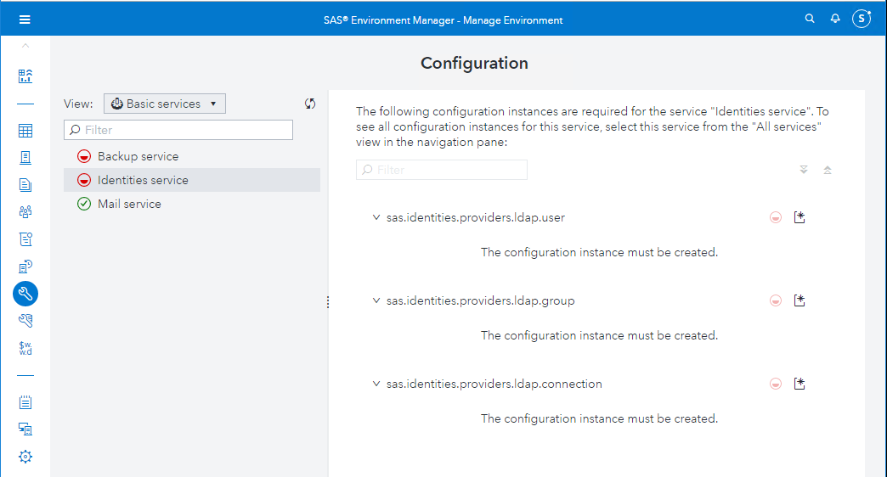

# Post Install Activities

* [Change the password for the sasboot account](#change-the-password-for-the-sasboot-account)
  * [Manual change of sasboot password](#manual-change-of-sasboot-password)
  * [Automated update of sasboot password](#automated-update-of-sasboot-password)
* [Configure the access to the OpenLDAP server](#configure-the-access-to-the-openldap-server)
  * [Goal](#goal)
  * [Solutions](#solutions)
* [(optional) Change the rabbitmq passwords](#optional-change-the-rabbitmq-passwords)
  * [Goal](#goal-1)
  * [Solution](#solution)
* [(Optional) Secure the LDAP connection and swap out the TLS certs](#optional-secure-the-ldap-connection-and-swap-out-the-tls-certs)

There are many post install activities that you should get familiar with. They are documented in the Deployment documentation.
Note: Depending on the type of deployment, you might have to specify the inventory file (with -i) in the ansible ad-hoc command.

## Change the password for the sasboot account

By default, the only admin account available in a freshly installed Viya environment is "sasboot".
In many cases, you will have to set its password to a chosen and known value.

The instructions on how to do it manually are available int the [official documentation](https://documentation.sas.com/?docsetId=dplyml0phy0lax&docsetTarget=p0dt267jhkqh3un178jzupyyetsa.htm&docsetVersion=3.5&locale=en#p1wdqhjgnxs3o1n1a8cs2qvpjba5)

Follow these instructions and update the password for sasboot to: "lnxsas" without quotes.

### Manual change of sasboot password

The doc should be sufficient, but these screenshots may help:


Type "lnxsas" twice.


Click on "Change Password"


Logon as sasboot/lnxsas


Click "Yes"


Click on "Skip setup"

### Automated update of sasboot password

Once you've done the manual updates, here are some pieces of code that you could have used to get this done a bit faster. (for next time!)
If you want to get the info from the log file very quickly, you can run this Ansible task:

```sh
cd ~/sas_viya_playbook
ansible CoreServices -m shell -a 'grep sasboot `ls -tr  /opt/sas/viya/config/var/log/saslogon/default/sas-saslogon_* | tail -n 1` ' -b --become-user sas
```


* If you want to do all this even faster, this code can reset the password to what you want it to be.

    ```sh

    #code taken from \\sashq\root\u\dapage\bareos\resetSasboot.sh
    # credits to David Page.


    cat << 'EOF' > ./resetsasboot.sh

    #!/bin/sh
    #right now this has to be run on the same machine as the log with the reset link - but if http proxy is on another machine this will need to be updated
    set -vx
    #export host=$(hostname -f)
    export host=sasviya02
    export password=lnxsas
    SASMAINROOT=${SASMAINROOT:=/opt/sas}
    export code=$(ls -tr $SASMAINROOT/viya/config/var/log/saslogon/default/sas-saslogon_* | tail -n1 | grep '.log$' | xargs grep 'sasboot' | cut -d'=' -f2)
    # make the first request, this expends the link
    curl -k https://$host/SASLogon/reset_password?code=$code -c cookies -o output
    # get a few things out of the output to use in the next request
    echo $code
    export CSRF_TOKEN=`grep 'name="_csrf"' output | cut -f 6 -d '"'`
    export NEW_CODE=`grep 'name="code"' output | cut -f 6 -d '"'`
    # make the second request with the password and other information
    curl -kvb cookies https://$host/SASLogon/reset_password.do -H "Content-Type: application/x-www-form-urlencoded" -d "code=${NEW_CODE}&email=none&password=${password}&password_confirmation=${password}&_csrf=${CSRF_TOKEN}"
    echo $?

    EOF

    chmod u+x ./resetsasboot.sh

    ./resetsasboot.sh

    ```

## Configure the access to the OpenLDAP server

In most customer deployments, you will not have a handy sitedefault.yml and will have to enter all the information in SAS Environment Manager.

You should get familiar with the process. Note that if you did place the sitedefault.yml in the right location, you do not have to do this exercise.

If you did it correctly, you will have a green checkmark by the "Identities service" and you will have the LDAP users populated in the Users menu.

### Goal

* Using the content of the sitedefault.yml file
* Configure your environment to access a the OpenLDAP server
* Make the user "Viya Demo 01" a SAS Administrator. Its username is "viyademo01"

### Solutions

1. First, make sure that the credentials function outside of SAS. Test this any machine, like sasviya01

```sh
#display the users
ldapsearch -v  -h intviya01.race.sas.com -p 389 -x -D "uid=sasldap,ou=users,dc=va82demo,dc=com" -W -b "ou=users,dc=va82demo,dc=com"

#display the groups
ldapsearch -v  -h intviya01.race.sas.com -p 389 -x -D "uid=sasldap,ou=users,dc=va82demo,dc=com" -W -b "ou=groups,dc=va82demo,dc=com"
```

1. After entering the password  (lnxsas), you should see, something like below:

```log
Enter LDAP Password:
filter: (objectclass=*)
requesting: All userApplication attributes
# extended LDIF
#
# LDAPv3
# base <ou=users,dc=va82demo,dc=com> with scope subtree
# filter: (objectclass=*)
# requesting: ALL
#

# users, va82demo.com
dn: ou=users,dc=va82demo,dc=com
objectClass: organizationalUnit
objectClass: top
ou: users

# sasldap, users, va82demo.com
dn: uid=sasldap,ou=users,dc=va82demo,dc=com
cn: sasldap
givenName: SAS
sn: LDAP
objectClass: top
objectClass: inetOrgPerson
objectClass: organizationalPerson
objectClass: person
userPassword:: bG54c2Fz
mail: sasldap@none.sas.com
l: Cary
o: Demo_Org
displayName: SAS LDAP Service Account
uid: sasldap

# viyademo01, users, va82demo.com
dn: uid=viyademo01,ou=users,dc=va82demo,dc=com
cn: viyademo01
givenName: Viya Demo
sn: User 01
objectClass: top
objectClass: inetOrgPerson
objectClass: organizationalPerson
objectClass: posixAccount
loginShell: /bin/bash
uidNumber: 100001
gidNumber: 100001
homeDirectory: /sharedhome/viyademo01
userPassword:: e1NTSEF9VjA3MWU4T0dQT3NjeE0xZDg3TitHSGNPQ1hQZnE5azU=
mail: viyademo01@intviya01.race.sas.com
l: Cary
o: Demo_Org
displayName: Viya Demo User 01
uid: viyademo01
...
# numResponses: 19
# numEntries: 18
```

1. Log into the Environment Manager as sasboot (https://sascas03.race.sas.com/SASEnvironmentManager), and create the require LDAP configurations:



1. Create the LDAP Connection section

 

1. Fill out the fields according to the content of the sitedefault.yml (located in /home/cloud-user/working/homegrown/openldap).


1. Create the LDAP Users section


1. Fill out the fields based on the sitedefault.yml content

1. Create the LDAP Group section


1. Fill out the fields based on the sitedefault.yml

1. Save

1. Now, navigate back to Users:


1. Select "Groups" instead of "Custom groups".


1. Click the refresh button.
1. You might have to reload identities :


1. You should see the list of groups populated.
1. Do the same thing for "Users"
1. Now, go back to the Custom Groups and select SAS Administrators:


1. Add "Viya Demo User 01" as a member of this group:


1. Now, you can sign out:


1. And log back in as the user viyademo01 with password lnxsas (you will see that you can assume the SAS Administrtaion rights)

## (optional) Change the rabbitmq passwords

### Goal

You can skip this hands-on and save it for later: This change requires an entire reboot of all the Viya services, and therefore can take a while.

* Using the [SAS Deployment doc](https://documentation.sas.com/?docsetId=dplyml0phy0lax&docsetTarget=p0dt267jhkqh3un178jzupyyetsa.htm&docsetVersion=3.5&locale=en#n03004sasmessagebroker0admin)

* Update the rabbitmq (sas message broker) password to "lnxsas"
* Go to the admin URL
* Log in as the user

### Solution

Keep in mind that if poorly done, this step can damage your deployment. If well executed, you'll have to restart the entire stack, which will likely take about 30 minutes.

1. Log on to the machine on which rabbitmq was deployed
1. Reset the password to "lnxsas" when prompted:

```sh
sudo /opt/sas/viya/home/bin/sas-rabbitmq-acc-admin change_passwd -t client -u sasclient --promptpw
```

1. You should see:

```log
Enter a new password (no spaces or special symbols):
Confirm by re-entering the new password:
Changing password for user "sasclient" ...
Password changed
```

1. Now stop all the services (and clean-up stray process):

```sh
cd ~/sas_viya_playbook
ansible-playbook viya-ark/playbooks/viya-mmsu/viya-services-stop.yml -e "enable_stray_cleanup=true"
```

1. Make sure that all services are stopped. The following should not return sas or rabbitmq process:

```sh
cd ~/sas_viya_playbook
ansible sas_all -m shell -a "ps -ef | grep -E 'sas|rabbit'"
```

1. Now restart all the services.

```sh
ansible-playbook viya.services.start.yml
```

The default port for the RabbitMQ interface is 15672. Open (http://`server`:15672/) You should now be able to log in as:

```log
u: sasclient
p: lnxsas
```

## (Optional) Secure the LDAP connection and swap out the TLS certs

If you are feeling so inclined, consult this [article](https://communities.sas.com/t5/SAS-Communities-Library/2-things-you-should-REALLY-do-just-after-your-Viya-deployment/ta-p/422632/jump-to/first-unread-message) and perform the required steps.

You will have to figure out how to obtain Certs for your server(s).
