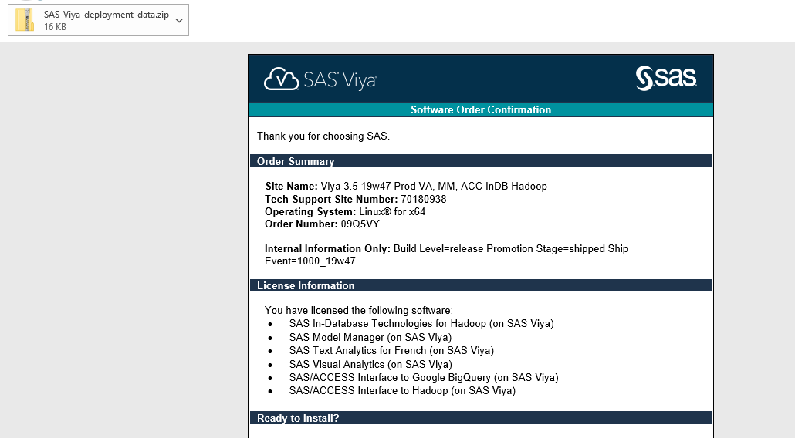
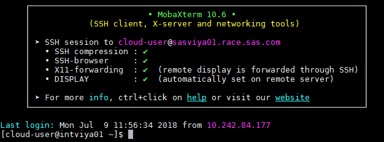
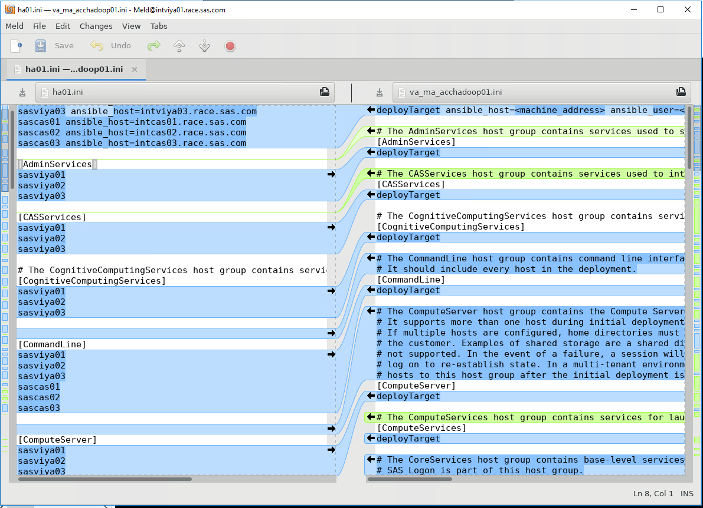
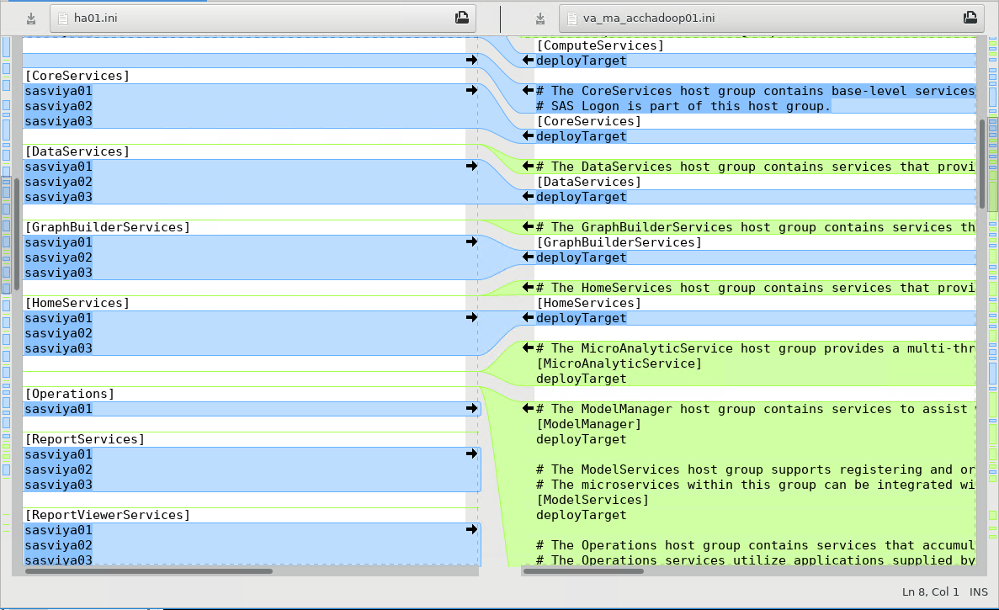
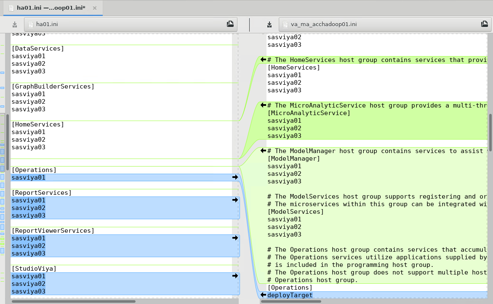
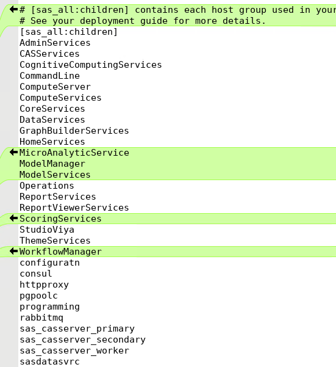
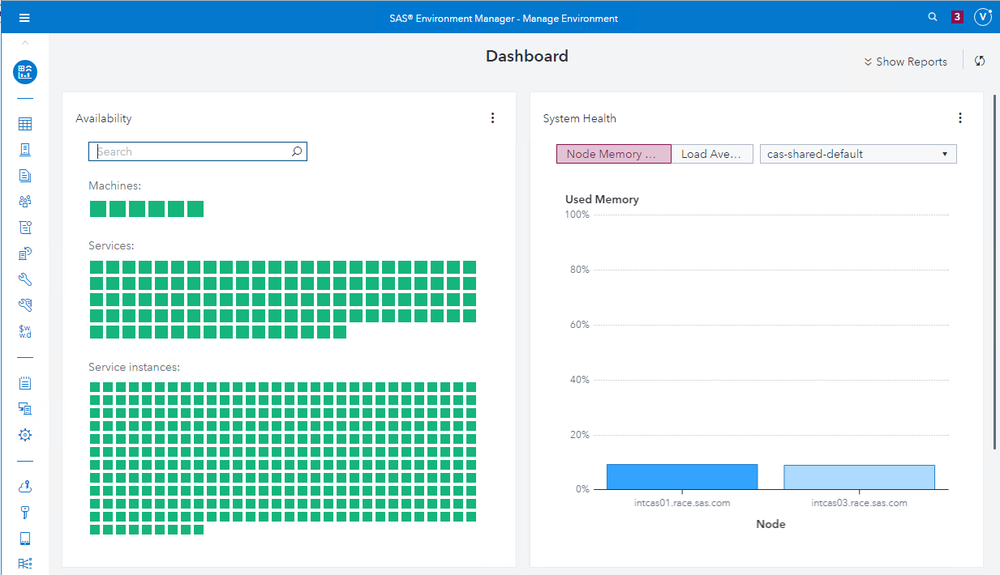
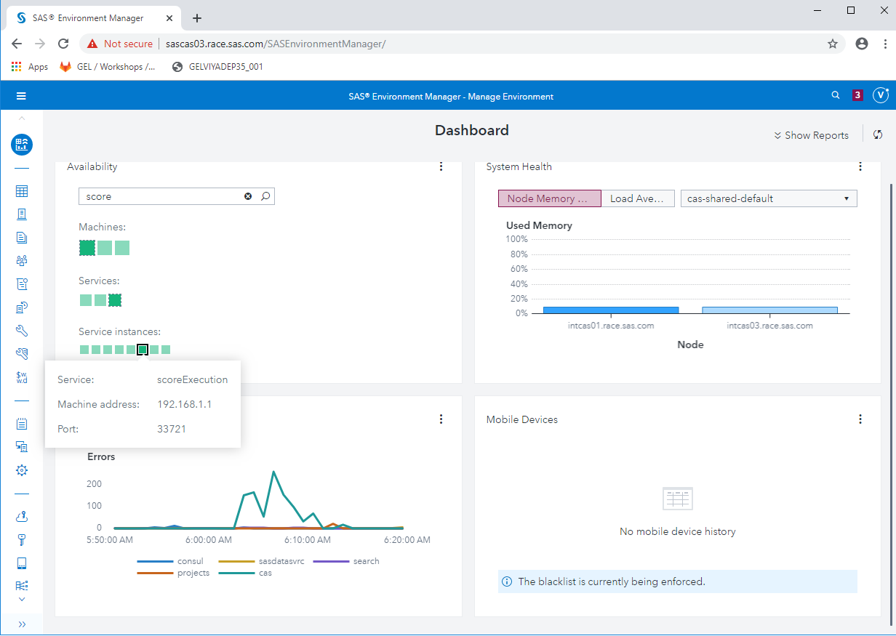

# Update your order with a new product

* [Update your order with a new product](#update-your-order-with-a-new-product)
  * [Update your order](#update-your-order)
  * [Archive the current playbook folder](#archive-the-current-playbook-folder)
  * [Get the updated playbook](#get-the-updated-playbook)
  * [Merge the inventory files](#merge-the-inventory-files)
  * [Copy the network conf](#copy-the-network-conf)
  * [Merge the vars.yml files](#merge-the-varsyml-files)
  * [Update the mirror repository location in vars.yml](#update-the-mirror-repository-location-in-varsyml)
  * [Add Data source information in vars.yml](#add-data-source-information-in-varsyml)
  * [Update your ansible.cfg](#update-your-ansiblecfg)
  * [Update the license file](#update-the-license-file)
  * [Stop haproxy on sascas03](#stop-haproxy-on-sascas03)
  * [Kick Off the deployment](#kick-off-the-deployment)
  * [Restart haproxy on sascas03](#restart-haproxy-on-sascas03)

## Update your order

Imagine we now, have a new order with Visual Analytics but also 2 additional products to connect to interact with Hadoop. To make the exercise even more interesting, we will also add Model Manager to the mix.

The order email would look like this



In this hands-on we want to add  SAS Viya software to an existing deployment and we will apply this new order (which brings additional products) on top of our existing deployment.

## Archive the current playbook folder

* Connect to the Ansible controller and rename the previous "sas_viya_playbook" folder as "sas_viya_playbook_old" e.g.

    ```bash
    cd ~
    mv ~/sas_viya_playbook ~/sas_viya_playbook.old
    ```

## Get the updated playbook

As we already know how to generate a playbook (see section [Build your playbook](07-Building_your_deployment_playbook.md)), we download a pre-built playbook from the gelweb server as instructed below.

* Download and unzip the new playbook with the Model Manager and Hadoop integration products :

    ```bash
    cd ~
    curl -o ~/SAS_Viya_playbook_VAMMACCHadoop.tgz --insecure https://gelweb.race.sas.com/scripts/GELVIYADEP35_001/SAS_Viya_playbook_VAMMACCHadoop.tgz
    tar xvf SAS_Viya_playbook_VAMMACCHadoop.tgz

    # give a better name to the new inventory to be used.
    cd ~/sas_viya_playbook
    cp inventory.ini va_mm_acchadoop01.ini
    ```

* You might also want to copy your service management scripts and playbook in the new context :

    ```bash
    cp -Rp ~/sas_viya_playbook.old/viya-ark ~/sas_viya_playbook
    ```

## Merge the inventory files

We will use a linux graphical tool called "meld" to merge the content of the previous and the new inventory and vars.yml files. But you could use any "diff" tool (such as MobaTextDiff already integrated in MobaXterm) or even do it directly inside your favorite text editor.

```sh
sudo yum install -y meld
```

* We also need to slightly modify the SSH server configuration server for X11 forwarding:

    ```bash
    ansible localhost -m lineinfile -a "dest=/etc/ssh/sshd_config regexp='X11UseLocalhost' line='X11UseLocalhost no'" -b

    ansible localhost -m service -a "name=sshd state=restarted" -b
    ```

* Now, you need to exit your linux session and re-connect, so that the X11 variables are properly set.

    ```sh
    exit
    ```

* Once reconnected to sasviya01, you should see that X11 forwarding is now enabled (4 green checkmarks).



* Ensure that the X Server is started, then execute:

    ```sh
    cd ~

    #choose either one of those depending on what was you latest deployment:
    #meld sas_viya_playbook.old/split01.ini sas_viya_playbook/ va_mm_acchadoop01.ini

    meld sas_viya_playbook.old/ha01.ini sas_viya_playbook/va_mm_acchadoop01.ini
    ```

*Note: if you see some errors like below, you can ignore them, they won't prevent meld to work.*



Look carefully at every change, and decide what should be in the new inventory file: va_mm_acchadoop01.ini



For example, as shown above, you will see new Host Groups (like [MicroAnalyticService]) on the right side, make sure you are not deleting them!
In such case **you cannot click on the arrow, you will have to manually copy-paste** the machine names for a result like below:



Remember to save your changes!

<!--

* create a merged inventory

    ```bash
    cat > ~/sas_viya_playbook/va_mm_acchadoop01.ini << EOF
    sasviya01 ansible_host=intviya01.race.sas.com
    sasviya02 ansible_host=intviya02.race.sas.com
    sasviya03 ansible_host=intviya03.race.sas.com
    sascas01 ansible_host=intcas01.race.sas.com
    sascas02 ansible_host=intcas02.race.sas.com
    sascas03 ansible_host=intcas03.race.sas.com

    [AdminServices]
    sasviya01
    sasviya02
    sasviya03

    [CASServices]
    sasviya01
    sasviya02
    sasviya03

    [CognitiveComputingServices]
    sasviya01
    sasviya02
    sasviya03

    [CommandLine]
    sasviya01
    sasviya02
    sasviya03
    sascas01
    sascas02
    sascas03

    [ComputeServer]
    sasviya01
    sasviya02
    sasviya03

    [ComputeServices]
    sasviya01
    sasviya02
    sasviya03

    [CoreServices]
    sasviya01
    sasviya02
    sasviya03

    [DataServices]
    sasviya01
    sasviya02
    sasviya03

    [GraphBuilderServices]
    sasviya01
    sasviya02
    sasviya03

    [HomeServices]
    sasviya01
    sasviya02
    sasviya03

    # The MicroAnalyticService host group provides a multi-threaded, low latency program execution service to support execution of decisions, business rules and scoring models.
    [MicroAnalyticService]
    sasviya01
    sasviya02
    sasviya03

    # The ModelManager host group contains services to assist with organizing, managing and monitoring the contents and lifecycle of statistical and analytical models.
    [ModelManager]
    sasviya01
    sasviya02
    sasviya03

    # The ModelServices host group supports registering and organizing models in a common model repository, and publishing models to different destinations.
    # The microservices within this group can be integrated with other systems using the REST API.
    [ModelServices]
    sasviya01
    sasviya02
    sasviya03

    [Operations]
    sasviya01

    [ReportServices]
    sasviya01
    sasviya02
    sasviya03

    [ReportViewerServices]
    sasviya01
    sasviya02
    sasviya03

    # The ScoringServices host group supports definition and execution of scoring jobs for models and other SAS content.
    [ScoringServices]
    sasviya01
    sasviya02
    sasviya03

    [StudioViya]
    sasviya01
    sasviya02
    sasviya03

    [ThemeServices]
    sasviya01
    sasviya02
    sasviya03

    # The WorkflowManager host group contains services and applications to assist with creating workflow definitions, and managing and reporting on in-progress and historical workflow processes.
    [WorkflowManager]
    sasviya01
    sasviya02
    sasviya03

    [configuratn]
    sasviya01
    sasviya02
    sasviya03

    [consul]
    sasviya01
    sasviya02
    sasviya03

    [httpproxy]
    sasviya01
    sasviya02
    sasviya03

    [pgpoolc]
    sasviya01

    [programming]
    sasviya01
    sasviya02
    sasviya03

    [rabbitmq]
    sasviya01
    sasviya02
    sasviya03

    [sas_casserver_primary]
    sascas01

    [sas_casserver_secondary]
    sascas02

    [sas_casserver_worker]
    sascas03

    [sasdatasvrc]
    sasviya01
    sasviya02
    sasviya03

    [sas_all:children]
    AdminServices
    CASServices
    CognitiveComputingServices
    CommandLine
    ComputeServer
    ComputeServices
    CoreServices
    DataServices
    GraphBuilderServices
    HomeServices
    MicroAnalyticService
    ModelManager
    ModelServices
    Operations
    ReportServices
    ReportViewerServices
    ScoringServices
    StudioViya
    ThemeServices
    WorkflowManager
    configuratn
    consul
    httpproxy
    pgpoolc
    programming
    rabbitmq
    sas_casserver_primary
    sas_casserver_secondary
    sas_casserver_worker
    sasdatasvrc
    EOF
    ```

-->

Pro-tip: to see the new HostGroup (coming from the added product), look at differences at the bottom of the file:



## Copy the network conf

Remember that all the machines in our environment have multiple network cards, IPs and hostnames. So just like for the initial deployment we need to have our "network configuration" files prepared.

* Let's copy the "network configuration" files from the old playbook folder

    ```bash
    cp -R ~/sas_viya_playbook.old/host_vars ~/sas_viya_playbook
    ```

## Merge the vars.yml files

Do the same for the vars.yml files:

  ```sh
  meld sas_viya_playbook.old/vars.yml sas_viya_playbook/vars.yml
  ```

Now you are almost ready to re-run your deployment.

<!-- FOR CHEATCODES

    ```bash
    cd ~/sas_viya_playbook
    cp vars.yml vars.yml.orig
    # start from the previous vars.yml
    cp ~/sas_viya_playbook.old/vars.yml ~/sas_viya_playbook/vars.yml

    #update LICENSE
    ansible localhost -m lineinfile -a "dest=vars.yml regexp='LICENSE_FILENAME' line='LICENSE_FILENAME: \"SASViyaV0300_09Q5VY_Linux_x86-64.txt\"'"
    ansible localhost -m lineinfile -a "dest=vars.yml regexp='LICENSE_COMPOSITE_FILENAME' line='LICENSE_COMPOSITE_FILENAME: \"SASViyaV0300_09Q5VY_70180938_Linux_x86-64.jwt\"'"
    ```
-->

## Update the mirror repository location in vars.yml

Remember that we are using a Mirror! You need to use a repository that will contains the added SAS packages (Model Manager, ACCESS to Hadoop, etc…).
Re-open the vars.yml file and replace the REPOSITORY_WAREHOUSE value with this mirror URL:

https://gelweb.race.sas.com/mirrors/yum/released/09Q5VY/sas_repos/

```log
REPOSITORY_WAREHOUSE: "https://gelweb.race.sas.com/mirrors/yum/released/09Q5VY/sas_repos/"
```

* You can do it manually using your favorite text editor or simply run the command below:

    ```bash
    cd ~/sas_viya_playbook
    ansible localhost -m lineinfile -a "dest=vars.yml regexp='REPOSITORY_WAREHOUSE' line='REPOSITORY_WAREHOUSE: \"https://gelweb.race.sas.com/mirrors/yum/released/09Q5VY/sas_repos/\"'"
    ```

## Add Data source information in vars.yml

As we have now have a SAS/ACCESS Interface to Hadoop we need to pre-configure some environment variable that will be required by the CAS Data Connector and by SPRE to access the remote data source.

Open the vars.yml file located in the sas_viya_playbook folder.
Under CAS_SETTINGS, add the following lines as shown, including the indentions, spaces, and numerical prefixes and uncomment the CAS_SETTINGS line. To uncomment the line, remove the number sign (#).

* It should look like this:

    ```sh
    CAS_SETTINGS:
      1: JAVA_HOME=/usr/lib/jvm/jre-1.8.0
      2: LD_LIBRARY_PATH=$LD_LIBRARY_PATH:$JAVA_HOME/lib/amd64/server
      #1: ODBCHOME=ODBC home directory
      #2: ODBCINI=$ODBCHOME/odbc.ini
      #3: ORACLE_HOME=Oracle home directory
    ```

Under FOUNDATION_CONFIGURATION, add the following lines as shown, and uncomment the FOUNDATION_CONFIGURATION line, remove the number sign (#).

```sh
# Creates a workspaceserver sasenv_deployment file
FOUNDATION_CONFIGURATION:
  #1: '# Comment about KEY'
  #2: KEY=value
  1: JAVA_HOME=/usr/lib/jvm/jre-1.8.0
  2: LD_LIBRARY_PATH=$LD_LIBRARY_PATH:$JAVA_HOME/lib/amd64/server
```

Save and close the vars.yml file.

<!-- INSERTBLOCK ANSIBLE COMMAND FOR CHEAT CODES

    ```bash
    cd ~/sas_viya_playbook
    ansible localhost -m lineinfile -a "dest=vars.yml regexp='#CAS_SETTINGS' line='CAS_SETTINGS:'"
    ansible localhost -m lineinfile -a "dest=vars.yml regexp='#FOUNDATION_CONFIGURATION' line='FOUNDATION_CONFIGURATION:'"
    ```

    ```bash
    # clean up marker code
    ansible localhost -m lineinfile -a "dest=vars.yml state='absent' line='# BEGIN ANSIBLE MANAGED BLOCK'"
    ansible localhost -m lineinfile -a "dest=vars.yml state='absent' line='# END ANSIBLE MANAGED BLOCK'"

    cat > /tmp/insertDataAccessBlockCAS.yml << EOF
    ---
    - hosts: localhost
      tasks:
      - name: Insert Data Access block for CAS
        blockinfile:
          path: ~/sas_viya_playbook/vars.yml
          insertafter: 'CAS_SETTINGS:'
          block: |2
              1: JAVA_HOME=/usr/lib/jvm/jre-1.8.0
              2: LD_LIBRARY_PATH=\$LD_LIBRARY_PATH:\$JAVA_HOME/lib/amd64/server
    EOF
    ansible-playbook /tmp/insertDataAccessBlockCAS.yml

    # clean up marker code
    ansible localhost -m lineinfile -a "dest=vars.yml state='absent' line='# BEGIN ANSIBLE MANAGED BLOCK'"
    ansible localhost -m lineinfile -a "dest=vars.yml state='absent' line='# END ANSIBLE MANAGED BLOCK'"

    cat > /tmp/insertDataAccessBlockSASF.yml << EOF
    ---
    - hosts: localhost
      tasks:
      - name: Insert Data Access block for SAS Foundation
        blockinfile:
          path: ~/sas_viya_playbook/vars.yml
          insertafter: "FOUNDATION_CONFIGURATION:"
          block: |2
              1: JAVA_HOME=/usr/lib/jvm/jre-1.8.0
              2: LD_LIBRARY_PATH=\$LD_LIBRARY_PATH:\$JAVA_HOME/lib/amd64/server
    EOF
    ansible-playbook /tmp/insertDataAccessBlockSASF.yml
    ```
  -->

## Update your ansible.cfg

By default, your ansible.cfg file has a line that says

```sh
"inventory = inventory.ini".
```

* We now need to change it so that it points to the new file: va_mm_acchadoop01.ini.

    ```bash
    # this quick command will make the change.
    # you can use a text editor if you prefer

    cd ~/sas_viya_playbook/

    ansible localhost -m lineinfile -a "dest=ansible.cfg regexp='inventory' line='inventory = va_mm_acchadoop01.ini'"
    ```

## Update the license file

No need for now.

## Stop haproxy on sascas03

During the Viya deployment installation pre-flight checks, the following task is performed :

```log
TASK [casserver-ensure-port-availability : Verify that controller HTTP port is available on all hosts in the cluster] **
```

This task will fails if haproxy is running.

* If you did the HA exercises (16- HA Deployment), stop haproxy on sascas03:

    ```bash
    cd ~/sas_viya_playbook
    ansible sascas03 -m service -a "name=haproxy state=stopped" -b
    ```

## Kick Off the deployment

* Ensure, that your ansible.cfg file in the current folder point to the intended inventory (split01.ini, ha01.ini or va_mm_acchadoop01.ini) and run the Viya deployment playbook:

    ```bash
    time ansible-playbook site.yml; ansible sas_all -m service -a "name=sas-viya-all-services.service enabled=no" -b > ./service.disable.log
    ```

It takes around 52 minutes in our experience.

## Restart haproxy on sascas03

* Now that the deployment is completed we can restart our HTTP loadbalancer

    ```bash
    cd ~/sas_viya_playbook
    ansible sascas03 -m service -a "name=haproxy state=started" -b
    ```

and open http://sascas03.race.sas.com in your web browser to validate that we can connect with the viyademo01 account (password:lnxsas) and access to the SAS Environment Manager and see the new products related services.




