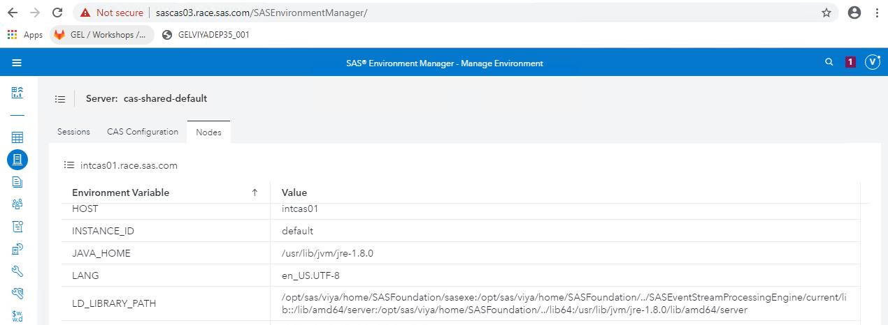

# Configure Data Connector to access Hive

* [Configure Data Connector to access Hive](#configure-data-connector-to-access-hive)
  * [Configure the connection to the remote Hadoop cluster (F2F only)](#configure-the-connection-to-the-remote-hadoop-cluster-f2f-only)
  * [Configure the Hive connection account](#configure-the-hive-connection-account)
  * [Configure and run the hadoop-tracer playbook](#configure-and-run-the-hadoop-tracer-playbook)
    * [Notes](#notes)
  * [Post-install CAS Data source configuration](#post-install-cas-data-source-configuration)
  * [Validate CAS access to Hive](#validate-cas-access-to-hive)
  * [Validate SPRE access to Hive](#validate-spre-access-to-hive)

In this section, we will run the "hadoop-tracer" playbook from the Ansible controller to collect the required Hadoop JAR and CONFIG files from a Hadoop 3 cluster and place them on our CAS Controller and SPRE machines. Then we will be able to validate that we can access some Hive tables data from the remote Hadoop cluster.

## Configure the connection to the remote Hadoop cluster (F2F only)

First thing first, our CAS controller must be able to contact the remote Hive server.

As there is no remote hadoop cluster as part of this collection, in this particular Hands-on we use a common Hadoop collection which is part of the VLE workshop standby collection):

* Hive Server IP: < **10.96.8.245** or ask the instructor>
* Hive Server Hostname: sashdp02.race.sas.com
* HDFS NameNode IP: 10.96.5.184
* HDFS NameNode Hostname: sashdp01.race.sas.com
* Ambari URL: http://10.96.5.184:8080/

Check the IP addresses with the instructor as they are subject to change.

With this information, update ```/etc/hosts``` on our Ansible controller:

Open the file with your favorite text editor:

```sh
sudo vi /etc/hosts
```

then add the 2 lines below at the end of the file.

```log
10.96.8.245 sashdp02.race.sas.com sashdp02
10.96.5.184 sashdp01.race.sas.com sashdp01
```

Ensure that you can "ssh" to this machine, then exit:

```sh
ssh sashdp01.race.sas.com
```

When prompted, type "y", then you should see :

```log
The authenticity of host 'sashdp02.race.sas.com (10.96.8.245)' can't be established.
ECDSA key fingerprint is SHA256:U0grULXFL26w+xOoL3+c5/4OsgpMOJz/dcbsvrcd6EQ.
ECDSA key fingerprint is MD5:73:df:44:4d:a3:28:e3:6f:76:de:ce:be:4f:e3:4e:aa.
Are you sure you want to continue connecting (yes/no)? yes
Warning: Permanently added 'sashdp01.race.sas.com,10.96.5.184' (ECDSA) to the list of known hosts.
Last login: Mon Dec 16 11:07:35 2019 from 172.16.18.51
```

The type ```exit``` to log out.

Now, let's push our updated host file onto all the machines!

```sh
cd ~/sas_viya_playbook
ansible sas_all -m copy -a "src=/etc/hosts dest=/etc/hosts owner=root group=root mode=0644" -b
```

<!-- CHEAT CODES

* create the playbook to insert a line in /etc/hosts

    ```bash
    cat > /tmp/insertHiveHostsBlock.yml << EOF
    ---
    - hosts: localhost,sas_casserver_primary,programming
      tasks:
      - name: Insert Hadoop Hosts block for remote CAS access
        blockinfile:
          path: /etc/hosts
          backup: yes
          insertafter: EOF
          block: |
            10.96.8.245 sashdp02.race.sas.com sashdp02
            10.96.5.184 sashdp01.race.sas.com sashdp01
    EOF
    ```

* and run it using our inventory file :

    ```bash
    cd ~/sas_viya_playbook
    ansible-playbook /tmp/insertHiveHostsBlock.yml --diff -b
    ```
-->

## Configure the Hive connection account

Then, to use the hadoop tracer playbook to collect the config xml and JARs files, we need an account:

1. That can be used to SSH from the ansible controller to the Hive server (without providing a password)

1. With a home directory in HDFS with write access

here, we will use the ```cloud-user``` account to run the hadoop tracer on the remote Hive machine.

## Configure and run the hadoop-tracer playbook

We assume that all the checks have been done on the Hadoop side to run the tool that will extract the required configuration and libraries (Python, strace, and wget installed, HDFS Home folder existing for the account running hadoop tracer, Hive is running, etc...).

Now, we have to create a copy of the inventory file to add the Hadoop cluster machine to the list of target references at the beginning of the file.

* Create a copy of the inventory file:

```sh
cd ~/sas_viya_playbook
cp <current inventory file> inventory_htracer.ini
```

Depending on the exercises that you did, choose the proper inventory file.
Remember that in order to be sucessful in this exercise, your order must include SAS/ACCESS to Hadoop interface.

<!-- CHEAT CODES
    ```bash
    cd ~/sas_viya_playbook
    LATEST_INV=$(ls -alrt ~/sas_viya_playbook | grep .ini | grep -v remote_hdfs.ini | tail -1 | awk '{print $9}')
    cd ~/sas_viya_playbook
    cp $LATEST_INV inventory_htracer.ini
    ```
-->

Edit the file inventory_htracer.ini

```sh
vi inventory_htracer.ini
```

To add the line below in the top section (where the ansible target hosts are defined):

```log
hiveserver ansible_host=sashdp02.race.sas.com ansible_ssh_common_args='-o StrictHostKeyChecking=no'
```

* You can also do it automatically with ansible :

    ```bash
    cd ~/sas_viya_playbook
    ansible localhost -m lineinfile -a "insertbefore=BOF path=inventory_htracer.ini line='hiveserver ansible_host=sashdp02.race.sas.com ansible_ssh_common_args=\'-o StrictHostKeyChecking=no\''" --diff
    ```

Then add the 2 lines in the inventory file for the new Hadoop Tracer Hostgroup:

```log
[hadooptracr1]
hiveserver
```

* You can also do it automatically with ansible :

    ```bash
    cd ~/sas_viya_playbook
    ansible localhost -m ini_file -a "path=~/sas_viya_playbook/inventory_htracer.ini section=hadooptracr1 option=hiveserver allow_no_value=yes" --diff
    ```

Check the following variables in the ~/sas_viya_playbook/group_vars/all file:

```log
hadoop_conf_home: /opt/sas/viya/config/data/hadoop
lib_folder_name: lib
conf_folder_name: conf
```

Note: These directories correspond to a JAR file path of /opt/sas/viya/config/data/hadoop/lib and to a configuration file path of /opt/sas/viya/config/data/hadoop/conf on the CAS Controller.

**----------------------------------------------------**
**IF YOU ARE IN A FACE TO FACE WORKSHOP STOP HERE ----**
**----------------------------------------------------**

Note for F2F workshops: as we are using a shared Hadoop collection and that the hadoop tracer playbook is not designed to be run in concurrence (generate a lot of processing and workload on the remote Hive machine), only one people can run the HadoopTracer at a time.
Please let the instructor(s) know that you reached this step in the exercise before going further.

* Create the Hadoop scratch folder

    ```bash
    cd ~/sas_viya_playbook
    ansible sas_casserver_primary:programming -m file -a "dest=/tmp/hadoop_deployment state=directory"
    ```

* To run the HadoopTracer playbook:

    ```bash
    cd ~/sas_viya_playbook
    time ansible-playbook utility/hadooptracer-launch.yml -i inventory_htracer.ini
    ```

Ansible will copy files to the Hadoop cluster node, run the hadoop tracer there, and then collect and copy the Hadoop JARS and configuration files back to the CAS controller and SAS programming nodes.
In my experience it takes around 15 minutes to complete.

You might have noticed this message :

```log
TASK [hadooptracer-uploadclientfiles : Check if Hive LLAP is enabled] *************************************************************
changed: [sascas01]
changed: [sasviya01]
changed: [sasviya02]
changed: [sasviya03]

TASK [hadooptracer-uploadclientfiles : debug] *************************************************************************************
ok: [sascas01] => {
    "msg": "The Hive service is llap enabled. Make sure that you follow the instructions that are stated in the Deployment Guide to set up the Hive transactional tables support."
}
ok: [sasviya01] => {
    "msg": "The Hive service is llap enabled. Make sure that you follow the instructions that are stated in the Deployment Guide to set up the Hive transactional tables support."
}
ok: [sasviya02] => {
    "msg": "The Hive service is llap enabled. Make sure that you follow the instructions that are stated in the Deployment Guide to set up the Hive transactional tables support."
}
ok: [sasviya03] => {
    "msg": "The Hive service is llap enabled. Make sure that you follow the instructions that are stated in the Deployment Guide to set up the Hive transactional tables support."
}
```

### Notes

* The ansible task "Run hadooptracer.py threaded" can take a little while (around 10 minutes) to run. If you open another MobaXterm window and connect to sashdp01, you will see a lot of java and python process started by the cloud-user user.  Then you should see the list of jar files that will be extracted and copied.

* We discovered during previous workshop that the remote execution of the hadoop-tracer will use an important amount of resources and is not intended for concurrent run. As a consequence, if multiple students are running this hands-on at the same time, the playbook might fail because they will exhaust the Hive server machine.

Finally, as an alternative if the HadoopTracer playbook fails or if you cannot use it, you can download the required config and jars file from the gelweb server and place them in the appropriate machines (CAS Controller and SPRE host(s)) and locations (/opt/sas/viya/config/data/hadoop/lib and conf).

```sh
cd /tmp/
curl -kO https://gelweb.race.sas.com/scripts/GELVIYADEP35_001/opt-sas-viya-config-data-hadoop.tar.gz
```

Unzip the file opt-sas-viya-config-data-hadoop.tar.gz and place the content of the "conf" an "lib" subfolders in the appropriate locations.

```sh
cd ~/sas_viya_playbook
 ansible sas_casserver_primary:programming -m file -a "name=/opt/sas/viya/config/data/hadoop state=directory owner=sas group=sas mode='0755'" -b
ansible sas_casserver_primary:programming -m copy -a "src=/tmp/opt-sas-viya-config-data-hadoop.tar.gz dest=/tmp/opt-sas-viya-config-data-hadoop.tar.gz" -b
ansible sas_casserver_primary:programming -m unarchive -a "src=/tmp/opt-sas-viya-config-data-hadoop.tar.gz dest=/opt/sas/viya/config/data/hadoop" -b
```

## Post-install CAS Data source configuration

CAS needs some settings to be able to use the SAS Data Connector to connect to Hive.
It can be done before the deployment in the vars.yml file (and you did it if you executed the section 18 steps).

Or it can be done post-deployment by changing the configuration files.

* Run the command below to change the configuration files

    ```bash
    cd ~/sas_viya_playbook
    ansible sascas* -m lineinfile -a "path=/opt/sas/viya/config/etc/cas/default/cas_usermods.settings create=yes backup=yes line='export JAVA_HOME=/usr/lib/jvm/jre-1.8.0\nexport LD_LIBRARY_PATH=\$LD_LIBRARY_PATH:\$JAVA_HOME/lib/amd64/server'" -b --diff
    ```

* Then restart the CAS server :

    ```bash
    cd ~/sas_viya_playbook
    ansible sascas01 -m shell -a "systemctl stop sas-viya-cascontroller-default" -b
    ```

* wait a little bit, then :

    <!-- CHEAT CODE
    ```bash
    sleep 10
    ```
    -->

    ```bash
    cd ~/sas_viya_playbook
    ansible sascas01 -m shell -a "systemctl start sas-viya-cascontroller-default" -b
    ```

Open Environment Manager, logon as viyademo01 and assume the Adminsitrator role. Click on "Servers" on the left hand panel, double-click on "CAS" server, then clik on the "Nodes" tab, select the CAS controller and click on the "Runtime environment" button on the top right.

Make sure that the JAVA_HOME and LD_LIBRARY_PATH variables have the same value as in the screenshot below.



## Validate CAS access to Hive

* Verify that the required Hadoop JAR files are successfully collected:

    ```bash
    cd ~/sas_viya_playbook
    ansible-playbook utility/hadooptracer-validation.yml -i inventory_htracer.ini
    ```

Open SASStudio 4 or SASStudio 5 as viyademo01 and run the following program:

```sh
cas mysession sessopts=(metrics=true) ;
/*declare the Hive caslib*/

*caslib cashive clear;
caslib cashive datasource=(srctype="hadoop",server="sashdp02.race.sas.com",
username="hive",
hadoopconfigdir="/opt/sas/viya/config/data/hadoop/conf",
hadoopjarpath="/opt/sas/viya/config/data/hadoop/lib");


/*show the caslib in SAS Studio*/
libname cashive cas caslib="cashive";

/*list the Hive tables and load one Hive table in CAS*/
proc casutil;
   list files incaslib="cashive";
   list tables incaslib="cashive";
quit;
proc casutil;
   load casdata="baseball" casout="baseball" outcaslib="cashive";
   contents casdata="baseball" incaslib="cashive"; /* show contents of the table in cas */
quit ;
cas mysession terminate;
```

<!-- ## Connect to an highly available Hive cluster

cd ~/sas_viya_playbook
ansible sascas01 -m lineinfile -a "dest=/etc/hosts line='10.96.13.199 sashdp03.race.sas.com sashdp03' insertafter=EOF" -b --diff

cas test;
caslib cashiveha clear;
caslib cashiveha datasource=(srctype="hadoop", username="hive",
hadoopconfigdir="/opt/sas/viya/config/data/hadoop/conf",
hadoopjarpath="/opt/sas/viya/config/data/hadoop/lib"
uri="jdbc:hive2://sashdp01.race.sas.com:2181,sashdp02.race.sas.com:2181,sashdp03.race.sas.com:2181/;serviceDiscoveryMode=zooKeeper;zooKeeperNamespace=hiveserver2");

proc casutil;
   list files incaslib="cashiveha";
   list tables incaslib="cashiveha";
quit;

-->

## Validate SPRE access to Hive

Open SASStudio as viyademo01 and run the following program:

```sh
/*Standard SAS/ACCESS to hadoop (not from CAS but workspace server)*/
options set=SAS_HADOOP_JAR_PATH="/opt/sas/viya/config/data/hadoop/lib";
options set=SAS_HADOOP_CONFIG_PATH="/opt/sas/viya/config/data/hadoop/conf";
libname hivelib hadoop user=hive server="sashdp02.race.sas.com";
```

Unfold the "hivelib" libname to see the tables in Hive.
