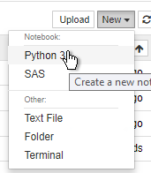
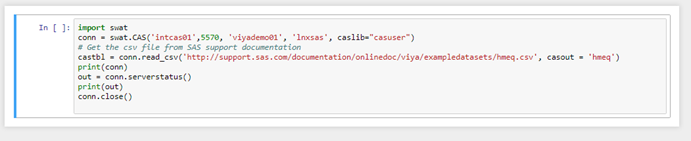
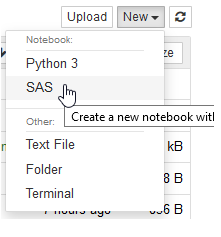

# Jupyter Hub

* [Jupyter Hub](#jupyter-hub)
  * [Install the components](#install-the-components)
  * [Configure and start Jupytherhub](#configure-and-start-jupytherhub)
  * [Test JupyterHub](#test-jupyterhub)

## Install the components

1. Log on to SASVIYA01 as cloud-user

    ```bash
    cd ~/working
    ```

1. Get the required packages

    ```bash
    # to be converted to playbook
    sudo yum install https://dl.fedoraproject.org/pub/epel/epel-release-latest-7.noarch.rpm -y
    sudo yum install python-pip
    sudo yum install bzip2 -y
    ```

    They will likely be already installed in your environment.

1. Install Anaconda

    ```bash
    cd /opt
    sudo curl -O https://repo.continuum.io/archive/Anaconda3-2019.10-Linux-x86_64.sh
    sudo bash Anaconda3-2019.10-Linux-x86_64.sh -b -p /opt/anaconda3
    ```

    Anaconda will download and install a lot of open source packages.

1. Install SWAT

    ```bash
    sudo /opt/anaconda3/bin/pip install https://github.com/sassoftware/python-swat/releases/download/v1.6.1/python-swat-1.6.1-linux64.tar.gz
    ```

1. Install and configure the SAS Kernel

    ```bash
    sudo /opt/anaconda3/bin/pip install sas_kernel
    export CFGPYFILE=/opt/anaconda3/lib/python3.7/site-packages/saspy/sascfg.py
    # backup the sas kernel config file
    sudo cp $CFGPYFILE $CFGPYFILE.orig

    # update saspath in the configuration file
    sudo sed -i.bak2 "s/default.*{'saspath'.*/default  \= {'saspath'  : '\/opt\/sas\/spre\/home\/bin\/sas'/"  $CFGPYFILE
    # update saspath in the configuration file
    sudo sed -i.bak2 "s/ssh.*{'saspath'.*/ssh      \= {'saspath'  : '\/opt\/sas\/spre\/home\/bin\/sas',/"  $CFGPYFILE
    # show the file content, the saspath should be set correctly
    cat $CFGPYFILE
    ```

1. Install nodejs and configurable http proxy

    ```bash
    # install nodeJS
    sudo yum install nodejs -y
    # install configurable-http-proxy
    sudo npm install -g configurable-http-proxy
    ```

1. Install JupyterHub

    ```bash
    sudo /opt/anaconda3/bin/pip install jupyterhub
    ```

## Configure and start Jupytherhub

During this process it is necessary to create the CAS_CLIENT_SSL_CA_LIST environment variable that points to the CA certificates.  It is also necessary to ensure that this variable is passed to the spawned Python sessions. This is done in the jupyterhub_config.py file.

1. Create a config file

    ```bash
    sudo mkdir /opt/anaconda3/etc/jupyterhub
    sudo rm -f /opt/anaconda3/etc/jupyterhub/jupyterhub_config.py
    sudo touch /opt/anaconda3/etc/jupyterhub/jupyterhub_config.py
    sudo /opt/anaconda3/bin/jupyterhub --generate-config -f /opt/anaconda3/etc/jupyterhub/jupyterhub_config.py
    ```

    Type ```y``` when prompted.

1. Append some lines to the config file

    ```bash
    sudo bash -c "cat << EOF >> /opt/anaconda3/etc/jupyterhub/jupyterhub_config.py
    #c.JupyterHub.confirm_no_ssl = True
    c.JupyterHub.cookie_secret_file = '/opt/anaconda3/var/cookie_secret'
    c.JupyterHub.pid_file = '/opt/anaconda3/var/jupyterhub.pid'
    c.JupyterHub.cleanup_servers = True
    c.JupyterHub.cleanup_proxy = True
    ## this is sometimes required.
    c.Spawner.env_keep.append('CAS_CLIENT_SSL_CA_LIST')
    c.Spawner.cmd = ['/opt/anaconda3/bin/jupyterhub-singleuser']
    EOF"

    sudo su -
    echo 'export PATH="/opt/anaconda3/bin:$PATH"' >> ~/.bashrc
    echo 'export CAS_CLIENT_SSL_CA_LIST=/opt/sas/viya/config/etc/SASSecurityCertificateFramework/cacerts/vault-ca.crt' >> ~/.bashrc

    #source .bashrc to pick up environment variable
    . ~/.bashrc
    ```

1. Verify that the certificate file is available

    ```bash
    ll $CAS_CLIENT_SSL_CA_LIST
    ```

1. Start JupyterHub either synchronously or asynchronously (still as root)

    ```bash
    #start it up (sync)
    #/opt/anaconda3/bin/jupyterhub -f /opt/anaconda3/etc/jupyterhub/jupyterhub_config.py

    #start it up (async)
    nohup /opt/anaconda3/bin/jupyterhub -f /opt/anaconda3/etc/jupyterhub/jupyterhub_config.py &
    ```

## Test JupyterHub

1. Create a python test program for testing in batch

    <!--
    ```bash
    exit
    ```
    -->

    ```bash
    # create a python test program
    cat << EOF > ~/castest.py
    import swat
    conn = swat.CAS('sascas01',5570, 'viyademo01', 'lnxsas', caslib="casuser")
    # Get the csv file from SAS support documentation
    castbl = conn.read_csv('http://support.sas.com/documentation/onlinedoc/viya/exampledatasets/hmeq.csv', casout = 'hmeq')
    print(conn)
    out = conn.serverstatus()
    print(out)
    conn.close()
    EOF
    ```

1. Execute test program in batch

    As cloud-user on the sasviya01 machine :

    ```bash
    echo 'export CAS_CLIENT_SSL_CA_LIST=/opt/sas/viya/config/etc/SASSecurityCertificateFramework/cacerts/vault-ca.crt' >> ~/.bashrc

    #source .bashrc to pick up environment variable
    . ~/.bashrc

    # Verify that the certificate file is available
    ll $CAS_CLIENT_SSL_CA_LIST

    # execute the test program
    /opt/anaconda3/bin/python ~/castest.py
    ```

    You should get some information back from the CAS Server that confirms that the CAS table hmeq as been loaded from the CSV file.

1. Logon to JupyterHub

    http://sasviya01.race.sas.com:8000
    viyademo01 - lnxsas

1. Start new program and open a python session

    

1. copy the following code to the programming cell

    ```sh
    import swat
    conn = swat.CAS('sascas01',5570, 'viyademo01', 'lnxsas', caslib="casuser")
    # Get the csv file from SAS support documentation
    castbl = conn.read_csv('http://support.sas.com/documentation/onlinedoc/viya/exampledatasets/hmeq.csv', casout = 'hmeq')
    print(conn)
    out = conn.serverstatus()
    print(out)
    conn.close()
    ```

    

1. Click the run button to execute  

1. This should produce a log that displays CAS info, session data and loads a table to CAS

1. Test with a SAS Notebook

    It is also possible to run a SAS program in a JupyterHub session.
    Simply select a SAS Notebook and run some test code.

    

    Copy-paste the following code:

    ```sh
    proc print data=sashelp.class;
    run;
    ```

    To interact with CAS it requires specifying a hostname and port and credentials.
