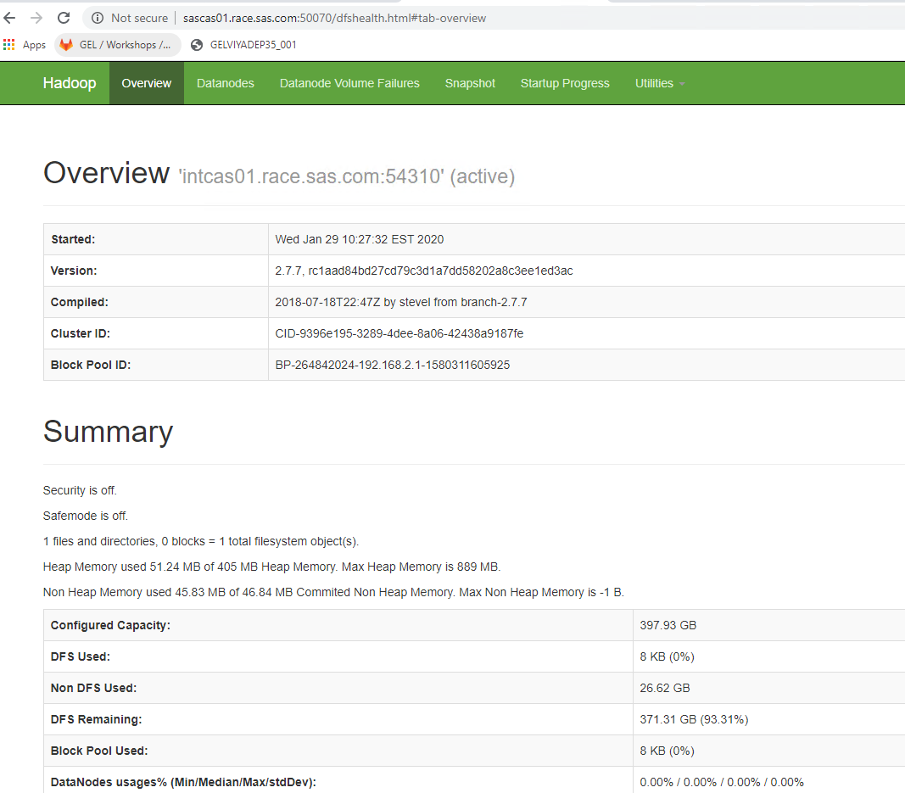
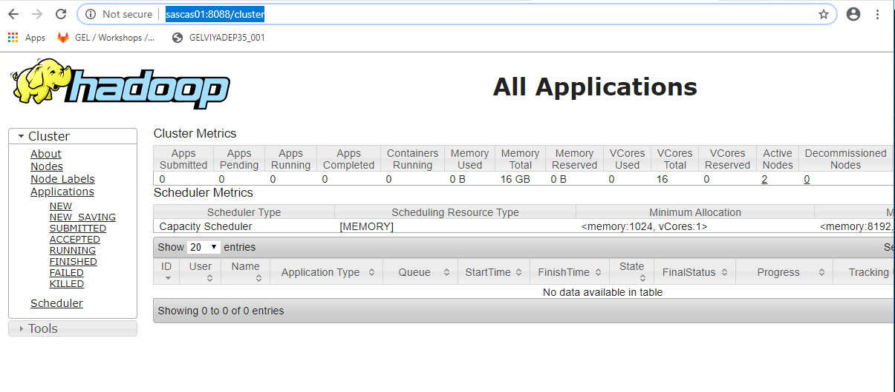
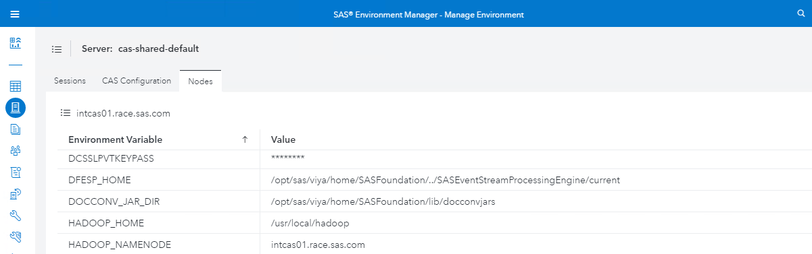
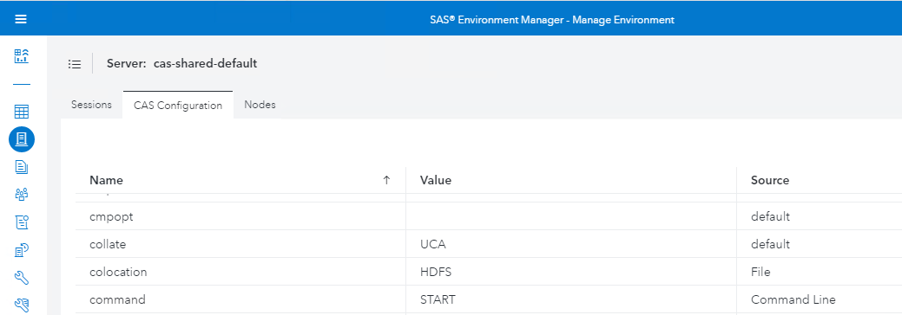
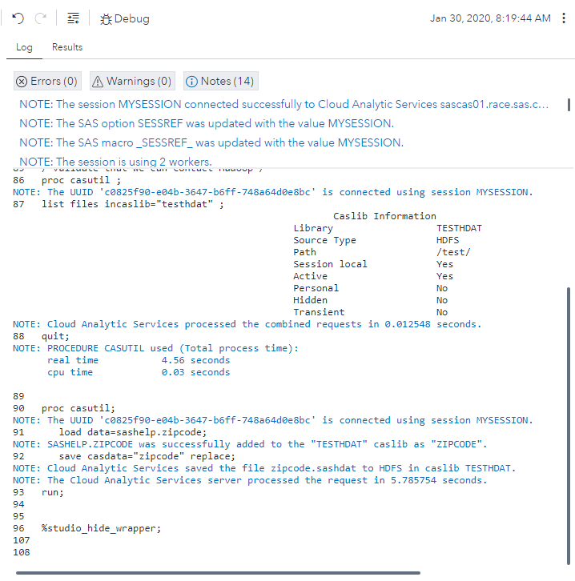
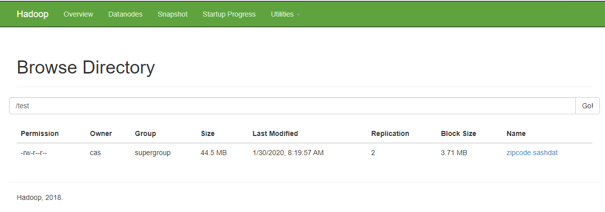

# Configure local HDFS deployment

* [Configure local HDFS deployment](#configure-local-hdfs-deployment)
  * [Install HDFS](#install-hdfs)
  * [Configure and start YARN (optionnal)](#configure-and-start-yarn-optionnal)
  * [Configure CAS SASHDAT on HDFS Access](#configure-cas-sashdat-on-hdfs-access)
    * [Update the vars.yml file and reinstall](#update-the-varsyml-file-and-reinstall)
    * [Update the CAS configuration and restart CAS](#update-the-cas-configuration-and-restart-cas)
    * [Deploying SAS Plug-ins for Hadoop (Apache Hadoop 2.7.7)](#deploying-sas-plug-ins-for-hadoop-apache-hadoop-277)
      * [Distribute the components in Hadoop](#distribute-the-components-in-hadoop)
      * [Configuring Apache HDFS for the SAS Plugins](#configuring-apache-hdfs-for-the-sas-plugins)
    * [Validate CAS access to HDFS](#validate-cas-access-to-hdfs)


## Install HDFS

We will automate the deployment of Apache Hadoop HDFS using the playbook available here: (http://misksapm.na.sas.com/KnowledgeSharingApplication/AdvSearchDisplayArtifact.jsp?Entry_ID=10536)

1. As cloud-user, navigate to the playbook directory

    ```bash
    cd ~/GELVIYADEP35-deploying-viya-3.5-on-linux/scripts/playbooks/apachehadooppoc/
    ```

1. Edit the inventory.ini:

    ```bash
    cat << EOF > inventory.ini
    sascas01  ansible_host=intcas01.race.sas.com
    sascas02  ansible_host=intcas02.race.sas.com
    sascas03  ansible_host=intcas03.race.sas.com

    [hadoopNN]
    sascas01

    [hadoopDN]
    sascas02
    sascas03

    [hadoopSNN]
    sascas02
    EOF
    ```

With this layout of the HDFS components, we are enforcing the strictly co-located CAS and HDFS architecture (CAS Controller and HDS Namenode co-located, and 1 HDFS Datanode for each CAS worker) where we can leverage SASHDAT in HDFS with the best performances.
BE CAREFUL, use "ansible_host" and not "ansible_ssh_host".

WARNING: before running the playbook, make sure you adjust the playbook:

1. Open "/group_vars/all.yml" and replace java_path value with for example:

    ```java_path: /usr/lib/jvm/java-1.8.0-openjdk-1.8.0.232.b09-0.el7_7.x86_64```

   * Check that the version number corresponds to the installed java version on the machines:

       ```sh
       sudo yum list installed | grep java
       #Or
       java -version
       #Or
       ls -l /etc/alternatives/java
       ```

1. Also change the hadoop version in the playbook variable file (group_vars/all.yml) :
hadoop_version: "2.7.7"
Ensure the URL: ```http://apache.cs.utah.edu/hadoop/common/hadoop-{{ hadoop_version }}/``` is responding. Otherwise adjust the Hadoop version.

1. Run the playbook :

    ```bash
    ansible-playbook gel.hadoopsetup.yml -i inventory.ini
    ```

1. Once the playbook execution is complete with no failure, run this command from the Hadoop Namenode (sascas01), to check that the namenode can see the datanodes :

   * first ssh to SASCAS01

       ```sh
       ssh sascas01
       ```

   * then

       ```sh
       sudo su - hdfs
       /usr/local/hadoop/sbin/slaves.sh hostname
       ```

   * You should see:

       ```log
       intcas03.race.sas.com: Warning: Permanently added 'intcas03.race.sas.com,192.168.2.3' (ECDSA) to the list of known hosts.
       intcas02.race.sas.com: Warning: Permanently added 'intcas02.race.sas.com,192.168.2.2' (ECDSA) to the list of known hosts.
       intcas03.race.sas.com: intcas03.race.sas.com
       intcas02.race.sas.com: intcas02.race.sas.com
       ```

    <!-- cheat code to force ssh fingerprint
    ```bash
    cd ~/sas_viya_playbook
    ansible sascas01 -m shell -a "ssh-keyscan -H intcas01.race.sas.com >> ~/.ssh/known_hosts" -b --become-user=hdfs
    ansible sascas01 -m shell -a "ssh-keyscan -H intcas02.race.sas.com >> ~/.ssh/known_hosts" -b --become-user=hdfs
    ansible sascas01 -m shell -a "ssh-keyscan -H intcas03.race.sas.com >> ~/.ssh/known_hosts" -b --become-user=hdfs
    ```
    -->

1. Then execute the following commands, one by one to format the HDFS, start the services and check the health of HDFS :

    ```sh
    hdfs namenode -format
    ```

    <!-- cheatcode
    ```bash
    cd ~/sas_viya_playbook
    ansible sascas01 -m shell -a "/usr/local/hadoop/bin/hdfs namenode -format -nonInteractive chdir='/home/hdfs'" -b --become-user=hdfs
    ```
    -->

   * then

    ```sh
    /usr/local/hadoop/sbin/start-dfs.sh
    ```

    <!--
    cheatcodes to register hdfs startup script as a service
    ```bash
    cd ~/sas_viya_playbook
    ansible sascas01 -m file -a "path=/etc/systemd/system/hdfs.service state=absent" -b
    ansible sascas01 -m file -a "path=/etc/systemd/system/hdfs.service state=touch mode=0644" -b
    cat > /tmp/insertHDFSServiceDef.yml << EOF
    ---
    - hosts: sascas01
      tasks:
      - name: Insert hdfs service definition
        blockinfile:
          path: /etc/systemd/system/hdfs.service
          marker: ""
          block: |
            [Unit]
            Description=Hadoop DFS namenode and datanode
            After=syslog.target network.target remote-fs.target nss-lookup.target network-online.target
            Requires=network-online.target
            [Service]
            User=hdfs
            Group=hadoop
            Type=forking
            ExecStart=/usr/local/hadoop/sbin/start-dfs.sh
            ExecStop=/usr/local/hadoop/sbin/stop-dfs.sh
            WorkingDirectory=/home/hdfs/
            Environment=JAVA_HOME=/usr/lib/jvm/java-1.8.0-openjdk
            Environment=HADOOP_HOME=/usr/local/hadoop
            TimeoutStartSec=2min
            PIDFile=/tmp/hadoop-hdfs-namenode.pid
            [Install]
            WantedBy=multi-user.target
      - name: Remove blank lines blockinfile put in
        lineinfile:
          path: /etc/systemd/system/hdfs.service
          state: absent
          regexp: '^$'
    EOF
    ansible-playbook /tmp/insertHDFSServiceDef.yml -b --diff
    ansible sascas01 -m shell -a "systemctl daemon-reload" -b
    ansible sascas01 -m shell -a "systemctl start hdfs.service" -b
    ```
    -->


   * then

    ```sh
    hdfs dfsadmin -report
    ```

1. As hdfs user, create a folder test:

    ```sh
    hadoop fs -mkdir /test
    hadoop fs -chmod 777 /test
    ```

    <!--
    ```bash
    cd ~/sas_viya_playbook
    ansible sascas01 -m shell -a "/usr/local/hadoop/bin/hadoop fs -mkdir /test" -b --become-user=hdfs
    ansible sascas01 -m shell -a "/usr/local/hadoop/bin/hadoop fs -chmod 777 /test" -b --become-user=hdfs
    ```
    -->

1. Check, open the URL : http://sascas01.race.sas.com:50070/ in your web browser

    

1. Make sure there are 2 live datanodes.

## Configure and start YARN (optionnal)

* Configure YARN so the Ressource manager binds on all the network interface and the GUI can be accessed remotly.


    ```sh
    ansible sascas01 -m lineinfile -a "path=/usr/local/hadoop/etc/hadoop/yarn-site-test.yml insertafter='<configuration>' value='<property><name>yarn.resourcemanager.bind-host</name><value>0.0.0.0</value></property>" -b --become-user hdfs --diff
    ```

* Start YARN

    Connect to the sascas01 machine and run the commands below.

    ```sh
    sudo su - hdfs
    /usr/local/hadoop/sbin/start-yarn.sh
    ```

* Open the Resource manager GUI : (http://sascas01:8088/cluster)



* Run a Hadoop test job (always as hdfs on the sascas01 machine)

    ```sh
    hadoop jar /usr/local/hadoop/share/hadoop/mapreduce/hadoop-mapreduce-examples-2.7.7.jar pi 10 100
    ```


## Configure CAS SASHDAT on HDFS Access

We can either redeploy Viya with some additional vars.yml parameters, or simply update a configuration file, propagate it across the CAS nodes and restart CAS.
Then we proceed with the SAS Plugins to Hadoop installation and configuration.

### Update the vars.yml file and reinstall

With your Viya installation account, open the vars.yml file located in the Viya installation playbook folder (sas_viya_playbook), add HADOOP_HOME and HADOOP_NAMENODE parameters, and then modify the colocation settings to "hdfs", as below:

```log
CAS_CONFIGURATION:
   env:
     #CAS_DISK_CACHE: /tmp
     HADOOP_HOME: '/usr/local/hadoop'
     HADOOP_NAMENODE: sascas01
   cfg:
     #gcport: 0
     #httpport: 8777
     #port: 5570
     colocation: 'hdfs'
```

Then run the Viya deployment playbook, for example:

```sh
cd ~/sas_viya_playbook
ansible-playbook site.yml
```

It takes around 40 minutes for the split deployment. If you don't have the time see the next section.

### Update the CAS configuration and restart CAS

As an alternative you can update the CAS configuration on each CAS node:

For example connect on sascas01 and edit the configuration file:

```sh
ssh sascas01
sudo vi /opt/sas/viya/config/etc/cas/default/casconfig_usermods.lua
```

add:

```log
env.HADOOP_NAMENODE = 'sascas01'
env.HADOOP_HOME = '/usr/local/hadoop'
cas.colocation = 'hdfs'
```

Save you changes and exit.
Do the same for sascas02 and sascas03.

* As an alternative, you can do it automatically with ansible:

    ```bash
    cd ~/sas_viya_playbook
    ansible sascas* -m lineinfile -a "path=/opt/sas/viya/config/etc/cas/default/casconfig_usermods.lua create=yes backup=yes line='env.HADOOP_NAMENODE=\'intcas01.race.sas.com\'\ncas.colocation=\'hdfs\'\nenv.HADOOP_HOME=\'/usr/local/hadoop\'' owner=sas mode=644" -b
    ```

* Then restart the CAS controller:

    ```bash
    cd ~/sas_viya_playbook
    ansible sascas01 -m service -a "name=sas-viya-cascontroller-default state=restarted" -b
    ```

Check in SAS Environment manager:





Note: If you were already connected in SAS Environment Manager, you will have to sign off, sign on again to see the changes in Environment Manager.

### Deploying SAS Plug-ins for Hadoop (Apache Hadoop 2.7.7)

#### Distribute the components in Hadoop

* Logon as cloud-user on sascas01 and follow the instructions and commands below:

    ```sh
    ssh sascas01
    ```

* Copy and unzip the SAS plug-ins package

    ```sh
    cp /opt/sas/viya/home/SASFoundation/hdatplugins/sashdat-03.05.02.gz /tmp
    cd /tmp
    gunzip sashdat-03.05.02.gz
    tar -xvf sashdat-03.05.02
    ```

    ```sh
    ansible sascas01 -m shell -a "cp /opt/sas/viya/home/SASFoundation/hdatplugins/sashdat-03.05.02.gz /tmp"
    ansible sascas01 -m shell -a "gunzip sashdat-03.05.02.gz chdir=/tmp"
    ansible sascas01 -m shell -a "tar -xvf sashdat-03.05.02 chdir=/tmp"
    ```

* switch to hdfs user

    ```sh
    sudo su - hdfs
    ```

* Distribute our SAS Plug-ins jars in Hadoop

    ```sh
    for c in sascas0{1..3}; do scp /tmp/HDATHome/lib/*.jar $c:/$HADOOP_HOME/share/hadoop/common/lib/;done
    ```
    <!-- Note: Official doc fix...otherwhise our plugins are not loaded in the classpath -->

* Distribute our SAS Plug-ins binaries and scripts

    ```sh
    for c in sascas0{1..3}; do scp /tmp/HDATHome/bin/* $c:/$HADOOP_HOME/bin;done
    ```

    Note: you might have to type "y" to accept the ssh key fingerprint.

* Distribute the SAS_VERSION manifest

    ```sh
    for c in sascas0{1..3}; do scp /tmp/HDATHome/SAS_VERSION $c:/$HADOOP_HOME/;done
    ```

<!--
    ```bash
    cd ~/sas_viya_playbook
    # get the hdat plugin
    ansible sascas01 -m fetch -a "src=/opt/sas/viya/home/SASFoundation/hdatplugins/sashdat-03.05.02.gz dest=/tmp/ owner=cloud-user flat=yes" -b
    cd /tmp
    gunzip sashdat-03.05.02.gz
    tar -xvf sashdat-03.05.02

    cd ~/sas_viya_playbook
    #distribute plugin binaries
    ansible sascas* -m copy -a "src=/tmp/HDATHome/bin/ dest=/usr/local/hadoop/bin remote_src=False mode=0755" -b --become-user=hdfs

    #distribute plugin libs
    ansible sascas* -m copy -a "src=/tmp/HDATHome/lib/ dest=/usr/local/hadoop/share/hadoop/common/lib remote_src=False" -b  --become-user=hdfs
    ansible sascas* -m copy -a "src=/tmp/HDATHome/SAS_VERSION dest=/usr/local/hadoop/ remote_src=False" -b  --become-user=hdfs
    ```
 -->

#### Configuring Apache HDFS for the SAS Plugins

* Ensure you connected as hdfs user on sascas01

    ```sh
    sudo su - hdfs
    cp /usr/local/hadoop/etc/hadoop/hdfs-site.xml /usr/local/hadoop/etc/hadoop/hdfs-site.xml.orig
    ```

* edit the file

    ```sh
    vi /usr/local/hadoop/etc/hadoop/hdfs-site.xml
    ```

* Add the block below in the hdfs-site.xml, within the &lt;configuration&gt;&lt;/configuration&gt; blocks:

    ```log
    <property>
    <name>dfs.namenode.plugins</name>
    <value>com.sas.cas.hadoop.NameNodeService</value>
    </property>
    <property>
    <name>dfs.datanode.plugins</name>
    <value>com.sas.cas.hadoop.DataNodeService</value>
    </property>
    <property>
    <name>com.sas.cas.service.allow.put</name>
    <value>true</value>
    </property>
    <property>
    <name>com.sas.cas.hadoop.service.namenode.port</name>
    <value>15452</value>
    </property>
    <property>
    <name>com.sas.cas.hadoop.service.datanode.port</name>
    <value>15453</value>
    </property>
    <property>
    <name> dfs.namenode.fs-limits.min-block-size</name>
    <value>0</value>
    </property>
    ```

<!-- Cheat codes

    ```bash
    cat > /tmp/hdfs-site.xml << EOF
    <?xml version="1.0"?>
    <?xml-stylesheet type="text/xsl" href="configuration.xsl"?>
    <configuration>
    <property>
        <name>dfs.replication</name>
        <value>2</value>
        <description>Default block replication.
        The actual number of replications can be specified when the file is created.
        The default is used if replication is not specified in create time.
        </description>
    </property>
    <property>
    <name>dfs.namenode.name.dir</name>
    <value>/home/hdfs/hadoop-data/hdfs/namenode</value>
    <description>Determines where on the local filesystem the DFS name node should store the name table(fsimage). If this is a comma-delimited list of directories then the name table is replicated in all of the directories, for redundancy.</description>
    </property>
    <property>
    <name>dfs.datanode.data.dir</name>
    <value>/home/hdfs/hadoop-data/hdfs/datanode</value>
    <description>Determines where on the local filesystem an DFS data node should store its blocks. If this is a comma-delimited list of directories, then data will be stored in all named directories, typically on different devices. Directories that do not exist are ignored.</description>
    </property>
    <property>
    <name>dfs.namenode.secondary.http-address</name>
    <value>intcas02.race.sas.com:50090</value>
    </property>
    <property>
        <name>dfs.namenode.plugins</name>
        <value>com.sas.cas.hadoop.NameNodeService</value>
        </property>
        <property>
        <name>dfs.datanode.plugins</name>
        <value>com.sas.cas.hadoop.DataNodeService</value>
        </property>
        <property>
        <name>com.sas.cas.service.allow.put</name>
        <value>true</value>
        </property>
        <property>
        <name>com.sas.cas.hadoop.service.namenode.port</name>
        <value>15452</value>
        </property>
        <property>
        <name>com.sas.cas.hadoop.service.datanode.port</name>
        <value>15453</value>
        </property>
        <property>
        <name> dfs.namenode.fs-limits.min-block-size</name>
        <value>0</value>
    </property>
    </configuration>
    EOF
    cd ~/sas_viya_playbook
    ansible sascas* -m copy -a "src=/tmp/hdfs-site.xml dest=/usr/local/hadoop/etc/hadoop/ remote_src=False" -b  --become-user=hdfs --diff
    ```
 -->

Ensure the last line of the file is &lt;/configuration&gt;.

* Always as hdfs user, distribute the hdfs-site.xml across the Hadoop nodes:

    ```sh
    for c in sascas0{1..3}; do scp /usr/local/hadoop/etc/hadoop/hdfs-site.xml $c:/$HADOOP_HOME/etc/hadoop;done
    ```

* Create an HDFS user's home directory for our test account:

    ```sh
    hadoop fs -mkdir /user
    hadoop fs -mkdir /user/viyademo01
    hadoop fs -chown viyademo01:marketing /user/viyademo01
    hadoop fs -ls /user
    ```

    <!--
    ```bash
    cd ~/sas_viya_playbook
    ansible sascas01 -m shell -a "/usr/local/hadoop/bin/hadoop fs -mkdir /user" -b --become-user=hdfs
    ansible sascas01 -m shell -a "/usr/local/hadoop/bin/hadoop fs -mkdir /user/viyademo01" -b --become-user=hdfs
    ansible sascas01 -m shell -a "/usr/local/hadoop/bin/hadoop fs -chown viyademo01:marketing /user/viyademo01" -b --become-user=hdfs
    ```
    -->

* Restart HDFS:

    ```sh
    /usr/local/hadoop/sbin/stop-dfs.sh
    /usr/local/hadoop/sbin/start-dfs.sh
    ```

    <!--
    ```bash
    cd ~/sas_viya_playbook
    ansible sascas01 -m shell -a "systemctl stop hdfs.service" -b
    ansible sascas01 -m shell -a "systemctl start hdfs.service" -b
    ```
    -->

Tip: type an hdfs command (as "hadoop fs -ls / "), to ensure there is no error introduced by your change.

### Validate CAS access to HDFS

Open SAS Studio (Enterprise) : (http://sasviya02.race.sas.com/SASStudioV/) as viyademo01 and run the following code:

```log
cas mysession;
caslib testhdat datasource=(srctype="hdfs") path="/test";

/*validate that we can contact Hadoop*/
proc casutil ;
list files incaslib="testhdat" ;
quit;

proc casutil;
   load data=sashelp.zipcode;
   save casdata="zipcode" replace;
run;
```

You should get the message below in the SAS LOG:



* Check in the HDFS Web GUI, click on "Utilities", then "Browse the filesystem":



* Delete the table and terminate the CAS session in SAS Studio:

```log
proc casutil;
   deletesource casdata="zipcode";
run;
quit;
cas mysession terminate;
```
